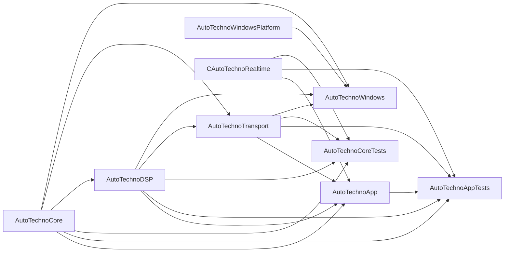
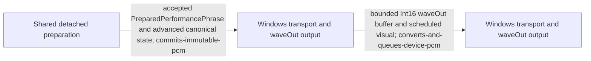

<!-- GENERATED by scripts/codebase_map.py; edit docs/codebase-map.json, not this file. -->
# Semantic Codebase Map

> This map describes the current implemented repository only. Future architecture remains in the roadmap and normative contracts. If this map conflicts with code, `Package.swift`, or a canonical contract, repair the manifest and regenerate the map in the same change.

## Use and refresh

Start with the component, continuation, transition, or flow matching the change, then follow its owner anchors, source files, contracts, boundaries, and tests.

```bash
python3 scripts/codebase_map.py generate
python3 scripts/codebase_map.py check
```

The commands build test modules before SwiftPM symbol extraction and require a matching Swift compiler and SDK. Pass `--build-path` to reuse an existing test build. Generated output contains no timestamps, commit hashes, absolute paths, line numbers, or mangled symbol identifiers.

## SwiftPM module graph



| Target | Responsibility | Internal dependencies |
| --- | --- | --- |
| `AutoTechnoApp` | macOS transport, scheduling, live-feedback coordination, lifecycle, inspector, and read-only presentation. | `AutoTechnoCore`<br>`AutoTechnoDSP`<br>`AutoTechnoTransport`<br>`CAutoTechnoRealtime` |
| `AutoTechnoAppTests` | macOS host lifecycle, live-feedback coordination, inspector, playing-time, and identity validation. | `AutoTechnoApp`<br>`AutoTechnoCore`<br>`AutoTechnoDSP`<br>`AutoTechnoTransport`<br>`CAutoTechnoRealtime` |
| `AutoTechnoCore` | Deterministic semantic planning, resolved score, persistent continuation, quality state, and future musical decisions. | — |
| `AutoTechnoCoreTests` | Cross-module deterministic planning, rendering, evaluation, continuation, realtime, and repository-surface validation. | `AutoTechnoCore`<br>`AutoTechnoDSP`<br>`AutoTechnoTransport`<br>`CAutoTechnoRealtime` |
| `AutoTechnoDSP` | Rendering, DSP, signal evidence, candidate evaluation, bounded correction, and offline/runtime quality policy. | `AutoTechnoCore` |
| `AutoTechnoTransport` | The platform-neutral detached preparation transaction shared by every desktop host. | `AutoTechnoCore`<br>`AutoTechnoDSP` |
| `AutoTechnoWindows` | Windows host lifecycle, shared preparation, scheduling, presentation, route recovery, and waveOut control. | `AutoTechnoCore`<br>`AutoTechnoDSP`<br>`AutoTechnoTransport`<br>`AutoTechnoWindowsPlatform` |
| `AutoTechnoWindowsPlatform` | Win32 windowing and waveOut playback shim with a fixed-work completion callback. | — |
| `CAutoTechnoRealtime` | Preallocated single-producer/single-consumer PCM handoff used by the macOS realtime callback. | — |

## Canonical runtime flows

### macOS phrase preparation and atomic commit

One semantic intention is resolved, rendered, evaluated, packaged, and atomically committed with every continuation state before macOS may schedule it.


Contracts: [`docs/AUTONOMOUS_RUNTIME_PROVENANCE.md`](AUTONOMOUS_RUNTIME_PROVENANCE.md), [`docs/PRIMARY_EVALUATOR.md`](PRIMARY_EVALUATOR.md)

### Windows phrase preparation and atomic commit

The Windows host consumes the same semantic plan, detached renderer, evaluator, immutable PCM, and continuation bundle before its serial state queue may accept the phrase.


Contracts: [`docs/AUTONOMOUS_RUNTIME_PROVENANCE.md`](AUTONOMOUS_RUNTIME_PROVENANCE.md), [`docs/PRIMARY_EVALUATOR.md`](PRIMARY_EVALUATOR.md), [`docs/WINDOWS_DISTRIBUTION.md`](WINDOWS_DISTRIBUTION.md)

### macOS scheduled playback and observation

macOS schedules accepted immutable PCM and the capture mixer copies only bounded app-owned samples into the authenticated background evidence path.


Contracts: [`docs/LIVE_FEEDBACK.md`](LIVE_FEEDBACK.md), [`docs/AUTONOMOUS_RUNTIME_VALIDATION.md`](AUTONOMOUS_RUNTIME_VALIDATION.md)

### Windows scheduled playback

Windows accepts the same immutable prepared phrase, then converts and queues bounded device PCM off the fixed-work completion callback.



Contracts: [`docs/WINDOWS_DISTRIBUTION.md`](WINDOWS_DISTRIBUTION.md), [`docs/AUTONOMOUS_RUNTIME_VALIDATION.md`](AUTONOMOUS_RUNTIME_VALIDATION.md)

### Live PCM feedback and future correction

Authenticated scheduled-output PCM is analyzed off-callback and may authorize one bounded proposal that becomes durable only through a later unscheduled preparation commit.

```mermaid
flowchart LR
  n_live_pcm_feedback_and_future_correction0["Realtime PCM handoff"]
  n_live_pcm_feedback_and_future_correction1["Live-feedback coordination and inspection"]
  n_live_pcm_feedback_and_future_correction2["Evidence, calibration, and primary evaluation"]
  n_live_pcm_feedback_and_future_correction3["Quality and feedback contracts"]
  n_live_pcm_feedback_and_future_correction4["Shared detached preparation"]
  n_live_pcm_feedback_and_future_correction5["macOS transport and session lifecycle"]
  n_live_pcm_feedback_and_future_correction0 -- "sequence- and generation-bound native-stereo packets; copies-app-owned-pcm" --> n_live_pcm_feedback_and_future_correction1
  n_live_pcm_feedback_and_future_correction1 -- "bounded live-output evidence; observes-without-changing-pcm" --> n_live_pcm_feedback_and_future_correction2
  n_live_pcm_feedback_and_future_correction2 -- "reason-coded headroom proposal and target boundary; observes-without-changing-pcm" --> n_live_pcm_feedback_and_future_correction3
  n_live_pcm_feedback_and_future_correction3 -- "pending live-master binding for an unscheduled phrase; changes-future-pcm-only" --> n_live_pcm_feedback_and_future_correction4
  n_live_pcm_feedback_and_future_correction4 -- "accepted PreparedPerformancePhrase and advanced canonical state; commits-immutable-pcm" --> n_live_pcm_feedback_and_future_correction5
```



Contracts: [`docs/LIVE_FEEDBACK.md`](LIVE_FEEDBACK.md), [`docs/SOUND_QUALITY.md`](SOUND_QUALITY.md)

### Long-horizon semantic and signal adaptation

Committed semantic history and realized signal evidence meet in one calibrated policy whose qualified result can affect only an eligible unscheduled future phrase.


Contracts: [`docs/LONG_HORIZON_PERFORMANCE_MAP.md`](LONG_HORIZON_PERFORMANCE_MAP.md), [`docs/AUTONOMOUS_RUNTIME_PROVENANCE.md`](AUTONOMOUS_RUNTIME_PROVENANCE.md)

## Canonical cross-boundary continuation states

These are the typed states that cross a canonical preparation, commit, scheduling, recovery, feedback, or monitoring boundary. Nested voice, effect, and evidence state remains owned by the named parent continuation.

| State | Canonical owner | Declaration | Scope | PCM relationship |
| --- | --- | --- | --- | --- |
| `autonomous-session-state` — Canonical session and score continuation | Session director and resolved score | `AutonomousSessionState` in [`Sources/AutoTechnoCore/AutonomousSession.swift`](../Sources/AutoTechnoCore/AutonomousSession.swift) | `canonical-phrase` | Selects one future score and advances only with an accepted prepared phrase; owns no PCM. |
| `render-state` — Voice and mix render continuation | Voice and phrase rendering | `RenderState` in [`Sources/AutoTechnoDSP/AutonomousPhraseRenderer.swift`](../Sources/AutoTechnoDSP/AutonomousPhraseRenderer.swift) | `canonical-phrase` | Carries deterministic voice, mix, tail, and output-transition memory used to render future PCM. |
| `graph-state` — Generated DSP graph continuation | Graph, effects, routing, and mix control | `GeneratedDSPContinuationState` in [`Sources/AutoTechnoDSP/GeneratedDSPGraph.swift`](../Sources/AutoTechnoDSP/GeneratedDSPGraph.swift) | `canonical-phrase` | Carries the one effect graph and its node memory while processing future PCM. |
| `quality-continuation` — Accepted quality-policy continuation | Quality and feedback contracts | `QualityContinuationState` in [`Sources/AutoTechnoCore/QualityQualification.swift`](../Sources/AutoTechnoCore/QualityQualification.swift) | `canonical-phrase` | Binds accepted evidence and policy provenance without retaining PCM. |
| `live-master-continuation` — Accepted live master-headroom continuation | Quality and feedback contracts | `LiveMasterHeadroomContinuationState` in [`Sources/AutoTechnoCore/LiveFeedback.swift`](../Sources/AutoTechnoCore/LiveFeedback.swift) | `canonical-phrase` | Controls only a qualified future render and advances atomically with that PCM. |
| `quality-retry-continuation` — Rejected-candidate recovery continuation | Quality and feedback contracts | `AutonomousQualityRetryContinuation` in [`Sources/AutoTechnoCore/QualityQualification.swift`](../Sources/AutoTechnoCore/QualityQualification.swift) | `host-control` | Coordinates bounded detached retries while rejected PCM remains uncommitted. |
| `long-horizon-adaptation-state` — Long-horizon realized-signal continuation | Long-horizon signal analysis and future adaptation | `LongHorizonFutureAdaptationState` in [`Sources/AutoTechnoDSP/LongHorizonFutureAdaptation.swift`](../Sources/AutoTechnoDSP/LongHorizonFutureAdaptation.swift) | `canonical-phrase` | Retains reduced accepted evidence and may change only an eligible future score/render. |
| `repeat-hold-playback-state` — Qualified repeat-hold presentation state | Session director and resolved score | `RepeatHoldEvolutionPlaybackMode` in [`Sources/AutoTechnoCore/RepeatHoldEvolutionPolicy.swift`](../Sources/AutoTechnoCore/RepeatHoldEvolutionPolicy.swift) | `host-control` | Selects exact accepted PCM or a prequalified pattern family without advancing canonical score state. |
| `phrase-preparation-key` — Detached preparation identity | Shared detached preparation | `PhrasePreparationKey` in [`Sources/AutoTechnoTransport/AutonomousPerformancePreparer.swift`](../Sources/AutoTechnoTransport/AutonomousPerformancePreparer.swift) | `detached-preparation` | Binds route, policy, recovery, and proposal lookup identity before future PCM can enter a host queue. |
| `phrase-preparation-replay-identity` — Exact detached preparation replay identity | Shared detached preparation | `PhrasePreparationReplayIdentity` in [`Sources/AutoTechnoTransport/AutonomousPerformancePreparer.swift`](../Sources/AutoTechnoTransport/AutonomousPerformancePreparer.swift) | `detached-preparation` | Serializes exact seed, canonical session, render, graph, long-horizon, route, recovery, proposal, and future-sample identities before preparation; it retains no PCM. |
| `realtime-pcm-queue` — Preallocated macOS PCM packet handoff | Realtime PCM handoff | `ATLivePCMQueue` in [`Sources/CAutoTechnoRealtime/CAutoTechnoRealtimePrivate.h`](../Sources/CAutoTechnoRealtime/CAutoTechnoRealtimePrivate.h) | `realtime-handoff` | Copies bounded app-owned scheduled-output PCM for one background consumer. |
| `scheduled-phrase-ledger` — Scheduled occurrence ledger | Live-feedback coordination and inspection | `ScheduledPhraseLedger` in [`Sources/AutoTechnoApp/LiveFeedbackCoordinator.swift`](../Sources/AutoTechnoApp/LiveFeedbackCoordinator.swift) | `host-control` | Authenticates copied sample ranges against exact scheduled immutable PCM occurrences. |
| `live-feedback-runtime-state` — Live-feedback lifecycle and correction state | Live-feedback coordination and inspection | `LiveFeedbackRuntimeCoordinator` in [`Sources/AutoTechnoApp/LiveFeedbackCoordinator.swift`](../Sources/AutoTechnoApp/LiveFeedbackCoordinator.swift) | `host-control` | Authorizes at most one future correction and never rewrites current PCM. |
| `live-feedback-capture-state` — Live PCM capture lifecycle | Live-feedback coordination and inspection | `LiveFeedbackCaptureLifecycle` in [`Sources/AutoTechnoApp/LiveFeedbackCoordinator.swift`](../Sources/AutoTechnoApp/LiveFeedbackCoordinator.swift) | `realtime-handoff` | Owns bounded producer/consumer lifecycle identity around the PCM queue. |
| `accepted-pcm-hold` — Accepted PCM hold provenance | Live-feedback coordination and inspection | `AcceptedPCMHold` in [`Sources/AutoTechnoApp/LiveFeedbackCoordinator.swift`](../Sources/AutoTechnoApp/LiveFeedbackCoordinator.swift) | `host-control` | Keeps already qualified PCM eligible when an authorized correction cannot commit. |
| `next-phrase-progress` — macOS successor preparation progress | macOS transport and session lifecycle | `NextPhraseProgress` in [`Sources/AutoTechnoApp/NextPhraseProgress.swift`](../Sources/AutoTechnoApp/NextPhraseProgress.swift) | `host-control` | Records bounded successor failure/repeat progress without treating rejected PCM as accepted. |
| `monitoring-output-state` — Downstream monitoring gain state | macOS transport and session lifecycle | `MonitoringOutputState` in [`Sources/AutoTechnoApp/MonitoringOutputState.swift`](../Sources/AutoTechnoApp/MonitoringOutputState.swift) | `monitoring-output` | Changes only downstream device-output gain after canonical capture and evidence. |
| `windows-recovery-context` — Windows route-recovery input snapshot | Windows transport and waveOut output | `WindowsRecoveryContext` in [`Sources/AutoTechnoWindows/main.swift`](../Sources/AutoTechnoWindows/main.swift) | `host-control` | Preserves incoming canonical state so the interrupted phrase can be rerendered for the recovered route. |

## Checked state and PCM transitions

Every edge names its execution boundary, consumed and produced continuation, immutable artifact, PCM consequence, and fail-closed behavior.

```mermaid
flowchart LR
  n_transition_evidence_calibration_and_primary_evaluation["Evidence, calibration, and primary evaluation"]
  n_transition_graph_effects_routing_and_mix["Graph, effects, routing, and mix control"]
  n_transition_instrument_pitch_and_role_policy["Instrument, pitch, and role policy"]
  n_transition_live_feedback_coordination_and_inspection["Live-feedback coordination and inspection"]
  n_transition_long_horizon_semantic_control["Long-horizon semantic control"]
  n_transition_long_horizon_signal_and_future_adaptation["Long-horizon signal analysis and future adaptation"]
  n_transition_macos_transport_and_session_lifecycle["macOS transport and session lifecycle"]
  n_transition_performance_grammar_and_composition["Performance grammar and phrase composition"]
  n_transition_quality_and_feedback_contracts["Quality and feedback contracts"]
  n_transition_realtime_pcm_handoff["Realtime PCM handoff"]
  n_transition_session_director_and_score["Session director and resolved score"]
  n_transition_shared_detached_preparation["Shared detached preparation"]
  n_transition_voice_and_phrase_rendering["Voice and phrase rendering"]
  n_transition_windows_transport_and_waveout["Windows transport and waveOut output"]
  n_transition_session_director_and_score -- "resolved phrase context and bars; none" --> n_transition_performance_grammar_and_composition
  n_transition_performance_grammar_and_composition -- "score-owned composition and role relations; none" --> n_transition_instrument_pitch_and_role_policy
  n_transition_instrument_pitch_and_role_policy -- "instrument, pitch, articulation, and material-world intent; none" --> n_transition_long_horizon_semantic_control
  n_transition_long_horizon_semantic_control -- "AutonomousPhrasePlan and exact replay-bound PhrasePreparationRequest; none" --> n_transition_shared_detached_preparation
  n_transition_shared_detached_preparation -- "RenderBlock voice PCM and role-local evidence; creates-future-pcm" --> n_transition_voice_and_phrase_rendering
  n_transition_voice_and_phrase_rendering -- "processed stereo blocks, role taps, and ending render/graph state; processes-future-pcm" --> n_transition_graph_effects_routing_and_mix
  n_transition_graph_effects_routing_and_mix -- "candidate vector, verdict, and atomic commit provenance; qualifies-without-changing-pcm" --> n_transition_evidence_calibration_and_primary_evaluation
  n_transition_evidence_calibration_and_primary_evaluation -- "PreparedPerformancePhrase with immutable qualified PCM; qualifies-without-changing-pcm" --> n_transition_shared_detached_preparation
  n_transition_shared_detached_preparation -- "accepted PreparedPerformancePhrase and advanced canonical state; commits-immutable-pcm" --> n_transition_macos_transport_and_session_lifecycle
  n_transition_shared_detached_preparation -- "accepted PreparedPerformancePhrase and advanced canonical state; commits-immutable-pcm" --> n_transition_windows_transport_and_waveout
  n_transition_macos_transport_and_session_lifecycle -- "sample-time scheduled buffer and authenticated capture range; schedules-immutable-pcm" --> n_transition_realtime_pcm_handoff
  n_transition_realtime_pcm_handoff -- "sequence- and generation-bound native-stereo packets; copies-app-owned-pcm" --> n_transition_live_feedback_coordination_and_inspection
  n_transition_windows_transport_and_waveout -- "bounded Int16 waveOut buffer and scheduled visual; converts-and-queues-device-pcm" --> n_transition_windows_transport_and_waveout
  n_transition_live_feedback_coordination_and_inspection -- "bounded live-output evidence; observes-without-changing-pcm" --> n_transition_evidence_calibration_and_primary_evaluation
  n_transition_evidence_calibration_and_primary_evaluation -- "reason-coded headroom proposal and target boundary; observes-without-changing-pcm" --> n_transition_quality_and_feedback_contracts
  n_transition_quality_and_feedback_contracts -- "pending live-master binding for an unscheduled phrase; changes-future-pcm-only" --> n_transition_shared_detached_preparation
  n_transition_session_director_and_score -- "committed semantic trajectory and episode state; none" --> n_transition_long_horizon_semantic_control
  n_transition_long_horizon_semantic_control -- "score-owned material-world render intent; creates-future-pcm" --> n_transition_voice_and_phrase_rendering
  n_transition_voice_and_phrase_rendering -- "semantic, signal, and effect-dose trajectory observation; observes-without-changing-pcm" --> n_transition_long_horizon_signal_and_future_adaptation
  n_transition_long_horizon_signal_and_future_adaptation -- "preserve, recover, or material-reframe intent; changes-future-pcm-only" --> n_transition_session_director_and_score
  n_transition_macos_transport_and_session_lifecycle -- "route-recovery PhrasePreparationRequest; rebuilds-unscheduled-pcm" --> n_transition_shared_detached_preparation
  n_transition_windows_transport_and_waveout -- "route-recovery PhrasePreparationRequest; rebuilds-unscheduled-pcm" --> n_transition_shared_detached_preparation
  n_transition_macos_transport_and_session_lifecycle -- "exact accepted PCM or prequalified repeat-hold pattern family; replays-qualified-pcm-without-canonical-advance" --> n_transition_macos_transport_and_session_lifecycle
  n_transition_windows_transport_and_waveout -- "exact accepted PCM or prequalified repeat-hold pattern family; replays-qualified-pcm-without-canonical-advance" --> n_transition_windows_transport_and_waveout
  n_transition_macos_transport_and_session_lifecycle -- "main-output-mixer gain intent; changes-monitoring-output-only" --> n_transition_macos_transport_and_session_lifecycle
```



| Transition | Boundary | Owner handoff | Consumes | Produces | Artifact | PCM consequence | Failure behavior |
| --- | --- | --- | --- | --- | --- | --- | --- |
| `score-to-performance-grammar` — Resolve score-owned performance grammar | `detached-preparation` | Session director and resolved score → Performance grammar and phrase composition | `autonomous-session-state` | — | resolved phrase context and bars | `none` | Reject an inconsistent plan before rendering. |
| `grammar-to-instrument-policy` — Resolve instrument, pitch, and role policy | `detached-preparation` | Performance grammar and phrase composition → Instrument, pitch, and role policy | `autonomous-session-state` | — | score-owned composition and role relations | `none` | Preserve the canonical plan or reject malformed score relations. |
| `instrument-to-long-horizon-score` — Bind the current material world | `detached-preparation` | Instrument, pitch, and role policy → Long-horizon semantic control | `autonomous-session-state` | — | instrument, pitch, articulation, and material-world intent | `none` | Use the bounded score-owned fallback without adding another engine. |
| `long-horizon-score-to-preparer` — Create one versioned preparation transaction | `detached-preparation` | Long-horizon semantic control → Shared detached preparation | `autonomous-session-state`<br>`long-horizon-adaptation-state` | `phrase-preparation-key`<br>`phrase-preparation-replay-identity` | AutonomousPhrasePlan and exact replay-bound PhrasePreparationRequest | `none` | Fail closed on discontinuous root, phrase, bar, route, or policy identity. |
| `preparer-to-voice-renderer` — Render score-owned voices and role taps | `detached-preparation` | Shared detached preparation → Voice and phrase rendering | `phrase-preparation-key`<br>`phrase-preparation-replay-identity`<br>`autonomous-session-state`<br>`render-state`<br>`graph-state`<br>`quality-continuation`<br>`live-master-continuation`<br>`long-horizon-adaptation-state` | `render-state` | RenderBlock voice PCM and role-local evidence | `creates-future-pcm` | Return a reason-coded preparation failure; no PCM becomes schedulable. |
| `voice-renderer-to-graph` — Process the canonical graph and mix | `detached-preparation` | Voice and phrase rendering → Graph, effects, routing, and mix control | `render-state`<br>`graph-state` | `render-state`<br>`graph-state` | processed stereo blocks, role taps, and ending render/graph state | `processes-future-pcm` | Reject invalid routing or use the declared protected neutral path. |
| `graph-to-primary-evaluator` — Qualify the complete prepared candidate | `detached-preparation` | Graph, effects, routing, and mix control → Evidence, calibration, and primary evaluation | `quality-continuation`<br>`live-master-continuation`<br>`render-state`<br>`graph-state` | `quality-continuation`<br>`live-master-continuation` | candidate vector, verdict, and atomic commit provenance | `qualifies-without-changing-pcm` | Reject or report qualification unavailable; never weaken a hard gate. |
| `evaluator-to-prepared-product` — Package one immutable prepared performance phrase | `detached-preparation` | Evidence, calibration, and primary evaluation → Shared detached preparation | `phrase-preparation-key`<br>`phrase-preparation-replay-identity`<br>`render-state`<br>`graph-state`<br>`quality-continuation`<br>`live-master-continuation`<br>`long-horizon-adaptation-state` | `render-state`<br>`graph-state`<br>`quality-continuation`<br>`live-master-continuation`<br>`long-horizon-adaptation-state` | PreparedPerformancePhrase with immutable qualified PCM | `qualifies-without-changing-pcm` | Return no commit-eligible product when any identity or evidence binding fails. |
| `prepared-product-to-macos-commit` — Commit the prepared phrase on macOS | `macos-future-phrase-commit` | Shared detached preparation → macOS transport and session lifecycle | `phrase-preparation-key`<br>`phrase-preparation-replay-identity`<br>`autonomous-session-state`<br>`render-state`<br>`graph-state`<br>`quality-continuation`<br>`live-master-continuation`<br>`long-horizon-adaptation-state` | `autonomous-session-state`<br>`render-state`<br>`graph-state`<br>`quality-continuation`<br>`live-master-continuation`<br>`long-horizon-adaptation-state`<br>`repeat-hold-playback-state`<br>`next-phrase-progress` | accepted PreparedPerformancePhrase and advanced canonical state | `commits-immutable-pcm` | Discard stale or unqualified work and preserve accepted PCM/fallback state. |
| `prepared-product-to-windows-commit` — Commit the prepared phrase on Windows | `windows-future-phrase-commit` | Shared detached preparation → Windows transport and waveOut output | `phrase-preparation-key`<br>`phrase-preparation-replay-identity`<br>`autonomous-session-state`<br>`render-state`<br>`graph-state`<br>`quality-continuation`<br>`live-master-continuation`<br>`long-horizon-adaptation-state` | `autonomous-session-state`<br>`render-state`<br>`graph-state`<br>`quality-continuation`<br>`live-master-continuation`<br>`long-horizon-adaptation-state`<br>`repeat-hold-playback-state` | accepted PreparedPerformancePhrase and advanced canonical state | `commits-immutable-pcm` | Discard stale or unqualified work and keep the last accepted host state. |
| `macos-schedule-to-realtime-capture` — Schedule immutable PCM and publish bounded capture packets | `macos-sample-scheduling` | macOS transport and session lifecycle → Realtime PCM handoff | `repeat-hold-playback-state`<br>`scheduled-phrase-ledger`<br>`live-feedback-capture-state` | `realtime-pcm-queue`<br>`scheduled-phrase-ledger`<br>`live-feedback-capture-state` | sample-time scheduled buffer and authenticated capture range | `schedules-immutable-pcm` | Do not schedule stale ranges; retain qualified fallback or report unavailable. |
| `realtime-packets-to-live-feedback` — Consume app-owned scheduled-output PCM packets | `macos-realtime-production` | Realtime PCM handoff → Live-feedback coordination and inspection | `realtime-pcm-queue`<br>`scheduled-phrase-ledger`<br>`live-feedback-capture-state` | `live-feedback-runtime-state`<br>`scheduled-phrase-ledger`<br>`live-feedback-capture-state` | sequence- and generation-bound native-stereo packets | `copies-app-owned-pcm` | Drop invalid/full packets and continue output without blocking. |
| `windows-queue-waveout-pcm` — Convert and queue immutable PCM for waveOut | `windows-control-scheduling` | Windows transport and waveOut output → Windows transport and waveOut output | `repeat-hold-playback-state` | `repeat-hold-playback-state` | bounded Int16 waveOut buffer and scheduled visual | `converts-and-queues-device-pcm` | Stop queue advancement and request recovery without callback-side work. |
| `live-feedback-to-evaluator` — Analyze one authenticated live PCM window | `background-live-analysis` | Live-feedback coordination and inspection → Evidence, calibration, and primary evaluation | `live-feedback-runtime-state`<br>`scheduled-phrase-ledger`<br>`live-feedback-capture-state`<br>`accepted-pcm-hold` | `live-feedback-runtime-state` | bounded live-output evidence | `observes-without-changing-pcm` | Reject incomplete, stale, late, mismatched, or unavailable windows. |
| `live-evaluator-to-quality-contract` — Reduce live evidence to one future proposal | `background-live-analysis` | Evidence, calibration, and primary evaluation → Quality and feedback contracts | `quality-continuation`<br>`live-master-continuation`<br>`live-feedback-runtime-state` | `live-feedback-runtime-state` | reason-coded headroom proposal and target boundary | `observes-without-changing-pcm` | Hold or reject the proposal; current and scheduled PCM remain immutable. |
| `quality-proposal-to-preparer` — Bind an authorized proposal to one future candidate | `detached-preparation` | Quality and feedback contracts → Shared detached preparation | `phrase-preparation-key`<br>`quality-continuation`<br>`live-master-continuation`<br>`live-feedback-runtime-state` | `phrase-preparation-key` | pending live-master binding for an unscheduled phrase | `changes-future-pcm-only` | Expire stale/late proposals and retain the previous committed controller state. |
| `session-to-long-horizon-semantics` — Accumulate committed semantic history | `detached-preparation` | Session director and resolved score → Long-horizon semantic control | `autonomous-session-state`<br>`long-horizon-adaptation-state` | `long-horizon-adaptation-state` | committed semantic trajectory and episode state | `none` | Mark discontinuous evidence unavailable without partial advancement. |
| `long-horizon-semantics-to-renderer` — Render the selected long-horizon consequence | `detached-preparation` | Long-horizon semantic control → Voice and phrase rendering | `autonomous-session-state`<br>`render-state`<br>`long-horizon-adaptation-state` | `render-state` | score-owned material-world render intent | `creates-future-pcm` | Use the bounded canonical score path. |
| `renderer-to-long-horizon-signal` — Reduce accepted render evidence | `detached-preparation` | Voice and phrase rendering → Long-horizon signal analysis and future adaptation | `render-state`<br>`long-horizon-adaptation-state` | `long-horizon-adaptation-state` | semantic, signal, and effect-dose trajectory observation | `observes-without-changing-pcm` | Preserve prior adaptation state when evidence is incomplete or discontinuous. |
| `long-horizon-decision-to-session` — Apply one eligible future trajectory decision | `detached-preparation` | Long-horizon signal analysis and future adaptation → Session director and resolved score | `autonomous-session-state`<br>`long-horizon-adaptation-state` | `autonomous-session-state`<br>`long-horizon-adaptation-state` | preserve, recover, or material-reframe intent | `changes-future-pcm-only` | Preserve course when the decision is invalid, stale, early, or ineligible. |
| `macos-route-recovery-to-preparer` — Rebuild the interrupted macOS phrase for a recovered route | `macos-route-recovery` | macOS transport and session lifecycle → Shared detached preparation | `autonomous-session-state`<br>`render-state`<br>`graph-state`<br>`quality-continuation`<br>`live-master-continuation`<br>`long-horizon-adaptation-state`<br>`accepted-pcm-hold` | `phrase-preparation-key`<br>`phrase-preparation-replay-identity`<br>`accepted-pcm-hold` | route-recovery PhrasePreparationRequest | `rebuilds-unscheduled-pcm` | Preserve the recovery request/hold and report unavailable for an unsupported route. |
| `windows-route-recovery-to-preparer` — Rebuild the interrupted Windows phrase for a recovered device | `windows-route-recovery` | Windows transport and waveOut output → Shared detached preparation | `windows-recovery-context`<br>`autonomous-session-state`<br>`render-state`<br>`graph-state`<br>`quality-continuation`<br>`live-master-continuation`<br>`long-horizon-adaptation-state` | `windows-recovery-context`<br>`phrase-preparation-key`<br>`phrase-preparation-replay-identity` | route-recovery PhrasePreparationRequest | `rebuilds-unscheduled-pcm` | Retain the recovery snapshot and do not queue mismatched PCM. |
| `macos-qualified-hold` — Present a bounded qualified macOS hold | `macos-sample-scheduling` | macOS transport and session lifecycle → macOS transport and session lifecycle | `repeat-hold-playback-state`<br>`quality-retry-continuation`<br>`next-phrase-progress`<br>`accepted-pcm-hold` | `repeat-hold-playback-state`<br>`quality-retry-continuation`<br>`next-phrase-progress`<br>`accepted-pcm-hold` | exact accepted PCM or prequalified repeat-hold pattern family | `replays-qualified-pcm-without-canonical-advance` | Fall back to exact accepted PCM and keep retries bounded. |
| `windows-qualified-hold` — Present a bounded qualified Windows hold | `windows-control-scheduling` | Windows transport and waveOut output → Windows transport and waveOut output | `repeat-hold-playback-state` | `repeat-hold-playback-state` | exact accepted PCM or prequalified repeat-hold pattern family | `replays-qualified-pcm-without-canonical-advance` | Fall back to exact accepted PCM and request the successor serially. |
| `macos-monitoring-output` — Apply downstream monitoring gain | `main-actor-presentation` | macOS transport and session lifecycle → macOS transport and session lifecycle | `monitoring-output-state` | `monitoring-output-state` | main-output-mixer gain intent | `changes-monitoring-output-only` | Normalize invalid gain to the bounded monitoring state without changing evidence. |
## Component ownership index

| Component | Targets | Canonical owner anchors | Responsibility |
| --- | --- | --- | --- |
| [`session-director-and-score`](#session-director-and-score) | `AutoTechnoCore` | `AutonomousSessionDirector` in [`Sources/AutoTechnoCore/AutonomousSession.swift`](../Sources/AutoTechnoCore/AutonomousSession.swift)<br>`AutonomousSessionState` in [`Sources/AutoTechnoCore/AutonomousSession.swift`](../Sources/AutoTechnoCore/AutonomousSession.swift)<br>`ResampledMemoryContinuationState` in [`Sources/AutoTechnoCore/ResampledMemory.swift`](../Sources/AutoTechnoCore/ResampledMemory.swift)<br>`ScoreMotifBaselineAnalyzer` in [`Sources/AutoTechnoCore/ScoreMotifBaselineAnalyzer.swift`](../Sources/AutoTechnoCore/ScoreMotifBaselineAnalyzer.swift) | Own the session identity, semantic intent, temporal memory including accepted-only resampled source recipes, phrase selection, complete resolved bars, deterministic successor state, structured quality-recovery intent, finite recovery waves, and accepted-versus-presentation time semantics. |
| [`performance-grammar-and-composition`](#performance-grammar-and-composition) | `AutoTechnoCore` | `PhraseCompositionResolver` in [`Sources/AutoTechnoCore/PhraseComposition.swift`](../Sources/AutoTechnoCore/PhraseComposition.swift)<br>`PerformanceCharacter` in [`Sources/AutoTechnoCore/PerformanceCharacter.swift`](../Sources/AutoTechnoCore/PerformanceCharacter.swift)<br>`KickMorphologyResolver` in [`Sources/AutoTechnoCore/KickMorphology.swift`](../Sources/AutoTechnoCore/KickMorphology.swift) | Resolve performance character, rhythmic relations including held long-cycle Euclidean relocation, phrase-local and bounded earlier-source slices, arpeggiation, pads, structural gestures, episode-bound kick materials, and score-owned feature articulations inside the canonical plan. |
| [`instrument-pitch-and-role-policy`](#instrument-pitch-and-role-policy) | `AutoTechnoCore` | `InstrumentPalette` in [`Sources/AutoTechnoCore/InstrumentPalette.swift`](../Sources/AutoTechnoCore/InstrumentPalette.swift)<br>`FoundationPitchResolver` in [`Sources/AutoTechnoCore/FoundationPitchResolver.swift`](../Sources/AutoTechnoCore/FoundationPitchResolver.swift) | Assign internal architectures and patches, enforce tonal/atonal pitch identity, plan material-world-selected coupled modal percussion, and resolve upper synth performance through the shared long-cycle grammar without creating another engine. |
| [`long-horizon-semantic-control`](#long-horizon-semantic-control) | `AutoTechnoCore` | `LongHorizonContinuationState` in [`Sources/AutoTechnoCore/LongHorizonContinuation.swift`](../Sources/AutoTechnoCore/LongHorizonContinuation.swift)<br>`LongHorizonPolymetricGrammar` in [`Sources/AutoTechnoCore/LongHorizonPolymetricGrammar.swift`](../Sources/AutoTechnoCore/LongHorizonPolymetricGrammar.swift)<br>`LongHorizonEffectCarrierState` in [`Sources/AutoTechnoCore/LongHorizonEffectCarrier.swift`](../Sources/AutoTechnoCore/LongHorizonEffectCarrier.swift)<br>`LongHorizonSessionBaselineAnalyzer` in [`Sources/AutoTechnoCore/LongHorizonSessionBaseline.swift`](../Sources/AutoTechnoCore/LongHorizonSessionBaseline.swift) | Maintain compact long-range musical continuation, causal four-to-eight-minute material-world lineage, held long-cycle grammar and effect carrier, semantic trajectory, episode selection, energy coordination, effect sentences, bounded future decision eligibility, and detached neutral session-trajectory evidence. |
| [`quality-and-feedback-contracts`](#quality-and-feedback-contracts) | `AutoTechnoCore` | `QualityQualificationContract` in [`Sources/AutoTechnoCore/QualityQualification.swift`](../Sources/AutoTechnoCore/QualityQualification.swift)<br>`LiveMasterHeadroomContinuationState` in [`Sources/AutoTechnoCore/LiveFeedback.swift`](../Sources/AutoTechnoCore/LiveFeedback.swift) | Define reason-coded quality decisions, accepted and observed provenance, live-feedback observations/proposals, revision rules, fail-closed future-boundary state, the non-promotional boundary for optional local listening hypotheses, the detached evidence-ranked deficit register, the offline baseline lifecycle and schema-migration policy, and the aggregate Phase-1 reproducible-evidence gate; none can independently authorize or enter runtime decisions. |
| [`voice-and-phrase-rendering`](#voice-and-phrase-rendering) | `AutoTechnoDSP` | `AutonomousPhraseRenderer` in [`Sources/AutoTechnoDSP/AutonomousPhraseRenderer.swift`](../Sources/AutoTechnoDSP/AutonomousPhraseRenderer.swift)<br>`VoiceRenderer` in [`Sources/AutoTechnoDSP/VoiceRenderer.swift`](../Sources/AutoTechnoDSP/VoiceRenderer.swift) | Render the canonical resolved score through internal voices, phrase composition including reconstructed earlier kick recipes, coupled-material modal percussion, kick/upper articulations, near-continuous asymmetric spatial dust, source-local terminal de-clicking, and stable continuation into immutable stereo blocks, transient role taps, and default-off detached diagnostic captures. |
| [`graph-effects-routing-and-mix`](#graph-effects-routing-and-mix) | `AutoTechnoDSP` | `DSPGraphGenerator` in [`Sources/AutoTechnoDSP/GeneratedDSPGraph.swift`](../Sources/AutoTechnoDSP/GeneratedDSPGraph.swift)<br>`AutomaticMixBalancer` in [`Sources/AutoTechnoDSP/AutomaticMixBalancer.swift`](../Sources/AutoTechnoDSP/AutomaticMixBalancer.swift) | Plan and render the bounded target-directed effect-world graph morph with one held carrier and post-graph upper pump, protected routing, FDN spatial field, automatic kick/foundation balance, nonlinear core, independently qualified repeat-hold DJ-deck chains with full-mix filtering and target-specific loop memories, and read-only waveform envelopes. |
| [`evidence-calibration-and-primary-evaluation`](#evidence-calibration-and-primary-evaluation) | `AutoTechnoDSP` | `AutonomousCandidateEvaluationTransaction` in [`Sources/AutoTechnoDSP/AutonomousCandidateEvaluation.swift`](../Sources/AutoTechnoDSP/AutonomousCandidateEvaluation.swift)<br>`ProfessionalQualityPrimaryEvaluator` in [`Sources/AutoTechnoDSP/ProfessionalQualityPrimaryEvaluator.swift`](../Sources/AutoTechnoDSP/ProfessionalQualityPrimaryEvaluator.swift)<br>`PCMSectionBoundaryBaselineAnalyzer` in [`Sources/AutoTechnoDSP/PCMSectionBoundaryBaselineAnalyzer.swift`](../Sources/AutoTechnoDSP/PCMSectionBoundaryBaselineAnalyzer.swift) | Construct complete candidate evidence, stream bounded perceptual analysis, validate exact artifacts and offline tolerance-aware PCM, signal, spectral, stereo-compatibility, collision, transient/envelope, rhythmic, and score-declared section-boundary reports, run the single calibrated primary evaluator, and bind atomic commit provenance. |
| [`long-horizon-signal-and-future-adaptation`](#long-horizon-signal-and-future-adaptation) | `AutoTechnoDSP` | `LongHorizonFutureAdaptationState` in [`Sources/AutoTechnoDSP/LongHorizonFutureAdaptation.swift`](../Sources/AutoTechnoDSP/LongHorizonFutureAdaptation.swift) | Accumulate realized signal and effect-dose trajectories, apply the calibrated long-horizon policy, and emit one bounded preserve, recover, or one-per-world material-reframe decision for an eligible unscheduled future phrase. |
| [`shared-detached-preparation`](#shared-detached-preparation) | `AutoTechnoTransport` | `AutonomousPerformancePreparer` in [`Sources/AutoTechnoTransport/AutonomousPerformancePreparer.swift`](../Sources/AutoTechnoTransport/AutonomousPerformancePreparer.swift)<br>`PhrasePreparationReplayIdentity` in [`Sources/AutoTechnoTransport/AutonomousPerformancePreparer.swift`](../Sources/AutoTechnoTransport/AutonomousPerformancePreparer.swift) | Own the platform-neutral request, cancellation, candidate preparation, immutable waveform derivation, success/failure envelope used by both hosts, and the default-off selected-candidate diagnostic capture requested only by local evidence exporters. |
| [`realtime-pcm-handoff`](#realtime-pcm-handoff) | `CAutoTechnoRealtime` | `ATLivePCMQueueProduceNativeStereo` in [`Sources/CAutoTechnoRealtime/CAutoTechnoRealtimeProducer.c`](../Sources/CAutoTechnoRealtime/CAutoTechnoRealtimeProducer.c) | Copy bounded app-owned native stereo PCM from one realtime producer into a preallocated lock-free SPSC queue for one background consumer. |
| [`macos-transport-and-session-lifecycle`](#macos-transport-and-session-lifecycle) | `AutoTechnoApp` | `TechnoEngine` in [`Sources/AutoTechnoApp/TechnoEngine.swift`](../Sources/AutoTechnoApp/TechnoEngine.swift)<br>`AutonomousSessionSeedSource` in [`Sources/AutoTechnoApp/AutonomousSessionSeedSource.swift`](../Sources/AutoTechnoApp/AutonomousSessionSeedSource.swift) | Own the active session seed, detached preparation tasks, stale-work epochs, AVAudioEngine scheduling, pause/resume, route recovery, New Set, atomic continuation commit, persistent finite-wave successor recovery, accepted-PCM hold behavior, and boundary-only repeat-hold pattern-family playback. |
| [`live-feedback-coordination-and-inspection`](#live-feedback-coordination-and-inspection) | `AutoTechnoApp` | `LiveFeedbackCoordinator` in [`Sources/AutoTechnoApp/LiveFeedbackCoordinator.swift`](../Sources/AutoTechnoApp/LiveFeedbackCoordinator.swift)<br>`LivePCMTransport` in [`Sources/AutoTechnoApp/LivePCMTransport.swift`](../Sources/AutoTechnoApp/LivePCMTransport.swift) | Authenticate scheduled occurrences from the canonical capture mixer upstream of monitoring gain, assemble bounded PCM windows, run cancellable background analysis, coordinate one future correction, manage hold/recovery lifecycle, and expose read-only snapshots. |
| [`read-only-ui-and-presentation`](#read-only-ui-and-presentation) | `AutoTechnoApp` | `ContentView` in [`Sources/AutoTechnoApp/ContentView.swift`](../Sources/AutoTechnoApp/ContentView.swift)<br>`LiveRenderInspectorView` in [`Sources/AutoTechnoApp/LiveRenderInspectorView.swift`](../Sources/AutoTechnoApp/LiveRenderInspectorView.swift) | Present the one-button transport, secondary New Set action, monitoring-only mute/volume, waveform, status, playing time, and technical inspector without owning musical decisions or callback work. |
| [`windows-transport-and-waveout`](#windows-transport-and-waveout) | `AutoTechnoWindows`<br>`AutoTechnoWindowsPlatform` | `WindowsAutoTechnoController` in [`Sources/AutoTechnoWindows/main.swift`](../Sources/AutoTechnoWindows/main.swift)<br>`at_wave_out_callback` in [`Sources/AutoTechnoWindowsPlatform/AutoTechnoWindowsPlatform.c`](../Sources/AutoTechnoWindowsPlatform/AutoTechnoWindowsPlatform.c) | Reuse canonical detached preparation and immutable primary or qualified repeat-hold pattern-family PCM while owning Win32 presentation, lookahead scheduling, waveOut conversion/queueing, device recovery, and fixed-work completion accounting. |

## Realtime and future-boundary guardrails

| Boundary | Owner | Execution context | Allowed work | Forbidden work | Failure behavior |
| --- | --- | --- | --- | --- | --- |
| Detached preparation | Shared detached preparation | Bounded cancellable non-realtime task before an unscheduled phrase boundary. | Planning, rendering, analysis, candidate evaluation, deterministic correction, and immutable waveform derivation. | Mutation of scheduled/current PCM, unbounded search, UI work, or direct audio-callback work. | Return a reason-coded unavailable/rejected outcome; stale or cancelled work cannot commit. |
| macOS realtime production | Realtime PCM handoff | AVAudioSourceNode render callback with one queue producer. | Bounded fixed-capacity native-stereo copy plus lock-free index/counter updates. | Allocation, locks, waits, analysis, logging, file/network I/O, UI, or musical decisions. | Drop the packet, increment a fixed counter, and continue audio without blocking. |
| Background live analysis | Live-feedback coordination and inspection | Single bounded background consumer/worker outside the audio callback and MainActor. | Assemble authenticated windows, analyze owned PCM, derive evidence, and propose one eligible future correction. | Microphone/system capture, current-buffer mutation, unbounded memory/work, UI mutation, or direct commit. | Reject incomplete, stale, mismatched, late, or unavailable evidence and preserve the deterministic hold/fallback state. |
| macOS future phrase commit | macOS transport and session lifecycle | MainActor boundary before an unscheduled prepared phrase becomes current on macOS. | Validate exact keys/generations and atomically commit plan, render, graph, quality, live-master, long-horizon, and hold state. | Partial state commit, rejected-attempt leakage, scheduled-buffer rewrite, or stale route/session acceptance. | Discard stale/unqualified work; preserve accepted PCM or follow the declared deterministic fallback. |
| Windows future phrase commit | Windows transport and waveOut output | Serial Windows host-state boundary before an unscheduled prepared phrase becomes current. | Validate exact key, route generation, prepared provenance, and atomically advance the shared canonical continuation bundle. | Partial state commit, rejected-attempt leakage, callback-side commit, or stale device/session acceptance. | Discard stale/unqualified work and retain the last accepted host state or unavailable status. |
| macOS sample-time scheduling | macOS transport and session lifecycle | MainActor transport control before immutable AVAudioPCMBuffer scheduling. | Select an accepted block or qualified hold family, bind its scheduled sample range, and queue immutable PCM. | Rendering, evaluation, scheduled-buffer mutation, unbounded retry, or audio-callback analysis. | Keep already accepted PCM eligible, open bounded successor recovery, or report unavailable. |
| Windows control-thread scheduling | Windows transport and waveOut output | Serial Windows host queue outside the waveOut completion callback. | Select qualified immutable PCM, convert it to bounded Int16 buffers, queue waveOut, and update read-only visuals. | Callback-side conversion/submission, unqualified PCM, partial canonical commit, or musical planning. | Stop queue advancement, retain accepted state, and request bounded device recovery. |
| macOS route recovery | macOS transport and session lifecycle | MainActor route-change lifecycle followed by detached rerendering for the active route. | Invalidate stale work, preserve the interrupted phrase's incoming bundle/hold, and request one route-bound rerender. | Reuse wrong-rate PCM, double-advance continuation, clear a latched hold, or perform planning in the callback. | Keep the recovery request and accepted hold provenance or report the route unavailable. |
| Windows device recovery | Windows transport and waveOut output | Serial Windows host-state recovery after waveOut device restart. | Preserve the interrupted incoming bundle and rerender one route-generation-bound phrase before queueing resumes. | Queue stale-rate PCM, advance twice, mutate canonical state in the completion callback, or bypass primary qualification. | Retain the recovery snapshot and remain recovering/unavailable until a valid device-bound phrase is prepared. |
| MainActor presentation | Read-only UI and presentation | SwiftUI/AppKit MainActor presentation and bounded user transport actions. | Render status, waveform, time, inspector data, and dispatch play/pause or New Set intent. | Musical planning, DSP analysis, PCM mutation, callback work, or technical parameter control. | Show coherent preparing/recovering/unavailable state without inventing runtime success. |
| Windows waveOut completion callback | Windows transport and waveOut output | Windows multimedia completion callback. | Only fixed atomic completion and played-frame counter updates. | Allocation, PCM conversion, cleanup, queue submission, preparation, scheduling, logging, or UI work. | Record fixed completion state; non-callback control work performs cleanup or recovery. |

## Component details

<a id="session-director-and-score"></a>
### Session director and resolved score

Own the session identity, semantic intent, temporal memory including accepted-only resampled source recipes, phrase selection, complete resolved bars, deterministic successor state, structured quality-recovery intent, finite recovery waves, and accepted-versus-presentation time semantics.

- Targets: `AutoTechnoCore`
- Owner anchors: `AutonomousSessionDirector` in [`Sources/AutoTechnoCore/AutonomousSession.swift`](../Sources/AutoTechnoCore/AutonomousSession.swift), `AutonomousSessionState` in [`Sources/AutoTechnoCore/AutonomousSession.swift`](../Sources/AutoTechnoCore/AutonomousSession.swift), `ResampledMemoryContinuationState` in [`Sources/AutoTechnoCore/ResampledMemory.swift`](../Sources/AutoTechnoCore/ResampledMemory.swift), `ScoreMotifBaselineAnalyzer` in [`Sources/AutoTechnoCore/ScoreMotifBaselineAnalyzer.swift`](../Sources/AutoTechnoCore/ScoreMotifBaselineAnalyzer.swift)
- Persistent or continuation state: `AutonomousSessionState`<br>`TemporalMusicalMemory`<br>`ResampledMemoryContinuationState`<br>`AutonomousPreparationEpoch`
- Inputs: `private session seed`<br>`accepted continuation`<br>`qualified future adaptation`<br>`bounded quality recovery context`<br>`accepted canonical bar and presentation bar`
- Outputs: `AutonomousPhrasePlan`<br>`ResolvedPerformanceBar`<br>`advanced session state`<br>`RepeatHoldEvolutionPlaybackMode`<br>`detached ScoreMotifBaselineEvidence`
- Evidence: `PhraseInterestReport`<br>`resolved event and pitch provenance`<br>`accepted-score motif recurrence, mutation, register, and density baseline`
- Depends on: —
- Boundaries: `macos-future-phrase-commit`, `windows-future-phrase-commit`
- Contracts: [`docs/PRODUCT.md`](PRODUCT.md), [`docs/AUTONOMOUS_RUNTIME_PROVENANCE.md`](AUTONOMOUS_RUNTIME_PROVENANCE.md), [`docs/BASELINE_CORPUS.md`](BASELINE_CORPUS.md), [`docs/PITCH_IDENTITY_CONTRACT.md`](PITCH_IDENTITY_CONTRACT.md), [`docs/SCORE_MOTIF_BASELINE.md`](SCORE_MOTIF_BASELINE.md)

Sources and stable top-level declarations:

- [`Sources/AutoTechnoCore/AutonomousRuntimeSafety.swift`](../Sources/AutoTechnoCore/AutonomousRuntimeSafety.swift) — `AutonomousPhraseBoundaryDecision` (Enumeration), `AutonomousPhraseBoundaryPolicy` (Enumeration), `AutonomousPreparationEpoch` (Structure)
- [`Sources/AutoTechnoCore/AutonomousSession.swift`](../Sources/AutoTechnoCore/AutonomousSession.swift) — `AutonomousPhraseKind` (Enumeration), `AutonomousPhrasePlan` (Structure), `AutonomousSessionDirector` (Structure), `AutonomousSessionState` (Structure), `ClosedHatDecayArticulation` (Structure), `ClosedHatDecayResolver` (Enumeration), `ClosedHatDecayRole` (Enumeration), `EnsembleArbiter` (Enumeration), `EnsembleContext` (Structure), `EnsembleEventProposal` (Structure), `EnsembleResolvedEvent` (Structure), `EnsembleVoice` (Enumeration), `GroovePulseArticulation` (Structure), `GroovePulseResolver` (Enumeration), `GroovePulseStrikeZone` (Enumeration), `KickSyntaxResolver` (Enumeration), `KickSyntaxRole` (Enumeration), `LongHorizonPhraseSelection` (Structure), `LongHorizonPhraseSelectionReason` (Enumeration), `LongHorizonPhraseSelectionSchema` (Enumeration), `MusicalMemoryBar` (Structure), `NarrativeArticulation` (Structure), `NarrativeDirection` (Enumeration), `NarrativeEvolutionState` (Structure), `PercussionEchoTextureArticulation` (Structure), `PercussionEchoTextureRelation` (Enumeration), `PercussionEchoTextureResolver` (Enumeration), `PhraseInterestEvaluator` (Enumeration), `PhraseInterestReport` (Structure), `ResolvedPerformanceBar` (Structure), `SessionDramaticDebt` (Structure), `SixteenthPulseClass` (Enumeration), `SpatialContrastArticulation` (Structure), `SpatialContrastState` (Structure), `SpatialDepthPosition` (Enumeration), `SpatialDustCadence` (Structure), `SpatialDustDominantSide` (Enumeration), `TemporalMusicalMemory` (Structure), `WeakSixteenthStage` (Enumeration), `ensembleEventSignature` (Function), `weightedEventCount` (Function)
- [`Sources/AutoTechnoCore/MusicalIntent.swift`](../Sources/AutoTechnoCore/MusicalIntent.swift) — `IntentBranch` (Enumeration), `MusicalControl` (Enumeration), `MusicalIntent` (Structure), `SequencerAmbientKind` (Enumeration)
- [`Sources/AutoTechnoCore/MusicalIntentMapper.swift`](../Sources/AutoTechnoCore/MusicalIntentMapper.swift) — `MusicalIntentMapper` (Structure)
- [`Sources/AutoTechnoCore/MusicalPerformance.swift`](../Sources/AutoTechnoCore/MusicalPerformance.swift) — `ArrangementGesture` (Enumeration), `FoundationCompanion` (Enumeration), `ModalIdentity` (Enumeration), `MotifCell` (Structure), `MusicalTransformation` (Enumeration), `PercussionGear` (Enumeration), `PerformanceBar` (Structure), `PerformanceRole` (Enumeration), `RhythmCell` (Structure), `SceneDNA` (Structure), `SignatureEvent` (Enumeration)
- [`Sources/AutoTechnoCore/RepeatHoldEvolutionPolicy.swift`](../Sources/AutoTechnoCore/RepeatHoldEvolutionPolicy.swift) — `RepeatHoldEvolutionBoundaryPolicy` (Enumeration), `RepeatHoldEvolutionContract` (Enumeration), `RepeatHoldEvolutionEffectKind` (Enumeration), `RepeatHoldEvolutionPatternFamily` (Enumeration), `RepeatHoldEvolutionPlaybackMode` (Enumeration), `RepeatHoldEvolutionTarget` (Enumeration)
- [`Sources/AutoTechnoCore/ResampledMemory.swift`](../Sources/AutoTechnoCore/ResampledMemory.swift) — `ResampledMemoryContinuationState` (Structure), `ResampledMemorySource` (Class)
- [`Sources/AutoTechnoCore/ScoreMotifBaselineAnalyzer.swift`](../Sources/AutoTechnoCore/ScoreMotifBaselineAnalyzer.swift) — `ScoreMotifBarComparison` (Structure), `ScoreMotifBarEvidence` (Structure), `ScoreMotifBarInput` (Structure), `ScoreMotifBaselineAnalysisResult` (Enumeration), `ScoreMotifBaselineAnalyzer` (Enumeration), `ScoreMotifBaselineEvidence` (Structure), `ScoreMotifBaselineSchema` (Enumeration), `ScoreMotifBaselineSummary` (Structure), `ScoreMotifBaselineUnavailableReason` (Enumeration), `ScoreMotifComparisonAvailability` (Enumeration), `ScoreMotifHasher` (Structure), `ScoreMotifNamedCount` (Structure), `ScoreMotifNoteInput` (Structure), `ScoreMotifPhraseInput` (Structure), `ScoreMotifToken` (Structure)
- [`Sources/AutoTechnoCore/SeededGenerator.swift`](../Sources/AutoTechnoCore/SeededGenerator.swift) — `SeededGenerator` (Structure)
- [`Sources/AutoTechnoCore/TechnoScene.swift`](../Sources/AutoTechnoCore/TechnoScene.swift) — `BeatShapeBand` (Enumeration), `BeatShapePattern` (Structure), `GrooveProfile` (Structure), `MotifSourceIntent` (Enumeration), `RenderCharacter` (Structure), `SectionKind` (Enumeration), `SequencerEvent` (Structure), `Step` (Structure), `SynthEvent` (Structure), `TechnoScene` (Structure), `TimedEvent` (Structure), `TimedEventKind` (Enumeration)

Tests:

- [`Tests/AutoTechnoCoreTests/AutonomousArchitectureTests.swift`](../Tests/AutoTechnoCoreTests/AutonomousArchitectureTests.swift)
- [`Tests/AutoTechnoCoreTests/BaselineCorpusTests.swift`](../Tests/AutoTechnoCoreTests/BaselineCorpusTests.swift)
- [`Tests/AutoTechnoCoreTests/BaselineRenderIntegrationTests.swift`](../Tests/AutoTechnoCoreTests/BaselineRenderIntegrationTests.swift)
- [`Tests/AutoTechnoCoreTests/IdentityReturnContinuationTests.swift`](../Tests/AutoTechnoCoreTests/IdentityReturnContinuationTests.swift)
- [`Tests/AutoTechnoCoreTests/ScoreMotifBaselineAnalyzerTests.swift`](../Tests/AutoTechnoCoreTests/ScoreMotifBaselineAnalyzerTests.swift)
- [`Tests/AutoTechnoCoreTests/ScoreMotifBaselineIntegrationTests.swift`](../Tests/AutoTechnoCoreTests/ScoreMotifBaselineIntegrationTests.swift)
- [`Tests/AutoTechnoCoreTests/SymbolicInterestRetryTests.swift`](../Tests/AutoTechnoCoreTests/SymbolicInterestRetryTests.swift)

<a id="performance-grammar-and-composition"></a>
### Performance grammar and phrase composition

Resolve performance character, rhythmic relations including held long-cycle Euclidean relocation, phrase-local and bounded earlier-source slices, arpeggiation, pads, structural gestures, episode-bound kick materials, and score-owned feature articulations inside the canonical plan.

- Targets: `AutoTechnoCore`
- Owner anchors: `PhraseCompositionResolver` in [`Sources/AutoTechnoCore/PhraseComposition.swift`](../Sources/AutoTechnoCore/PhraseComposition.swift), `PerformanceCharacter` in [`Sources/AutoTechnoCore/PerformanceCharacter.swift`](../Sources/AutoTechnoCore/PerformanceCharacter.swift), `KickMorphologyResolver` in [`Sources/AutoTechnoCore/KickMorphology.swift`](../Sources/AutoTechnoCore/KickMorphology.swift)
- Persistent or continuation state: `HarmonicContinuationState`<br>`ResampledMemorySource`<br>`performance-character memory`<br>`score-owned structural debts`
- Inputs: `resolved phrase context`<br>`modal identity`<br>`performance character`<br>`long-horizon episode and presentation bar`<br>`accepted bounded resampled-memory recipes`
- Outputs: `PhraseCompositionBar`<br>`bounded earlier kick-source recall`<br>`foundation and kick relations`<br>`upper and percussion articulations`<br>`episode-bound kick material articulation`
- Evidence: `score-side relation and event fingerprints`<br>`kick episode, material, progress, and presence provenance`<br>`resampled source recipe, source hash, and output hash`
- Depends on: `session-director-and-score`
- Boundaries: —
- Contracts: [`docs/PERFORMANCE_GRAMMAR.md`](PERFORMANCE_GRAMMAR.md), [`docs/SYNTH_TRACK_RENDERING_MATRIX.md`](SYNTH_TRACK_RENDERING_MATRIX.md), [`docs/AUTONOMOUS_RUNTIME_PROVENANCE.md`](AUTONOMOUS_RUNTIME_PROVENANCE.md)

Sources and stable top-level declarations:

- [`Sources/AutoTechnoCore/ClimaxHang.swift`](../Sources/AutoTechnoCore/ClimaxHang.swift) — `ClimaxHangArticulation` (Structure), `ClimaxHangContract` (Enumeration), `ClimaxHangRelation` (Enumeration), `ClimaxHangResolver` (Enumeration)
- [`Sources/AutoTechnoCore/FoundationPreKickPocket.swift`](../Sources/AutoTechnoCore/FoundationPreKickPocket.swift) — `FoundationPreKickPocketArticulation` (Structure), `FoundationPreKickPocketContract` (Enumeration), `FoundationPreKickPocketRelation` (Enumeration), `FoundationPreKickPocketResolver` (Enumeration)
- [`Sources/AutoTechnoCore/FoundationRhythmicRelation.swift`](../Sources/AutoTechnoCore/FoundationRhythmicRelation.swift) — `FoundationRhythmicRelation` (Enumeration), `FoundationRhythmicRelationContract` (Enumeration), `FoundationRhythmicRelationResolver` (Enumeration)
- [`Sources/AutoTechnoCore/KickMorphology.swift`](../Sources/AutoTechnoCore/KickMorphology.swift) — `KickMorphologyArticulation` (Structure), `KickMorphologyEpisodeContext` (Structure), `KickMorphologyHome` (Enumeration), `KickMorphologyParameters` (Structure), `KickMorphologyResolver` (Enumeration)
- [`Sources/AutoTechnoCore/PerformanceCharacter.swift`](../Sources/AutoTechnoCore/PerformanceCharacter.swift) — `FoundationBehavior` (Enumeration), `PerformanceCharacter` (Enumeration), `PerformanceCharacterContract` (Enumeration), `PerformanceCharacterEvidence` (Structure)
- [`Sources/AutoTechnoCore/PhraseComposition.swift`](../Sources/AutoTechnoCore/PhraseComposition.swift) — `ArpeggiatorDirection` (Enumeration), `ArpeggiatorPlan` (Structure), `ArpeggiatorStep` (Structure), `AudioSliceDirection` (Enumeration), `AudioSlicePlan` (Structure), `AudioSliceSourceKind` (Enumeration), `AudioSliceTexture` (Enumeration), `AudioSliceTrigger` (Structure), `HarmonicContinuationState` (Structure), `PadHarmonicDisclosureStage` (Enumeration), `PadHarmonicFunction` (Enumeration), `PadRhythmicModulation` (Structure), `PadRhythmicModulationRelation` (Enumeration), `PadVoice` (Structure), `PadVoicing` (Structure), `PhraseCompositionBar` (Structure), `PhraseCompositionResolver` (Enumeration)
- [`Sources/AutoTechnoCore/UpperMusicalPump.swift`](../Sources/AutoTechnoCore/UpperMusicalPump.swift) — `UpperMusicalPumpArticulation` (Structure), `UpperMusicalPumpResolver` (Enumeration), `UpperMusicalPumpSchema` (Enumeration)
- [`Sources/AutoTechnoCore/UpperPercussionTail.swift`](../Sources/AutoTechnoCore/UpperPercussionTail.swift) — `UpperPercussionBody` (Enumeration), `UpperPercussionTailArticulation` (Structure), `UpperPercussionTailResolver` (Enumeration), `UpperPercussionTailRole` (Enumeration)
- [`Sources/AutoTechnoCore/UpperSpectralReveal.swift`](../Sources/AutoTechnoCore/UpperSpectralReveal.swift) — `UpperSpectralRevealArticulation` (Structure), `UpperSpectralRevealRelation` (Enumeration), `UpperSpectralRevealResolver` (Enumeration)

Tests:

- [`Tests/AutoTechnoCoreTests/ClimaxHangTests.swift`](../Tests/AutoTechnoCoreTests/ClimaxHangTests.swift)
- [`Tests/AutoTechnoCoreTests/FoundationRhythmicRelationTests.swift`](../Tests/AutoTechnoCoreTests/FoundationRhythmicRelationTests.swift)
- [`Tests/AutoTechnoCoreTests/KickSyntaxTests.swift`](../Tests/AutoTechnoCoreTests/KickSyntaxTests.swift)
- [`Tests/AutoTechnoCoreTests/LongHorizonPolymetricGrammarTests.swift`](../Tests/AutoTechnoCoreTests/LongHorizonPolymetricGrammarTests.swift)
- [`Tests/AutoTechnoCoreTests/PercussionEchoTextureTests.swift`](../Tests/AutoTechnoCoreTests/PercussionEchoTextureTests.swift)
- [`Tests/AutoTechnoCoreTests/PhraseCompositionTests.swift`](../Tests/AutoTechnoCoreTests/PhraseCompositionTests.swift)
- [`Tests/AutoTechnoCoreTests/UpperPercussionTailTests.swift`](../Tests/AutoTechnoCoreTests/UpperPercussionTailTests.swift)
- [`Tests/AutoTechnoCoreTests/UpperSpectralRevealTests.swift`](../Tests/AutoTechnoCoreTests/UpperSpectralRevealTests.swift)

<a id="instrument-pitch-and-role-policy"></a>
### Instrument, pitch, and role policy

Assign internal architectures and patches, enforce tonal/atonal pitch identity, plan material-world-selected coupled modal percussion, and resolve upper synth performance through the shared long-cycle grammar without creating another engine.

- Targets: `AutoTechnoCore`
- Owner anchors: `InstrumentPalette` in [`Sources/AutoTechnoCore/InstrumentPalette.swift`](../Sources/AutoTechnoCore/InstrumentPalette.swift), `FoundationPitchResolver` in [`Sources/AutoTechnoCore/FoundationPitchResolver.swift`](../Sources/AutoTechnoCore/FoundationPitchResolver.swift)
- Persistent or continuation state: `SynthWorldDNA`<br>`SynthPerformancePlan`<br>`modal percussion material and coupling articulation`
- Inputs: `resolved roles`<br>`modal identity`<br>`performance character`<br>`held material-world rhythm and architecture`
- Outputs: `instrument assignments`<br>`resolved upper notes`<br>`material-bound coupled modal foundation plan`
- Evidence: `score-owned assignment, pitch, automation, modal material, and coupling provenance`
- Depends on: `performance-grammar-and-composition`, `session-director-and-score`
- Boundaries: —
- Contracts: [`docs/INSTRUMENT_PALETTE.md`](INSTRUMENT_PALETTE.md), [`docs/PITCH_IDENTITY_CONTRACT.md`](PITCH_IDENTITY_CONTRACT.md), [`docs/SYNTH_TRACK_RENDERING_MATRIX.md`](SYNTH_TRACK_RENDERING_MATRIX.md)

Sources and stable top-level declarations:

- [`Sources/AutoTechnoCore/FoundationPitchResolver.swift`](../Sources/AutoTechnoCore/FoundationPitchResolver.swift) — `FoundationPitchResolver` (Enumeration)
- [`Sources/AutoTechnoCore/InstrumentPalette.swift`](../Sources/AutoTechnoCore/InstrumentPalette.swift) — `InstrumentArchitecture` (Enumeration), `InstrumentAssignment` (Structure), `InstrumentAutomation` (Structure), `InstrumentCapability` (Structure), `InstrumentEffect` (Enumeration), `InstrumentPalette` (Enumeration), `InstrumentPatch` (Enumeration), `InstrumentUse` (Enumeration), `MusicalPitchIdentity` (Enumeration), `ResonantMonoSpectralRelation` (Enumeration), `SpectralTextureClusterRelation` (Enumeration), `SpectralTextureHarmonicTailRelation` (Enumeration)
- [`Sources/AutoTechnoCore/ModalPercussion.swift`](../Sources/AutoTechnoCore/ModalPercussion.swift) — `ModalPercussionArticulation` (Structure), `ModalPercussionMaterial` (Enumeration), `ModalPercussionResolver` (Enumeration), `ModalPercussionUse` (Enumeration)
- [`Sources/AutoTechnoCore/SynthPerformance.swift`](../Sources/AutoTechnoCore/SynthPerformance.swift) — `InterlockChapter` (Enumeration), `InterlockEvolutionState` (Structure), `MotifTimbreFingerprint` (Structure), `PulseEchoTextureArticulation` (Structure), `RelationalArticulation` (Structure), `RelationalCyclePhase` (Structure), `RelationalFollowerStage` (Enumeration), `ResolvedUpperNote` (Structure), `SynthGesture` (Enumeration), `SynthPerformanceBar` (Structure), `SynthPerformancePlan` (Structure), `SynthRole` (Enumeration), `SynthWorldDNA` (Structure), `UpperEnvelopeRelation` (Enumeration), `UpperNoteGate` (Enumeration), `UpperTimbreIntent` (Structure), `UpperTimingRelation` (Enumeration)

Tests:

- [`Tests/AutoTechnoCoreTests/InstrumentPaletteTests.swift`](../Tests/AutoTechnoCoreTests/InstrumentPaletteTests.swift)
- [`Tests/AutoTechnoCoreTests/ModalPercussionPlanningTests.swift`](../Tests/AutoTechnoCoreTests/ModalPercussionPlanningTests.swift)
- [`Tests/AutoTechnoCoreTests/UpperTimbrePlanningTests.swift`](../Tests/AutoTechnoCoreTests/UpperTimbrePlanningTests.swift)

<a id="long-horizon-semantic-control"></a>
### Long-horizon semantic control

Maintain compact long-range musical continuation, causal four-to-eight-minute material-world lineage, held long-cycle grammar and effect carrier, semantic trajectory, episode selection, energy coordination, effect sentences, bounded future decision eligibility, and detached neutral session-trajectory evidence.

- Targets: `AutoTechnoCore`
- Owner anchors: `LongHorizonContinuationState` in [`Sources/AutoTechnoCore/LongHorizonContinuation.swift`](../Sources/AutoTechnoCore/LongHorizonContinuation.swift), `LongHorizonPolymetricGrammar` in [`Sources/AutoTechnoCore/LongHorizonPolymetricGrammar.swift`](../Sources/AutoTechnoCore/LongHorizonPolymetricGrammar.swift), `LongHorizonEffectCarrierState` in [`Sources/AutoTechnoCore/LongHorizonEffectCarrier.swift`](../Sources/AutoTechnoCore/LongHorizonEffectCarrier.swift), `LongHorizonSessionBaselineAnalyzer` in [`Sources/AutoTechnoCore/LongHorizonSessionBaseline.swift`](../Sources/AutoTechnoCore/LongHorizonSessionBaseline.swift)
- Persistent or continuation state: `LongHorizonContinuationState`<br>`long-horizon episode, material-world, energy, polymetric-grammar, and effect-carrier state`
- Inputs: `committed phrase semantics`<br>`qualified long-horizon observation`<br>`exact contiguous canonical planning phrases for detached baseline observation`
- Outputs: `semantic trajectory`<br>`detached fixed-segment session baseline with explicit signal and qualification unavailability`<br>`episode operator`<br>`material-world score plan with activation-anchored lane geometry, held carrier, and upper pump`<br>`future preserve, recover, or material-reframe intent`
- Evidence: `long-horizon semantic report`<br>`bounded score-only session segments, payoff spacing, recovery latency, recurrence, and capability exposure`<br>`material lineage, lane geometry and phase, held carrier, upper-pump, energy, and effect-sentence provenance`
- Depends on: `session-director-and-score`
- Boundaries: `macos-future-phrase-commit`, `windows-future-phrase-commit`
- Contracts: [`docs/LONG_HORIZON_SESSION_BASELINE.md`](LONG_HORIZON_SESSION_BASELINE.md), [`docs/LONG_HORIZON_PERFORMANCE_MAP.md`](LONG_HORIZON_PERFORMANCE_MAP.md), [`docs/PERFORMANCE_GRAMMAR.md`](PERFORMANCE_GRAMMAR.md), [`docs/AUTONOMOUS_RUNTIME_PROVENANCE.md`](AUTONOMOUS_RUNTIME_PROVENANCE.md)

Sources and stable top-level declarations:

- [`Sources/AutoTechnoCore/LongHorizonContinuation.swift`](../Sources/AutoTechnoCore/LongHorizonContinuation.swift) — `LongHorizonCompletedEpisode` (Structure), `LongHorizonContinuationHasher` (Structure), `LongHorizonContinuationSchema` (Enumeration), `LongHorizonContinuationState` (Structure), `LongHorizonContinuationUpdateResult` (Enumeration), `LongHorizonContinuationUpdateUnavailableReason` (Enumeration), `LongHorizonEnergyRelationship` (Enumeration), `LongHorizonEnergyTarget` (Structure), `LongHorizonEpisodeCompletionReason` (Enumeration), `LongHorizonEpisodeIntent` (Structure), `LongHorizonEpisodeOperator` (Enumeration), `LongHorizonIdentityLandmarkSummary` (Structure), `LongHorizonNamedUseRecency` (Structure), `LongHorizonObligation` (Structure), `LongHorizonObligationKind` (Enumeration), `LongHorizonReserveState` (Structure), `LongHorizonSemanticEnergyVector` (Structure), `LongHorizonTrajectoryDecisionApplicationResult` (Enumeration), `longHorizonContinuationSaturatingIncrement` (Function)
- [`Sources/AutoTechnoCore/LongHorizonEffectCarrier.swift`](../Sources/AutoTechnoCore/LongHorizonEffectCarrier.swift) — `LongHorizonEffectCarrierArticulation` (Structure), `LongHorizonEffectCarrierResolver` (Enumeration), `LongHorizonEffectCarrierSchema` (Enumeration), `LongHorizonEffectCarrierState` (Structure), `LongHorizonEffectCarrierStatus` (Enumeration)
- [`Sources/AutoTechnoCore/LongHorizonEffectSentence.swift`](../Sources/AutoTechnoCore/LongHorizonEffectSentence.swift) — `LongHorizonEffectSentence` (Structure), `LongHorizonEffectSentenceCapability` (Enumeration), `LongHorizonEffectSentenceFunction` (Enumeration), `LongHorizonEffectSentencePriority` (Enumeration), `LongHorizonEffectSentenceSchema` (Enumeration)
- [`Sources/AutoTechnoCore/LongHorizonEnergyCoordination.swift`](../Sources/AutoTechnoCore/LongHorizonEnergyCoordination.swift) — `LongHorizonEnergyCoordination` (Structure), `LongHorizonEnergyCoordinationReason` (Enumeration), `LongHorizonEnergyCoordinationSchema` (Enumeration)
- [`Sources/AutoTechnoCore/LongHorizonMaterialWorld.swift`](../Sources/AutoTechnoCore/LongHorizonMaterialWorld.swift) — `EffectWorldTarget` (Structure), `LongHorizonHarmonicTreatment` (Enumeration), `LongHorizonMaterialAxes` (Structure), `LongHorizonMaterialHandoff` (Enumeration), `LongHorizonMaterialWorldIntent` (Structure), `LongHorizonMaterialWorldPlan` (Structure), `LongHorizonMaterialWorldResolver` (Enumeration), `LongHorizonMotifTreatment` (Enumeration), `LongHorizonRhythmLanguage` (Enumeration), `LongHorizonRoleHierarchy` (Enumeration), `LongHorizonTimbralArchitecture` (Enumeration)
- [`Sources/AutoTechnoCore/LongHorizonPolymetricGrammar.swift`](../Sources/AutoTechnoCore/LongHorizonPolymetricGrammar.swift) — `LongHorizonPolymetricBarEvidence` (Structure), `LongHorizonPolymetricGrammar` (Structure), `LongHorizonPolymetricGrammarResolver` (Enumeration), `LongHorizonPolymetricGrammarSchema` (Enumeration), `LongHorizonPolymetricHasher` (Structure), `LongHorizonPolymetricLane` (Enumeration), `LongHorizonPolymetricLaneGeometry` (Structure)
- [`Sources/AutoTechnoCore/LongHorizonSemanticTrajectory.swift`](../Sources/AutoTechnoCore/LongHorizonSemanticTrajectory.swift) — `LongHorizonDebtSlot` (Structure), `LongHorizonDramaticDebtEvidence` (Structure), `LongHorizonEventSignatureRecurrenceEvidence` (Structure), `LongHorizonEventSignatureRecurrenceState` (Structure), `LongHorizonEventSignatureSlot` (Structure), `LongHorizonIdentityLandmark` (Structure), `LongHorizonIdentityRecallEvidence` (Structure), `LongHorizonNamedCount` (Structure), `LongHorizonNamedCounterState` (Structure), `LongHorizonNamedRecurrenceCollection` (Structure), `LongHorizonNamedRecurrenceEvidence` (Structure), `LongHorizonNamedRecurrenceState` (Structure), `LongHorizonPeriodicityLagEvidence` (Structure), `LongHorizonPeriodicityState` (Structure), `LongHorizonScalarState` (Structure), `LongHorizonScalarTrajectoryEvidence` (Structure), `LongHorizonSemanticBarObservation` (Structure), `LongHorizonSemanticBarToken` (Structure), `LongHorizonSemanticCapability` (Enumeration), `LongHorizonSemanticDebtObservation` (Structure), `LongHorizonSemanticHasher` (Structure), `LongHorizonSemanticPhraseObservation` (Structure), `LongHorizonSemanticTrajectoryAccumulator` (Structure), `LongHorizonSemanticTrajectoryReport` (Structure), `LongHorizonSemanticTrajectorySchema` (Enumeration), `LongHorizonTensionDwellEvidence` (Structure), `LongHorizonTensionDwellState` (Structure), `LongHorizonTrajectoryAvailability` (Enumeration), `LongHorizonTrajectoryObservationResult` (Enumeration), `LongHorizonTrajectoryQualificationStatus` (Enumeration), `LongHorizonTrajectoryStorageEvidence` (Structure), `LongHorizonTrajectoryUnavailableReason` (Enumeration), `longHorizonSaturatingAdd` (Function), `longHorizonSaturatingIncrement` (Function)
- [`Sources/AutoTechnoCore/LongHorizonSessionBaseline.swift`](../Sources/AutoTechnoCore/LongHorizonSessionBaseline.swift) — `LongHorizonSessionBaselineAnalysisResult` (Enumeration), `LongHorizonSessionBaselineAnalyzer` (Enumeration), `LongHorizonSessionBaselineBarInput` (Structure), `LongHorizonSessionBaselineHasher` (Structure), `LongHorizonSessionBaselinePhraseInput` (Structure), `LongHorizonSessionBaselineReport` (Structure), `LongHorizonSessionBaselineSchema` (Enumeration), `LongHorizonSessionBaselineUnavailableReason` (Enumeration), `LongHorizonSessionCapabilityExposure` (Structure), `LongHorizonSessionNamedBarCount` (Structure), `LongHorizonSessionPayoffRecoveryEvidence` (Structure), `LongHorizonSessionPayoffRecoveryStatus` (Enumeration), `LongHorizonSessionScalarSummary` (Structure), `LongHorizonSessionSegmentEvidence` (Structure), `LongHorizonSessionSpacingEvidence` (Structure)
- [`Sources/AutoTechnoCore/LongHorizonTrajectoryDecision.swift`](../Sources/AutoTechnoCore/LongHorizonTrajectoryDecision.swift) — `LongHorizonTrajectoryDecision` (Structure), `LongHorizonTrajectoryDecisionAction` (Enumeration), `LongHorizonTrajectoryDecisionHasher` (Structure), `LongHorizonTrajectoryDecisionReason` (Enumeration), `LongHorizonTrajectoryDecisionSchema` (Enumeration)

Tests:

- [`Tests/AutoTechnoCoreTests/LongHorizonContinuationTests.swift`](../Tests/AutoTechnoCoreTests/LongHorizonContinuationTests.swift)
- [`Tests/AutoTechnoCoreTests/LongHorizonEnergyCoordinationTests.swift`](../Tests/AutoTechnoCoreTests/LongHorizonEnergyCoordinationTests.swift)
- [`Tests/AutoTechnoCoreTests/LongHorizonEpisodeSelectionTests.swift`](../Tests/AutoTechnoCoreTests/LongHorizonEpisodeSelectionTests.swift)
- [`Tests/AutoTechnoCoreTests/LongHorizonMaterialWorldTests.swift`](../Tests/AutoTechnoCoreTests/LongHorizonMaterialWorldTests.swift)
- [`Tests/AutoTechnoCoreTests/LongHorizonPlanningBaselineProbe.swift`](../Tests/AutoTechnoCoreTests/LongHorizonPlanningBaselineProbe.swift)
- [`Tests/AutoTechnoCoreTests/LongHorizonPolymetricGrammarTests.swift`](../Tests/AutoTechnoCoreTests/LongHorizonPolymetricGrammarTests.swift)
- [`Tests/AutoTechnoCoreTests/LongHorizonSemanticTrajectoryTests.swift`](../Tests/AutoTechnoCoreTests/LongHorizonSemanticTrajectoryTests.swift)
- [`Tests/AutoTechnoCoreTests/LongHorizonSessionBaselineIntegrationTests.swift`](../Tests/AutoTechnoCoreTests/LongHorizonSessionBaselineIntegrationTests.swift)
- [`Tests/AutoTechnoCoreTests/LongHorizonSessionBaselineTests.swift`](../Tests/AutoTechnoCoreTests/LongHorizonSessionBaselineTests.swift)
- [`Tests/AutoTechnoCoreTests/LongHorizonTrajectoryBaselineTests.swift`](../Tests/AutoTechnoCoreTests/LongHorizonTrajectoryBaselineTests.swift)

<a id="quality-and-feedback-contracts"></a>
### Quality and feedback contracts

Define reason-coded quality decisions, accepted and observed provenance, live-feedback observations/proposals, revision rules, fail-closed future-boundary state, the non-promotional boundary for optional local listening hypotheses, the detached evidence-ranked deficit register, the offline baseline lifecycle and schema-migration policy, and the aggregate Phase-1 reproducible-evidence gate; none can independently authorize or enter runtime decisions.

- Targets: `AutoTechnoCore`
- Owner anchors: `QualityQualificationContract` in [`Sources/AutoTechnoCore/QualityQualification.swift`](../Sources/AutoTechnoCore/QualityQualification.swift), `LiveMasterHeadroomContinuationState` in [`Sources/AutoTechnoCore/LiveFeedback.swift`](../Sources/AutoTechnoCore/LiveFeedback.swift)
- Persistent or continuation state: `QualityContinuationState`<br>`LiveMasterHeadroomContinuationState`<br>`AutonomousQualityRetryContinuation`<br>`accepted PCM hold provenance`
- Inputs: `candidate decision`<br>`authenticated scheduled-output evidence`
- Outputs: `quality continuation`<br>`bounded live correction proposal`<br>`future eligibility boundary`<br>`detached evidence-ranked non-authoritative deficit register`<br>`offline baseline regeneration order and explicit compatibility or invalidation state`<br>`aggregate Phase-1 evidence currency with exact PCM and bounded qualification states`
- Evidence: `QualityDecision`<br>`accepted live-feedback observation fingerprint`<br>`identity-blind local listening record that may only propose a later falsifiable hypothesis`<br>`source-bound prevalence, severity, confidence, ownership, and roadmap-link facts with uncalibrated observations quarantined`<br>`schema-, contract-, corpus-, engine-, route-, build-, and dependency-bound evidence lifecycle metadata`<br>`fifteen current artifact bindings, subordinate validation, exact whole/role PCM, and deficit-source traceability without a musical-quality claim`
- Depends on: `session-director-and-score`
- Boundaries: `background-live-analysis`, `macos-future-phrase-commit`, `windows-future-phrase-commit`
- Contracts: [`docs/SOUND_QUALITY.md`](SOUND_QUALITY.md), [`docs/CONTROLLED_LISTENING_PROTOCOL.md`](CONTROLLED_LISTENING_PROTOCOL.md), [`docs/BASELINE_LIFECYCLE_POLICY.md`](BASELINE_LIFECYCLE_POLICY.md), [`docs/DEFICIT_REGISTER.md`](DEFICIT_REGISTER.md), [`docs/PHASE_ONE_GATE.md`](PHASE_ONE_GATE.md), [`docs/LIVE_FEEDBACK.md`](LIVE_FEEDBACK.md), [`docs/PRIMARY_EVALUATOR.md`](PRIMARY_EVALUATOR.md), [`docs/AUTONOMOUS_RUNTIME_PROVENANCE.md`](AUTONOMOUS_RUNTIME_PROVENANCE.md)

Sources and stable top-level declarations:

- [`Sources/AutoTechnoCore/LiveFeedback.swift`](../Sources/AutoTechnoCore/LiveFeedback.swift) — `LiveFeedbackContract` (Enumeration), `LiveFeedbackFingerprint` (Enumeration), `LiveFeedbackProposalOutcome` (Enumeration), `LiveFeedbackReason` (Enumeration), `LiveMasterHeadroomContinuationState` (Structure), `LiveMasterHeadroomProposal` (Structure)
- [`Sources/AutoTechnoCore/QualityQualification.swift`](../Sources/AutoTechnoCore/QualityQualification.swift) — `AutonomousQualityRecoveryContext` (Structure), `AutonomousQualityRecoveryDirection` (Enumeration), `AutonomousQualityRecoveryIntent` (Structure), `AutonomousQualityRecoverySchedulingDecision` (Enumeration), `AutonomousQualityRecoverySchedulingPolicy` (Enumeration), `AutonomousQualityRetryContinuation` (Structure), `CanonicalJourneyCheckpoint` (Enumeration), `QualityContinuationState` (Structure), `QualityDecision` (Structure), `QualityDecisionOutcome` (Enumeration), `QualityQualificationContract` (Enumeration), `QualityReasonCode` (Enumeration)

Tests:

- [`Tests/AutoTechnoCoreTests/LiveFeedbackCoreTests.swift`](../Tests/AutoTechnoCoreTests/LiveFeedbackCoreTests.swift)
- [`Tests/AutoTechnoCoreTests/LiveFeedbackTestSupport.swift`](../Tests/AutoTechnoCoreTests/LiveFeedbackTestSupport.swift)
- [`Tests/AutoTechnoCoreTests/QualityQualificationFoundationTests.swift`](../Tests/AutoTechnoCoreTests/QualityQualificationFoundationTests.swift)

<a id="voice-and-phrase-rendering"></a>
### Voice and phrase rendering

Render the canonical resolved score through internal voices, phrase composition including reconstructed earlier kick recipes, coupled-material modal percussion, kick/upper articulations, near-continuous asymmetric spatial dust, source-local terminal de-clicking, and stable continuation into immutable stereo blocks, transient role taps, and default-off detached diagnostic captures.

- Targets: `AutoTechnoDSP`
- Owner anchors: `AutonomousPhraseRenderer` in [`Sources/AutoTechnoDSP/AutonomousPhraseRenderer.swift`](../Sources/AutoTechnoDSP/AutonomousPhraseRenderer.swift), `VoiceRenderer` in [`Sources/AutoTechnoDSP/VoiceRenderer.swift`](../Sources/AutoTechnoDSP/VoiceRenderer.swift)
- Persistent or continuation state: `RenderState`<br>`voice and phrase-composition continuation`<br>`four-slot modal material, coupling, and eight-mode continuation`
- Inputs: `AutonomousPhrasePlan`<br>`DSPGraphPlan`<br>`incoming render continuation`
- Outputs: `RenderBlock`<br>`transient role taps and opt-in local diagnostic captures`<br>`ending render state`
- Evidence: `role-local render evidence`<br>`source-terminal attack and ending evidence`<br>`exact PCM fingerprints`<br>`aligned dry-role, protected-rhythm, processed-stage, and nonlinear-residual reconstruction evidence`<br>`score/render correspondence`<br>`modal material, coupling, stability, decay, and pitch evidence`<br>`spatial-dust channel, cadence, low-band exclusion, and clearing evidence`
- Depends on: `instrument-pitch-and-role-policy`, `performance-grammar-and-composition`, `session-director-and-score`
- Boundaries: `detached-preparation`
- Contracts: [`docs/SYNTH_TRACK_RENDERING_MATRIX.md`](SYNTH_TRACK_RENDERING_MATRIX.md), [`docs/INSTRUMENT_PALETTE.md`](INSTRUMENT_PALETTE.md), [`docs/ROLE_STEM_CAPTURE.md`](ROLE_STEM_CAPTURE.md), [`docs/AUTONOMOUS_RUNTIME_PROVENANCE.md`](AUTONOMOUS_RUNTIME_PROVENANCE.md)

Sources and stable top-level declarations:

- [`Sources/AutoTechnoDSP/AlienAnalogVoice.swift`](../Sources/AutoTechnoDSP/AlienAnalogVoice.swift) — `AlienAnalogVoice` (Enumeration), `AlienTimbreTreatment` (Structure), `AlienVelocityResponse` (Structure), `AlienVoiceNote` (Structure), `AlienVoiceState` (Structure), `MotifSpectralSculpture` (Enumeration), `TonalEnvelopeExpansionContract` (Enumeration), `TonalPatchTreatment` (Structure)
- [`Sources/AutoTechnoDSP/AutonomousPhraseRenderer.swift`](../Sources/AutoTechnoDSP/AutonomousPhraseRenderer.swift) — `AutonomousBarRoleStemCapture` (Structure), `AutonomousPhraseRenderer` (Enumeration), `BusState` (Structure), `ClosedHatRenderEvidence` (Structure), `CrossPhraseTransitionEvidence` (Structure), `EffectKind` (Enumeration), `EffectState` (Structure), `ExactPCMFingerprint` (Enumeration), `FoundationPreKickPocketRenderEvidence` (Structure), `FoundationRhythmRenderEvidence` (Structure), `GroovePulseRenderEvidence` (Structure), `IndefinitePitchRenderEvidence` (Structure), `InstrumentArchitectureRenderEvidence` (Structure), `KickMixEvidence` (Structure), `LiveMasterTrimRenderEvidence` (Structure), `ModulationState` (Structure), `OutputTransitionContinuationState` (Structure), `PercussionEchoTextureRenderEvidence` (Structure), `PulseEchoReturnDriveRenderEvidence` (Structure), `RenderBlock` (Structure), `RenderBuffers` (Structure), `RenderLayer` (Enumeration), `RenderState` (Structure), `RenderWorkspace` (Structure), `RenderedBar` (Structure), `ResonantMonoModulationRenderEvidence` (Structure), `SpatialDustChannelRenderEvidence` (Structure), `SpatialDustRenderEvidence` (Structure), `SpatialFDNRenderEvidence` (Structure), `SpectralTextureClusterRenderEvidence` (Structure), `SpectralTextureHarmonicTailRenderEvidence` (Structure), `StemReconstructionEvidence` (Structure), `TonalEnvelopeExpansionRenderEvidence` (Structure), `UpperNoteRenderEvidence` (Structure), `UpperSpectralRevealRenderEvidence` (Structure), `UpperTimingRenderEvent` (Structure), `UpperTimingRenderEvidence` (Structure), `UpperTimingRoleSignalEvidence` (Structure), `VoiceEvent` (Structure), `VoiceKind` (Enumeration), `VoiceRoleStemCapture` (Structure)
- [`Sources/AutoTechnoDSP/BandLimitedInterpolator.swift`](../Sources/AutoTechnoDSP/BandLimitedInterpolator.swift) — `BandLimitedInterpolator` (Enumeration)
- [`Sources/AutoTechnoDSP/ClimaxHangRenderer.swift`](../Sources/AutoTechnoDSP/ClimaxHangRenderer.swift) — `ClimaxHangRenderEvidence` (Structure), `ClimaxHangRenderer` (Enumeration)
- [`Sources/AutoTechnoDSP/KickSourceDynamics.swift`](../Sources/AutoTechnoDSP/KickSourceDynamics.swift) — `KickSourceDynamicsContract` (Enumeration), `KickSourceDynamicsEvidenceAccumulator` (Structure), `KickSourceDynamicsRenderEvidence` (Structure)
- [`Sources/AutoTechnoDSP/ModalPercussionVoice.swift`](../Sources/AutoTechnoDSP/ModalPercussionVoice.swift) — `ModalPercussionBarRenderEvidence` (Structure), `ModalPercussionModeState` (Structure), `ModalPercussionRenderEventEvidence` (Structure), `ModalPercussionVoice` (Enumeration), `ModalPercussionVoiceSlotState` (Structure), `ModalPercussionVoiceState` (Structure), `ScheduledModalPercussionEvent` (Structure)
- [`Sources/AutoTechnoDSP/PhraseCompositionRenderer.swift`](../Sources/AutoTechnoDSP/PhraseCompositionRenderer.swift) — `AudioSliceRenderEvidence` (Structure), `AudioSliceRenderer` (Enumeration), `PadRhythmicModulationFingerprint` (Enumeration), `PolyphonicPadRenderEvidence` (Structure), `PolyphonicPadState` (Structure), `PolyphonicPadVoice` (Enumeration)
- [`Sources/AutoTechnoDSP/ResonantMonoVoice.swift`](../Sources/AutoTechnoDSP/ResonantMonoVoice.swift) — `ResonantMonoFoundationRenderResult` (Structure), `ResonantMonoModulationContract` (Enumeration), `ResonantMonoModulationEventRenderEvidence` (Structure), `ResonantMonoModulationTreatment` (Structure), `ResonantMonoState` (Structure), `ResonantMonoVoice` (Enumeration)
- [`Sources/AutoTechnoDSP/SourceTerminalDeclick.swift`](../Sources/AutoTechnoDSP/SourceTerminalDeclick.swift) — `SourceTerminalDeclickContract` (Enumeration), `SourceTerminalDeclickEvidenceAccumulator` (Structure), `SourceTerminalDeclickRenderEvidence` (Structure)
- [`Sources/AutoTechnoDSP/SpectralTextureVoice.swift`](../Sources/AutoTechnoDSP/SpectralTextureVoice.swift) — `IndefinitePitchContract` (Enumeration), `SpectralTextureClusterContract` (Enumeration), `SpectralTextureClusterEventRenderEvidence` (Structure), `SpectralTextureClusterTreatment` (Structure), `SpectralTextureHarmonicTailContract` (Enumeration), `SpectralTextureHarmonicTailEventRenderEvidence` (Structure), `SpectralTextureHarmonicTailTreatment` (Structure), `SpectralTextureState` (Structure), `SpectralTextureVoice` (Enumeration)
- [`Sources/AutoTechnoDSP/UpperPercussionTailDSP.swift`](../Sources/AutoTechnoDSP/UpperPercussionTailDSP.swift) — `UpperPercussionTailDSPContract` (Enumeration), `UpperPercussionTailEvidenceAccumulator` (Structure), `UpperPercussionTailRenderEvidence` (Structure)
- [`Sources/AutoTechnoDSP/UpperSpectralRevealDSP.swift`](../Sources/AutoTechnoDSP/UpperSpectralRevealDSP.swift) — `UpperSpectralRevealContract` (Enumeration)
- [`Sources/AutoTechnoDSP/VoiceRenderer.swift`](../Sources/AutoTechnoDSP/VoiceRenderer.swift) — `ClosedHatVoiceContract` (Enumeration), `GroovePulseVoice` (Enumeration), `KickMixBalance` (Enumeration), `PercussionEchoTextureVoice` (Enumeration), `PulseEchoReturnDriveContract` (Enumeration), `VoiceRenderer` (Enumeration)

Tests:

- [`Tests/AutoTechnoCoreTests/KickSourceDynamicsTests.swift`](../Tests/AutoTechnoCoreTests/KickSourceDynamicsTests.swift)
- [`Tests/AutoTechnoCoreTests/ModalPercussionDSPTests.swift`](../Tests/AutoTechnoCoreTests/ModalPercussionDSPTests.swift)
- [`Tests/AutoTechnoCoreTests/RoleStemCaptureTests.swift`](../Tests/AutoTechnoCoreTests/RoleStemCaptureTests.swift)
- [`Tests/AutoTechnoCoreTests/SourceTerminalDeclickTests.swift`](../Tests/AutoTechnoCoreTests/SourceTerminalDeclickTests.swift)
- [`Tests/AutoTechnoCoreTests/SpatialDustTests.swift`](../Tests/AutoTechnoCoreTests/SpatialDustTests.swift)
- [`Tests/AutoTechnoCoreTests/UpperPercussionTailDSPTests.swift`](../Tests/AutoTechnoCoreTests/UpperPercussionTailDSPTests.swift)
- [`Tests/AutoTechnoCoreTests/UpperSpectralRevealDSPTests.swift`](../Tests/AutoTechnoCoreTests/UpperSpectralRevealDSPTests.swift)
- [`Tests/AutoTechnoCoreTests/UpperTimbreDSPTests.swift`](../Tests/AutoTechnoCoreTests/UpperTimbreDSPTests.swift)

<a id="graph-effects-routing-and-mix"></a>
### Graph, effects, routing, and mix control

Plan and render the bounded target-directed effect-world graph morph with one held carrier and post-graph upper pump, protected routing, FDN spatial field, automatic kick/foundation balance, nonlinear core, independently qualified repeat-hold DJ-deck chains with full-mix filtering and target-specific loop memories, and read-only waveform envelopes.

- Targets: `AutoTechnoDSP`
- Owner anchors: `DSPGraphGenerator` in [`Sources/AutoTechnoDSP/GeneratedDSPGraph.swift`](../Sources/AutoTechnoDSP/GeneratedDSPGraph.swift), `AutomaticMixBalancer` in [`Sources/AutoTechnoDSP/AutomaticMixBalancer.swift`](../Sources/AutoTechnoDSP/AutomaticMixBalancer.swift)
- Persistent or continuation state: `GeneratedDSPContinuationState`<br>`AutomaticMixState`<br>`FeedbackDelayNetworkState`
- Inputs: `resolved phrase`<br>`score-owned effect-world target`<br>`previous graph`<br>`role stems`
- Outputs: `DSPGraphPlan`<br>`bounded one-node effect-world convergence`<br>`processed canonical mix`<br>`PreparedRepeatHoldEvolutionPhrase families`<br>`ending graph and mix state`
- Evidence: `graph validation`<br>`requested and realized effect-world evidence`<br>`protected routing reconstruction`<br>`RepeatHoldEvolutionEvidence including full-mix routing, spectral consequence, target-specific capture, shortest grid slice, and exact replay provenance`<br>`mix and spatial evidence`
- Depends on: `session-director-and-score`
- Boundaries: `detached-preparation`
- Contracts: [`docs/SPATIAL_ENGINE.md`](SPATIAL_ENGINE.md), [`docs/NONLINEAR_DSP_CORE.md`](NONLINEAR_DSP_CORE.md), [`docs/MIX_BALANCE_BENCHMARK.md`](MIX_BALANCE_BENCHMARK.md), [`docs/AUTONOMOUS_RUNTIME_PROVENANCE.md`](AUTONOMOUS_RUNTIME_PROVENANCE.md)

Sources and stable top-level declarations:

- [`Sources/AutoTechnoDSP/AutomaticMixBalancer.swift`](../Sources/AutoTechnoDSP/AutomaticMixBalancer.swift) — `AutomaticMixBalancer` (Enumeration), `AutomaticMixPlan` (Structure), `AutomaticMixState` (Structure), `MixBand` (Enumeration), `MixRole` (Enumeration), `StemObservation` (Structure), `StemObservationAnalyzer` (Enumeration)
- [`Sources/AutoTechnoDSP/EffectCarrierAndUpperPumpDSP.swift`](../Sources/AutoTechnoDSP/EffectCarrierAndUpperPumpDSP.swift) — `EffectCarrierRenderEvidence` (Structure), `EffectCarrierRenderSchema` (Enumeration), `EffectCarrierRoleDoseEvidence` (Structure), `UpperMusicalPumpProcessor` (Enumeration), `UpperMusicalPumpRenderEvidence` (Structure), `UpperMusicalPumpRenderSchema` (Enumeration)
- [`Sources/AutoTechnoDSP/FeedbackDelayNetwork.swift`](../Sources/AutoTechnoDSP/FeedbackDelayNetwork.swift) — `FeedbackDelayNetwork` (Enumeration), `FeedbackDelayNetworkConfiguration` (Structure), `FeedbackDelayNetworkFrame` (Structure), `FeedbackDelayNetworkState` (Structure)
- [`Sources/AutoTechnoDSP/GeneratedDSPGraph.swift`](../Sources/AutoTechnoDSP/GeneratedDSPGraph.swift) — `AutonomousCandidateEvaluating` (Protocol), `AutonomousCandidatePolicyVerdict` (Structure), `AutonomousCommitPolicy` (Enumeration), `AutonomousCorrectionBudget` (Structure), `AutonomousPhrasePreparationFailure` (Structure), `AutonomousPhrasePreparationOutcome` (Enumeration), `AutonomousPhrasePreparer` (Enumeration), `AutonomousRenderPassBudget` (Structure), `BoundCandidateEvaluation` (Structure), `DSPGraphGenerator` (Enumeration), `DSPGraphMutation` (Structure), `DSPGraphMutationKind` (Enumeration), `DSPGraphNode` (Structure), `DSPGraphNodeKind` (Enumeration), `DSPGraphNodeState` (Structure), `DSPGraphPlan` (Structure), `DSPGraphValidation` (Structure), `DSPGraphValidator` (Enumeration), `DSPProtectedRouting` (Structure), `GeneratedDSPContinuationState` (Structure), `GeneratedDSPGraphRenderer` (Enumeration), `PhraseAudioPreflight` (Structure), `PhraseBarAudioEvidence` (Structure), `PreparedAutonomousPhrase` (Class), `ProfessionalEvidenceOnlyEvaluator` (Structure)
- [`Sources/AutoTechnoDSP/RepeatHoldEvolution.swift`](../Sources/AutoTechnoDSP/RepeatHoldEvolution.swift) — `AutonomousPhraseRenderProduct` (Structure), `PreparedRepeatHoldEvolutionPhrase` (Structure), `RepeatHoldEvolutionDSPContract` (Enumeration), `RepeatHoldEvolutionDeckState` (Structure), `RepeatHoldEvolutionEvidence` (Structure), `RepeatHoldEvolutionInputRouting` (Enumeration), `RepeatHoldEvolutionLoopGesture` (Structure), `RepeatHoldEvolutionQualifier` (Enumeration), `RepeatHoldEvolutionRenderAccumulator` (Structure), `RepeatHoldEvolutionRenderBlock` (Structure), `RepeatHoldEvolutionRenderCandidate` (Structure), `RepeatHoldEvolutionTransformInput` (Structure), `RepeatHoldEvolutionTransformResult` (Structure)
- [`Sources/AutoTechnoDSP/TPTAntialiasedNonlinearCore.swift`](../Sources/AutoTechnoDSP/TPTAntialiasedNonlinearCore.swift) — `AntiderivativeAntialiasedTanhState` (Structure), `TPTAntialiasedNonlinearCore` (Enumeration), `TPTAntialiasedNonlinearCoreContract` (Enumeration), `TPTAntialiasedNonlinearCoreEvidenceAccumulator` (Structure), `TPTAntialiasedNonlinearCoreRenderEvidence` (Structure), `TPTAntialiasedNonlinearCoreState` (Structure), `TPTStateVariableFilterResponse` (Structure), `TPTStateVariableFilterState` (Structure)
- [`Sources/AutoTechnoDSP/WaveformEnvelope.swift`](../Sources/AutoTechnoDSP/WaveformEnvelope.swift) — `WaveformEnvelope` (Enumeration)

Tests:

- [`Tests/AutoTechnoCoreTests/EffectCarrierAndUpperPumpTests.swift`](../Tests/AutoTechnoCoreTests/EffectCarrierAndUpperPumpTests.swift)
- [`Tests/AutoTechnoCoreTests/FeedbackDelayNetworkTests.swift`](../Tests/AutoTechnoCoreTests/FeedbackDelayNetworkTests.swift)
- [`Tests/AutoTechnoCoreTests/LongHorizonMaterialWorldTests.swift`](../Tests/AutoTechnoCoreTests/LongHorizonMaterialWorldTests.swift)
- [`Tests/AutoTechnoCoreTests/RepeatHoldEvolutionTests.swift`](../Tests/AutoTechnoCoreTests/RepeatHoldEvolutionTests.swift)
- [`Tests/AutoTechnoCoreTests/SpatialProtectedRoutingRegressionTests.swift`](../Tests/AutoTechnoCoreTests/SpatialProtectedRoutingRegressionTests.swift)
- [`Tests/AutoTechnoCoreTests/TPTAntialiasedNonlinearCoreTests.swift`](../Tests/AutoTechnoCoreTests/TPTAntialiasedNonlinearCoreTests.swift)

<a id="evidence-calibration-and-primary-evaluation"></a>
### Evidence, calibration, and primary evaluation

Construct complete candidate evidence, stream bounded perceptual analysis, validate exact artifacts and offline tolerance-aware PCM, signal, spectral, stereo-compatibility, collision, transient/envelope, rhythmic, and score-declared section-boundary reports, run the single calibrated primary evaluator, and bind atomic commit provenance.

- Targets: `AutoTechnoDSP`
- Owner anchors: `AutonomousCandidateEvaluationTransaction` in [`Sources/AutoTechnoDSP/AutonomousCandidateEvaluation.swift`](../Sources/AutoTechnoDSP/AutonomousCandidateEvaluation.swift), `ProfessionalQualityPrimaryEvaluator` in [`Sources/AutoTechnoDSP/ProfessionalQualityPrimaryEvaluator.swift`](../Sources/AutoTechnoDSP/ProfessionalQualityPrimaryEvaluator.swift), `PCMSectionBoundaryBaselineAnalyzer` in [`Sources/AutoTechnoDSP/PCMSectionBoundaryBaselineAnalyzer.swift`](../Sources/AutoTechnoDSP/PCMSectionBoundaryBaselineAnalyzer.swift)
- Persistent or continuation state: `candidate transaction provenance`<br>`calibrated primary artifacts`<br>`streaming evidence accumulators`
- Inputs: `planned structure`<br>`rendered blocks and stems`<br>`route-local evaluator artifacts`
- Outputs: `candidate vector`<br>`reason-coded primary verdict`<br>`prepared commit provenance`
- Evidence: `BS.1770 and true-peak evidence`<br>`masking and role-stem evidence`<br>`exact and tolerance-aware local PCM comparison reports`<br>`bar-, channel-, and role-local signal integrity baselines`<br>`window-, segment-, and role-local spectral and causal-band baselines`<br>`full- and causal-band stereo correlation, mid/side, mono-retention, and structural compatibility baselines`<br>`score-bound event-local kick/foundation collision baselines`<br>`legacy-compatible transient density plus PCM-inferred role-local attack, decay, and crest baselines`<br>`whole-mix onset distribution, rest, silence, metrical, microtiming, and bounded repetition/mutation baselines`<br>`score-declared phrase/chapter boundary, fixed transition-cell, multidimensional contrast, and explicit recovery-state baselines`<br>`professional calibration and holdout reports`
- Depends on: `graph-effects-routing-and-mix`, `quality-and-feedback-contracts`, `voice-and-phrase-rendering`
- Boundaries: `background-live-analysis`, `detached-preparation`, `macos-future-phrase-commit`, `windows-future-phrase-commit`
- Contracts: [`docs/SOUND_QUALITY.md`](SOUND_QUALITY.md), [`docs/PCM_COMPARISON_REPORT.md`](PCM_COMPARISON_REPORT.md), [`docs/KICK_FOUNDATION_COLLISION_BASELINE.md`](KICK_FOUNDATION_COLLISION_BASELINE.md), [`docs/PCM_RHYTHMIC_BASELINE.md`](PCM_RHYTHMIC_BASELINE.md), [`docs/PCM_SECTION_BOUNDARY_BASELINE.md`](PCM_SECTION_BOUNDARY_BASELINE.md), [`docs/PCM_SIGNAL_BASELINE.md`](PCM_SIGNAL_BASELINE.md), [`docs/PCM_SPECTRAL_BASELINE.md`](PCM_SPECTRAL_BASELINE.md), [`docs/PCM_STEREO_COMPATIBILITY_BASELINE.md`](PCM_STEREO_COMPATIBILITY_BASELINE.md), [`docs/PCM_TRANSIENT_ENVELOPE_BASELINE.md`](PCM_TRANSIENT_ENVELOPE_BASELINE.md), [`docs/PRIMARY_EVALUATOR.md`](PRIMARY_EVALUATOR.md), [`docs/AUTONOMOUS_RUNTIME_VALIDATION.md`](AUTONOMOUS_RUNTIME_VALIDATION.md), [`docs/AUTONOMOUS_RUNTIME_PROVENANCE.md`](AUTONOMOUS_RUNTIME_PROVENANCE.md)

Sources and stable top-level declarations:

- [`Sources/AutoTechnoDSP/AudioQualityReport.swift`](../Sources/AutoTechnoDSP/AudioQualityReport.swift) — `AudioQualityReport` (Structure)
- [`Sources/AutoTechnoDSP/AutonomousCandidateEvaluation.swift`](../Sources/AutoTechnoDSP/AutonomousCandidateEvaluation.swift) — `AutonomousAutomaticMixEvidence` (Structure), `AutonomousBarFullMixEvidence` (Structure), `AutonomousCandidateAttempt` (Structure), `AutonomousCandidateAttemptKind` (Enumeration), `AutonomousCandidateCanonicalJSON` (Enumeration), `AutonomousCandidateCompletenessFailure` (Enumeration), `AutonomousCandidateContinuationFingerprint` (Structure), `AutonomousCandidateEvaluationTransaction` (Structure), `AutonomousCandidateEvaluationTransactionValidator` (Class), `AutonomousCandidateEvaluationVector` (Structure), `AutonomousCandidateFingerprint` (Enumeration), `AutonomousClimaxArcEvidence` (Structure), `AutonomousClimaxArcRelation` (Enumeration), `AutonomousClimaxHangEvidence` (Structure), `AutonomousClosedHatBarEvidence` (Structure), `AutonomousClosedHatEventEvidence` (Structure), `AutonomousFocusedEffectBarEvidence` (Structure), `AutonomousFoundationPreKickPocketEvidence` (Structure), `AutonomousFoundationRhythmBarEvidence` (Structure), `AutonomousFullMixEvidence` (Class), `AutonomousGraphEvidence` (Structure), `AutonomousGroovePulseBarEvidence` (Structure), `AutonomousGroovePulseEventEvidence` (Structure), `AutonomousHardGateEvidence` (Structure), `AutonomousIndefinitePitchEvidence` (Structure), `AutonomousInstrumentArchitectureEvidence` (Structure), `AutonomousInstrumentAssignmentEvidence` (Structure), `AutonomousInstrumentBarEvidence` (Structure), `AutonomousKickSourceDynamicsEvidence` (Structure), `AutonomousKickSyntaxBarEvidence` (Structure), `AutonomousLiveMasterRenderValidationInput` (Structure), `AutonomousLiveTargetStartEvidence` (Structure), `AutonomousMaskingBarEvidence` (Structure), `AutonomousMaskingObservationEvidence` (Structure), `AutonomousModalPercussionBarEvidence` (Structure), `AutonomousModalPercussionEventEvidence` (Structure), `AutonomousPercussionEchoTextureBarEvidence` (Structure), `AutonomousPhraseCompositionBarEvidence` (Structure), `AutonomousPlaybackGateEvidence` (Structure), `AutonomousPolymetricBarEvidence` (Structure), `AutonomousPolymetricLaneEvidence` (Structure), `AutonomousPreparedCommitProvenance` (Structure), `AutonomousPulseEchoDriveBarEvidence` (Structure), `AutonomousResonantMonoModulationEvidence` (Structure), `AutonomousRoleGainEvidence` (Structure), `AutonomousRoleStemCompletenessFailure` (Enumeration), `AutonomousRoleStemEvidence` (Structure), `AutonomousRouteContinuationEvidence` (Structure), `AutonomousSpatialDustBarEvidence` (Structure), `AutonomousSpatialFDNBarEvidence` (Structure), `AutonomousSpectralTextureClusterEvidence` (Structure), `AutonomousSpectralTextureHarmonicTailEvidence` (Structure), `AutonomousStemBandEvidence` (Structure), `AutonomousStemBarEvidence` (Structure), `AutonomousSymbolicEvidence` (Structure), `AutonomousTPTAntialiasedNonlinearCoreEvidence` (Structure), `AutonomousTonalEnvelopeExpansionEvidence` (Structure), `AutonomousUpperPercussionTailBarEvidence` (Structure), `AutonomousUpperPercussionTailEventEvidence` (Structure), `AutonomousUpperSpectralRevealEvidence` (Structure), `AutonomousUpperTimingBarEvidence` (Structure), `AutonomousUpperTimingRoleSignalEvidence` (Structure), `AutonomousValidatedLiveMasterEvidence` (Structure), `PhraseCompositionArpeggiatorPitchFingerprint` (Enumeration)
- [`Sources/AutoTechnoDSP/AutonomousPreparationResourceBudget.swift`](../Sources/AutoTechnoDSP/AutonomousPreparationResourceBudget.swift) — `AutonomousPreparationResourceBudget` (Structure)
- [`Sources/AutoTechnoDSP/AutonomousTypedFingerprint.swift`](../Sources/AutoTechnoDSP/AutonomousTypedFingerprint.swift) — `AutonomousTypedFingerprint` (Enumeration), `StreamingFNV1a` (Structure), `fixedWidthFingerprintHex` (Function), `fixedWidthFingerprintHex(_:)` (Function)
- [`Sources/AutoTechnoDSP/BS1770AudioEvidence.swift`](../Sources/AutoTechnoDSP/BS1770AudioEvidence.swift) — `BS1770AudioEvidence` (Enumeration), `BS1770BiquadCoefficients` (Structure), `BS1770LoudnessMeasurement` (Structure)
- [`Sources/AutoTechnoDSP/LiveMasterHeadroomController.swift`](../Sources/AutoTechnoDSP/LiveMasterHeadroomController.swift) — `LiveMasterHeadroomController` (Enumeration), `LiveMasterHeadroomEligibleTarget` (Structure), `PendingLiveMasterHeadroomBinding` (Structure)
- [`Sources/AutoTechnoDSP/LiveOutputWindowEvidence.swift`](../Sources/AutoTechnoDSP/LiveOutputWindowEvidence.swift) — `LiveMasterHeadroomTarget` (Structure), `LiveOutputCaptureProvenance` (Structure), `LiveOutputPlanSourceIdentity` (Structure), `LiveOutputWindowAnalyzer` (Enumeration), `LiveOutputWindowEvidence` (Structure)
- [`Sources/AutoTechnoDSP/MusicalQualityMetrics.swift`](../Sources/AutoTechnoDSP/MusicalQualityMetrics.swift) — `MusicalQualityMetrics` (Structure)
- [`Sources/AutoTechnoDSP/PCMKickFoundationCollisionAnalyzer.swift`](../Sources/AutoTechnoDSP/PCMKickFoundationCollisionAnalyzer.swift) — `PCMKickFoundationCollisionAnalysisResult` (Enumeration), `PCMKickFoundationCollisionAnalyzer` (Enumeration), `PCMKickFoundationCollisionClass` (Enumeration), `PCMKickFoundationCollisionEventEvidence` (Structure), `PCMKickFoundationCollisionEvidence` (Structure), `PCMKickFoundationCollisionUnavailableReason` (Enumeration), `PCMKickFoundationCollisionWindowEvidence` (Structure), `PCMKickFoundationEventInput` (Structure), `PCMKickFoundationPocketInput` (Structure), `PCMKickFoundationPocketState` (Enumeration)
- [`Sources/AutoTechnoDSP/PCMRhythmicBaselineAnalyzer.swift`](../Sources/AutoTechnoDSP/PCMRhythmicBaselineAnalyzer.swift) — `PCMRhythmicBarComparison` (Structure), `PCMRhythmicBarEvidence` (Structure), `PCMRhythmicBaselineAnalyzer` (Enumeration), `PCMRhythmicBaselineEvidence` (Structure), `PCMRhythmicComparisonAvailability` (Enumeration), `PCMRhythmicIntervalStatus` (Enumeration), `PCMRhythmicOnsetEvidence` (Structure), `PCMRhythmicSummary` (Structure)
- [`Sources/AutoTechnoDSP/PCMSectionBoundaryBaselineAnalyzer.swift`](../Sources/AutoTechnoDSP/PCMSectionBoundaryBaselineAnalyzer.swift) — `PCMSectionBoundaryBarMetrics` (Structure), `PCMSectionBoundaryBarObservation` (Structure), `PCMSectionBoundaryBaselineAnalyzer` (Enumeration), `PCMSectionBoundaryBaselineEvidence` (Structure), `PCMSectionBoundaryEvidence` (Structure), `PCMSectionBoundaryMarkerKind` (Enumeration), `PCMSectionBoundaryMetricEvidence` (Structure), `PCMSectionBoundaryRecoveryStatus` (Enumeration), `PCMSectionBoundaryRecoveryTiming` (Structure), `PCMSectionBoundaryScoreBar` (Structure), `PCMSectionBoundaryTimelineInput` (Structure), `PCMSectionBoundaryTransitionCell` (Structure)
- [`Sources/AutoTechnoDSP/PCMSignalIntegrityAnalyzer.swift`](../Sources/AutoTechnoDSP/PCMSignalIntegrityAnalyzer.swift) — `PCMSignalIntegrityAnalyzer` (Enumeration), `PCMSignalIntegrityEvidence` (Structure), `PCMSignalIntegrityStatistics` (Structure), `PCMSignalIntegrityWindow` (Structure)
- [`Sources/AutoTechnoDSP/PCMSpectralBaselineAnalyzer.swift`](../Sources/AutoTechnoDSP/PCMSpectralBaselineAnalyzer.swift) — `PCMSpectralBaselineAnalyzer` (Enumeration), `PCMSpectralBaselineEvidence` (Structure), `PCMSpectralSegmentEvidence` (Structure), `PCMSpectralSummary` (Structure), `PCMSpectralWindowEvidence` (Structure)
- [`Sources/AutoTechnoDSP/PCMStereoCompatibilityAnalyzer.swift`](../Sources/AutoTechnoDSP/PCMStereoCompatibilityAnalyzer.swift) — `PCMStereoCompatibilityAnalyzer` (Enumeration), `PCMStereoCompatibilityEvidence` (Structure), `PCMStereoCompatibilitySegment` (Structure), `PCMStereoCompatibilityState` (Enumeration), `PCMStereoDomainEvidence` (Structure)
- [`Sources/AutoTechnoDSP/PCMTransientEnvelopeAnalyzer.swift`](../Sources/AutoTechnoDSP/PCMTransientEnvelopeAnalyzer.swift) — `PCMTransientDensityTracker` (Structure), `PCMTransientEnvelopeAnalyzer` (Enumeration), `PCMTransientEnvelopeEndSource` (Enumeration), `PCMTransientEnvelopeEventEvidence` (Structure), `PCMTransientEnvelopeEvidence` (Structure), `PCMTransientEnvelopeOnsetSource` (Enumeration), `PCMTransientEnvelopeSegmentEvidence` (Structure), `PCMTransientEnvelopeSummary` (Structure)
- [`Sources/AutoTechnoDSP/PackagedResourceBundle.swift`](../Sources/AutoTechnoDSP/PackagedResourceBundle.swift) — `PackagedResourceBundle` (Enumeration)
- [`Sources/AutoTechnoDSP/ProfessionalEvidenceReportBank.swift`](../Sources/AutoTechnoDSP/ProfessionalEvidenceReportBank.swift) — `ProfessionalEvidenceReportBank` (Structure), `ProfessionalEvidenceReportBankError` (Enumeration), `ProfessionalQualityPolicyAvailability` (Enumeration)
- [`Sources/AutoTechnoDSP/ProfessionalQualityAdversarialSuite.swift`](../Sources/AutoTechnoDSP/ProfessionalQualityAdversarialSuite.swift) — `ProfessionalQualityAdversarialCaseResult` (Structure), `ProfessionalQualityAdversarialScenario` (Enumeration), `ProfessionalQualityAdversarialSuiteReport` (Structure), `ProfessionalQualityLiveCandidateChain` (Structure), `ProfessionalQualityLiveCandidateStorage` (Class), `ProfessionalQualityLiveCandidateTransitionEvidence` (Structure), `ProfessionalQualityLiveScheduledOccurrenceEvidence` (Structure)
- [`Sources/AutoTechnoDSP/ProfessionalQualityCalibration.swift`](../Sources/AutoTechnoDSP/ProfessionalQualityCalibration.swift) — `AutonomousStemRoleFailure` (Structure), `ProfessionalQualityCalibrationError` (Enumeration), `ProfessionalQualityCalibrationProfile` (Structure), `ProfessionalQualityCheckpointProfile` (Structure), `ProfessionalQualityLiveMasterAttack` (Enumeration), `ProfessionalQualityLiveMasterProvenance` (Structure), `ProfessionalQualityMetric` (Enumeration), `ProfessionalQualityMetricBounds` (Structure), `ProfessionalQualityMetricValue` (Structure), `ProfessionalQualityObservation` (Structure), `ProfessionalQualityProfileEvaluator` (Enumeration), `ProfessionalQualityRateConsistencyBounds` (Structure), `ProfessionalQualityRejection` (Enumeration), `ProfessionalQualityRelationshipEvaluator` (Enumeration), `ProfessionalQualityRelationshipFailure` (Structure), `ProfessionalQualityRelationshipFailureKind` (Enumeration), `ProfessionalQualityTrajectory` (Enumeration), `ProfessionalQualityTrajectoryBounds` (Structure), `ProfessionalQualityVerdict` (Structure)
- [`Sources/AutoTechnoDSP/ProfessionalQualityCalibrationCorpus.swift`](../Sources/AutoTechnoDSP/ProfessionalQualityCalibrationCorpus.swift) — `ProfessionalQualityCalibrationCorpus` (Structure), `ProfessionalQualityCalibrationTrajectory` (Structure)
- [`Sources/AutoTechnoDSP/ProfessionalQualityHoldoutQualification.swift`](../Sources/AutoTechnoDSP/ProfessionalQualityHoldoutQualification.swift) — `ProfessionalQualityHoldoutQualification` (Structure), `ProfessionalQualityHoldoutTrajectoryResult` (Structure)
- [`Sources/AutoTechnoDSP/ProfessionalQualityPreparationEvaluator.swift`](../Sources/AutoTechnoDSP/ProfessionalQualityPreparationEvaluator.swift) — `ProfessionalQualityPreparationAvailability` (Enumeration), `ProfessionalQualityPreparationEvaluator` (Structure)
- [`Sources/AutoTechnoDSP/ProfessionalQualityPrimaryArtifacts.swift`](../Sources/AutoTechnoDSP/ProfessionalQualityPrimaryArtifacts.swift) — `ProfessionalQualityPrimaryArtifacts` (Structure)
- [`Sources/AutoTechnoDSP/ProfessionalQualityPrimaryEvaluator.swift`](../Sources/AutoTechnoDSP/ProfessionalQualityPrimaryEvaluator.swift) — `ProfessionalQualityCandidateAssessment` (Structure), `ProfessionalQualityCandidateAssessmentAvailability` (Enumeration), `ProfessionalQualityPrimaryEvaluator` (Structure), `ProfessionalQualityRecoveryFailure` (Structure), `ProfessionalQualityRecoveryIntentReducer` (Enumeration)
- [`Sources/AutoTechnoDSP/ProfessionalQualityVerdict.swift`](../Sources/AutoTechnoDSP/ProfessionalQualityVerdict.swift) — `ProfessionalQualityReportVerdict` (Structure)
- [`Sources/AutoTechnoDSP/Resources/professional-quality-primary-adversarial-suite-v29.json`](../Sources/AutoTechnoDSP/Resources/professional-quality-primary-adversarial-suite-v29.json) — no top-level declaration indexed
- [`Sources/AutoTechnoDSP/Resources/professional-quality-primary-holdout-v29.json`](../Sources/AutoTechnoDSP/Resources/professional-quality-primary-holdout-v29.json) — no top-level declaration indexed
- [`Sources/AutoTechnoDSP/Resources/professional-quality-primary-profile-v29.json`](../Sources/AutoTechnoDSP/Resources/professional-quality-primary-profile-v29.json) — no top-level declaration indexed
- [`Sources/AutoTechnoDSP/SpectrumMaskingAnalyzer.swift`](../Sources/AutoTechnoDSP/SpectrumMaskingAnalyzer.swift) — `MaskingBand` (Structure), `MaskingBandEnergyWindow` (Structure), `MaskingBandFilter` (Structure), `MaskingBandFilterOutput` (Structure), `MaskingRole` (Enumeration), `RoleMaskingObservation` (Structure), `SpectrumMaskingAnalyzer` (Enumeration)
- [`Sources/AutoTechnoDSP/StreamingPerceptualEvidence.swift`](../Sources/AutoTechnoDSP/StreamingPerceptualEvidence.swift) — `StreamingPerceptualEvidence` (Class), `StreamingPerceptualEvidenceAnalyzer` (Enumeration)
- [`Sources/AutoTechnoDSP/UpperTimbreEvidence.swift`](../Sources/AutoTechnoDSP/UpperTimbreEvidence.swift) — `CanonicalJourneyQualificationReport` (Structure), `CanonicalJourneyQualificationReportError` (Enumeration), `UpperTimbreAnalysisInput` (Structure), `UpperTimbreEvidence` (Structure), `UpperTimbreEvidenceAnalyzer` (Enumeration), `UpperTimbreSlideWindow` (Structure), `UpperTimbreStereoFrame` (Structure), `UpperVelocityExpressionEvidence` (Structure), `UpperVelocityExpressionWindow` (Structure)

Tests:

- [`Tests/AutoTechnoCoreTests/AutonomousCandidateEvaluationTests.swift`](../Tests/AutoTechnoCoreTests/AutonomousCandidateEvaluationTests.swift)
- [`Tests/AutoTechnoCoreTests/AutonomousPhrasePreparationDiagnosticsTests.swift`](../Tests/AutoTechnoCoreTests/AutonomousPhrasePreparationDiagnosticsTests.swift)
- [`Tests/AutoTechnoCoreTests/BS1770AudioEvidenceTests.swift`](../Tests/AutoTechnoCoreTests/BS1770AudioEvidenceTests.swift)
- [`Tests/AutoTechnoCoreTests/BaselineArtifactReportSupport.swift`](../Tests/AutoTechnoCoreTests/BaselineArtifactReportSupport.swift)
- [`Tests/AutoTechnoCoreTests/CanonicalJourneyQualificationHarness.swift`](../Tests/AutoTechnoCoreTests/CanonicalJourneyQualificationHarness.swift)
- [`Tests/AutoTechnoCoreTests/KickFoundationCollisionIntegrationTests.swift`](../Tests/AutoTechnoCoreTests/KickFoundationCollisionIntegrationTests.swift)
- [`Tests/AutoTechnoCoreTests/PCMKickFoundationCollisionAnalyzerTests.swift`](../Tests/AutoTechnoCoreTests/PCMKickFoundationCollisionAnalyzerTests.swift)
- [`Tests/AutoTechnoCoreTests/PCMRhythmicBaselineAnalyzerTests.swift`](../Tests/AutoTechnoCoreTests/PCMRhythmicBaselineAnalyzerTests.swift)
- [`Tests/AutoTechnoCoreTests/PCMSectionBoundaryBaselineAnalyzerTests.swift`](../Tests/AutoTechnoCoreTests/PCMSectionBoundaryBaselineAnalyzerTests.swift)
- [`Tests/AutoTechnoCoreTests/PCMSignalIntegrityAnalyzerTests.swift`](../Tests/AutoTechnoCoreTests/PCMSignalIntegrityAnalyzerTests.swift)
- [`Tests/AutoTechnoCoreTests/PCMSpectralBaselineAnalyzerTests.swift`](../Tests/AutoTechnoCoreTests/PCMSpectralBaselineAnalyzerTests.swift)
- [`Tests/AutoTechnoCoreTests/PCMStereoCompatibilityAnalyzerTests.swift`](../Tests/AutoTechnoCoreTests/PCMStereoCompatibilityAnalyzerTests.swift)
- [`Tests/AutoTechnoCoreTests/PCMTransientEnvelopeAnalyzerTests.swift`](../Tests/AutoTechnoCoreTests/PCMTransientEnvelopeAnalyzerTests.swift)
- [`Tests/AutoTechnoCoreTests/PrimaryEvaluatorReadinessTests.swift`](../Tests/AutoTechnoCoreTests/PrimaryEvaluatorReadinessTests.swift)
- [`Tests/AutoTechnoCoreTests/PrimaryEvaluatorTestSupport.swift`](../Tests/AutoTechnoCoreTests/PrimaryEvaluatorTestSupport.swift)
- [`Tests/AutoTechnoCoreTests/ProfessionalQualityCalibrationIntegrationTests.swift`](../Tests/AutoTechnoCoreTests/ProfessionalQualityCalibrationIntegrationTests.swift)
- [`Tests/AutoTechnoCoreTests/ProfessionalQualityCalibrationTests.swift`](../Tests/AutoTechnoCoreTests/ProfessionalQualityCalibrationTests.swift)
- [`Tests/AutoTechnoCoreTests/QualityQualificationFoundationTests.swift`](../Tests/AutoTechnoCoreTests/QualityQualificationFoundationTests.swift)
- [`Tests/AutoTechnoCoreTests/RhythmicBaselineIntegrationTests.swift`](../Tests/AutoTechnoCoreTests/RhythmicBaselineIntegrationTests.swift)
- [`Tests/AutoTechnoCoreTests/SectionBoundaryBaselineIntegrationTests.swift`](../Tests/AutoTechnoCoreTests/SectionBoundaryBaselineIntegrationTests.swift)
- [`Tests/AutoTechnoCoreTests/SignalBaselineIntegrationTests.swift`](../Tests/AutoTechnoCoreTests/SignalBaselineIntegrationTests.swift)
- [`Tests/AutoTechnoCoreTests/SpectralBaselineIntegrationTests.swift`](../Tests/AutoTechnoCoreTests/SpectralBaselineIntegrationTests.swift)
- [`Tests/AutoTechnoCoreTests/SpectrumMaskingAnalyzerTests.swift`](../Tests/AutoTechnoCoreTests/SpectrumMaskingAnalyzerTests.swift)
- [`Tests/AutoTechnoCoreTests/StereoCompatibilityBaselineIntegrationTests.swift`](../Tests/AutoTechnoCoreTests/StereoCompatibilityBaselineIntegrationTests.swift)
- [`Tests/AutoTechnoCoreTests/StreamingPerceptualEvidenceTests.swift`](../Tests/AutoTechnoCoreTests/StreamingPerceptualEvidenceTests.swift)
- [`Tests/AutoTechnoCoreTests/TransientEnvelopeBaselineIntegrationTests.swift`](../Tests/AutoTechnoCoreTests/TransientEnvelopeBaselineIntegrationTests.swift)
- [`Tests/AutoTechnoCoreTests/UpperTimbreIntegrationTests.swift`](../Tests/AutoTechnoCoreTests/UpperTimbreIntegrationTests.swift)

<a id="long-horizon-signal-and-future-adaptation"></a>
### Long-horizon signal analysis and future adaptation

Accumulate realized signal and effect-dose trajectories, apply the calibrated long-horizon policy, and emit one bounded preserve, recover, or one-per-world material-reframe decision for an eligible unscheduled future phrase.

- Targets: `AutoTechnoDSP`
- Owner anchors: `LongHorizonFutureAdaptationState` in [`Sources/AutoTechnoDSP/LongHorizonFutureAdaptation.swift`](../Sources/AutoTechnoDSP/LongHorizonFutureAdaptation.swift)
- Persistent or continuation state: `LongHorizonFutureAdaptationState`<br>`last material-reframe generation`<br>`signal trajectory accumulator`<br>`effect-dose accumulator`
- Inputs: `committed semantic trajectory`<br>`realized render evidence`<br>`versioned long-horizon artifacts`
- Outputs: `LongHorizonFutureAdaptationUpdate`<br>`qualified preserve, recover, or material-reframe observation`
- Evidence: `LongHorizonSignalTrajectory`<br>`LongHorizonEffectDoseReport`<br>`calibrated professional-policy verdict`
- Depends on: `evidence-calibration-and-primary-evaluation`, `long-horizon-semantic-control`
- Boundaries: `detached-preparation`, `macos-future-phrase-commit`, `windows-future-phrase-commit`
- Contracts: [`docs/LONG_HORIZON_PERFORMANCE_MAP.md`](LONG_HORIZON_PERFORMANCE_MAP.md), [`docs/SOUND_QUALITY.md`](SOUND_QUALITY.md), [`docs/AUTONOMOUS_RUNTIME_PROVENANCE.md`](AUTONOMOUS_RUNTIME_PROVENANCE.md)

Sources and stable top-level declarations:

- [`Sources/AutoTechnoDSP/LongHorizonEffectDose.swift`](../Sources/AutoTechnoDSP/LongHorizonEffectDose.swift) — `LongHorizonEffectDoseAccumulator` (Structure), `LongHorizonEffectDoseAvailability` (Enumeration), `LongHorizonEffectDoseBarEvidence` (Structure), `LongHorizonEffectDoseObservationResult` (Enumeration), `LongHorizonEffectDosePhraseEvidence` (Structure), `LongHorizonEffectDoseReport` (Structure), `LongHorizonEffectDoseSchema` (Enumeration), `LongHorizonEffectDoseUnavailableReason` (Enumeration), `LongHorizonEffectFamily` (Enumeration), `LongHorizonEffectFamilyDose` (Structure), `LongHorizonEffectFamilyReport` (Structure), `LongHorizonEffectSentenceEvidence` (Structure)
- [`Sources/AutoTechnoDSP/LongHorizonFutureAdaptation.swift`](../Sources/AutoTechnoDSP/LongHorizonFutureAdaptation.swift) — `LongHorizonFutureAdaptationState` (Structure), `LongHorizonFutureAdaptationUpdate` (Structure), `LongHorizonFutureDecisionFactory` (Enumeration), `LongHorizonRuntimeHasher` (Structure), `LongHorizonRuntimePolicyObservation` (Structure), `LongHorizonRuntimePolicySchema` (Enumeration)
- [`Sources/AutoTechnoDSP/LongHorizonProfessionalPolicy.swift`](../Sources/AutoTechnoDSP/LongHorizonProfessionalPolicy.swift) — `LongHorizonAdversarialAttack` (Enumeration), `LongHorizonAdversarialCaseVerdict` (Structure), `LongHorizonAdversarialSuiteReport` (Structure), `LongHorizonHoldoutJourneyVerdict` (Structure), `LongHorizonHoldoutQualification` (Structure), `LongHorizonPolicyBounds` (Structure), `LongHorizonPolicyCalibrationCorpus` (Structure), `LongHorizonPolicyEffectBound` (Structure), `LongHorizonPolicyEffectObservation` (Structure), `LongHorizonPolicyFailureDimension` (Enumeration), `LongHorizonPolicyHasher` (Structure), `LongHorizonPolicyJSON` (Enumeration), `LongHorizonPolicyNamedValue` (Structure), `LongHorizonPolicyObservation` (Structure), `LongHorizonPolicyOperatorDelta` (Structure), `LongHorizonPolicyOperatorDeltaBound` (Structure), `LongHorizonPolicySemanticBound` (Structure), `LongHorizonPolicySemanticMetric` (Enumeration), `LongHorizonPolicyVerdict` (Structure), `LongHorizonProfessionalPolicy` (Structure), `LongHorizonProfessionalPolicyError` (Enumeration), `LongHorizonProfessionalPolicySchema` (Enumeration), `LongHorizonProfessionalProfile` (Structure), `LongHorizonProfessionalProfileEvaluator` (Structure)
- [`Sources/AutoTechnoDSP/LongHorizonProfessionalPolicyArtifacts.swift`](../Sources/AutoTechnoDSP/LongHorizonProfessionalPolicyArtifacts.swift) — `LongHorizonProfessionalPolicyArtifacts` (Structure)
- [`Sources/AutoTechnoDSP/LongHorizonSignalTrajectory.swift`](../Sources/AutoTechnoDSP/LongHorizonSignalTrajectory.swift) — `LongHorizonRealizedSignalVector` (Structure), `LongHorizonSignalBarEvidence` (Structure), `LongHorizonSignalEpisodeSummary` (Structure), `LongHorizonSignalHasher` (Structure), `LongHorizonSignalMetric` (Enumeration), `LongHorizonSignalMetricSummary` (Structure), `LongHorizonSignalMetricValue` (Structure), `LongHorizonSignalOperatorCount` (Structure), `LongHorizonSignalOperatorTransitionSummary` (Structure), `LongHorizonSignalPhraseEvidence` (Structure), `LongHorizonSignalTrajectoryAccumulator` (Structure), `LongHorizonSignalTrajectoryAvailability` (Enumeration), `LongHorizonSignalTrajectoryObservationResult` (Enumeration), `LongHorizonSignalTrajectoryReport` (Structure), `LongHorizonSignalTrajectorySchema` (Enumeration), `LongHorizonSignalTrajectoryUnavailableReason` (Enumeration), `LongHorizonSignalTransitionEvidence` (Structure)
- [`Sources/AutoTechnoDSP/Resources/long-horizon-adversarial-suite-v16.json`](../Sources/AutoTechnoDSP/Resources/long-horizon-adversarial-suite-v16.json) — no top-level declaration indexed
- [`Sources/AutoTechnoDSP/Resources/long-horizon-holdout-v16.json`](../Sources/AutoTechnoDSP/Resources/long-horizon-holdout-v16.json) — no top-level declaration indexed
- [`Sources/AutoTechnoDSP/Resources/long-horizon-professional-profile-v16.json`](../Sources/AutoTechnoDSP/Resources/long-horizon-professional-profile-v16.json) — no top-level declaration indexed

Tests:

- [`Tests/AutoTechnoCoreTests/LongHorizonEffectDoseTests.swift`](../Tests/AutoTechnoCoreTests/LongHorizonEffectDoseTests.swift)
- [`Tests/AutoTechnoCoreTests/LongHorizonPolicyCalibrationIntegrationTests.swift`](../Tests/AutoTechnoCoreTests/LongHorizonPolicyCalibrationIntegrationTests.swift)
- [`Tests/AutoTechnoCoreTests/LongHorizonProfessionalPolicyTests.swift`](../Tests/AutoTechnoCoreTests/LongHorizonProfessionalPolicyTests.swift)
- [`Tests/AutoTechnoCoreTests/LongHorizonSignalTrajectoryTests.swift`](../Tests/AutoTechnoCoreTests/LongHorizonSignalTrajectoryTests.swift)

<a id="shared-detached-preparation"></a>
### Shared detached preparation

Own the platform-neutral request, cancellation, candidate preparation, immutable waveform derivation, success/failure envelope used by both hosts, and the default-off selected-candidate diagnostic capture requested only by local evidence exporters.

- Targets: `AutoTechnoTransport`
- Owner anchors: `AutonomousPerformancePreparer` in [`Sources/AutoTechnoTransport/AutonomousPerformancePreparer.swift`](../Sources/AutoTechnoTransport/AutonomousPerformancePreparer.swift), `PhrasePreparationReplayIdentity` in [`Sources/AutoTechnoTransport/AutonomousPerformancePreparer.swift`](../Sources/AutoTechnoTransport/AutonomousPerformancePreparer.swift)
- Persistent or continuation state: `PhrasePreparationKey`<br>`PhrasePreparationReplayIdentity`<br>`incoming render, graph, quality, live-master, and long-horizon state`
- Inputs: `PhrasePreparationRequest`<br>`AutonomousSessionDirector`<br>`route-local evaluator artifacts`
- Outputs: `PerformancePreparationOutcome`<br>`PreparedPerformancePhrase`<br>`opt-in selected-candidate role-stem capture for local evidence`<br>`deterministic preparation replay identity`<br>`read-only waveform envelopes`
- Evidence: `preparation diagnostics`<br>`release-only detached planning, render/evaluate, presentation, complete-preparation, and process-high-water observations`<br>`exact seed, continuation, route, recovery, and sample-boundary fingerprints`<br>`commit-eligible prepared transaction`
- Depends on: `evidence-calibration-and-primary-evaluation`, `graph-effects-routing-and-mix`, `session-director-and-score`, `voice-and-phrase-rendering`
- Boundaries: `detached-preparation`, `macos-future-phrase-commit`, `windows-future-phrase-commit`
- Contracts: [`docs/AUTONOMOUS_RUNTIME_PROVENANCE.md`](AUTONOMOUS_RUNTIME_PROVENANCE.md), [`docs/AUTONOMOUS_RUNTIME_VALIDATION.md`](AUTONOMOUS_RUNTIME_VALIDATION.md), [`docs/PERFORMANCE_ENVELOPE.md`](PERFORMANCE_ENVELOPE.md), [`docs/PRIMARY_EVALUATOR.md`](PRIMARY_EVALUATOR.md), [`docs/ROLE_STEM_CAPTURE.md`](ROLE_STEM_CAPTURE.md)

Sources and stable top-level declarations:

- [`Sources/AutoTechnoTransport/AutonomousPerformancePreparer.swift`](../Sources/AutoTechnoTransport/AutonomousPerformancePreparer.swift) — `AutonomousPerformancePreparer` (Enumeration), `PerformancePreparationOutcome` (Enumeration), `PhrasePreparationFailure` (Structure), `PhrasePreparationKey` (Structure), `PhrasePreparationReplayIdentity` (Structure), `PhrasePreparationRequest` (Structure), `PreparedPerformancePhrase` (Structure)

Tests:

- [`Tests/AutoTechnoCoreTests/AutonomousPhrasePreparationDiagnosticsTests.swift`](../Tests/AutoTechnoCoreTests/AutonomousPhrasePreparationDiagnosticsTests.swift)
- [`Tests/AutoTechnoCoreTests/CurrentRuntimeTests.swift`](../Tests/AutoTechnoCoreTests/CurrentRuntimeTests.swift)
- [`Tests/AutoTechnoCoreTests/PerformanceEnvelopeIntegrationTests.swift`](../Tests/AutoTechnoCoreTests/PerformanceEnvelopeIntegrationTests.swift)
- [`Tests/AutoTechnoCoreTests/PhrasePreparationReplayIdentityTests.swift`](../Tests/AutoTechnoCoreTests/PhrasePreparationReplayIdentityTests.swift)
- [`Tests/AutoTechnoCoreTests/StemCaptureIntegrationTests.swift`](../Tests/AutoTechnoCoreTests/StemCaptureIntegrationTests.swift)

<a id="realtime-pcm-handoff"></a>
### Realtime PCM handoff

Copy bounded app-owned native stereo PCM from one realtime producer into a preallocated lock-free SPSC queue for one background consumer.

- Targets: `CAutoTechnoRealtime`
- Owner anchors: `ATLivePCMQueueProduceNativeStereo` in [`Sources/CAutoTechnoRealtime/CAutoTechnoRealtimeProducer.c`](../Sources/CAutoTechnoRealtime/CAutoTechnoRealtimeProducer.c)
- Persistent or continuation state: `ATLivePCMQueue`<br>`fixed producer/consumer indices and generation`
- Inputs: `app-owned mixer PCM`<br>`sample index and route/controller generation`
- Outputs: `bounded immutable PCM packets`<br>`drop/reject counters`
- Evidence: `off-callback exact-producer performance observations separated from live callback and underrun evidence`<br>`packet sequence and generation metadata`<br>`object-level callback dependency audit`
- Depends on: —
- Boundaries: `macos-realtime-production`
- Contracts: [`docs/LIVE_FEEDBACK.md`](LIVE_FEEDBACK.md), [`docs/AUTONOMOUS_RUNTIME_VALIDATION.md`](AUTONOMOUS_RUNTIME_VALIDATION.md), [`docs/PERFORMANCE_ENVELOPE.md`](PERFORMANCE_ENVELOPE.md)

Sources and stable top-level declarations:

- [`Sources/CAutoTechnoRealtime/CAutoTechnoRealtimeConsumer.c`](../Sources/CAutoTechnoRealtime/CAutoTechnoRealtimeConsumer.c) — `ATLivePCMQueueConsume` (Function)
- [`Sources/CAutoTechnoRealtime/CAutoTechnoRealtimeLifecycle.c`](../Sources/CAutoTechnoRealtime/CAutoTechnoRealtimeLifecycle.c) — `ATLivePCMQueueCreate` (Function), `ATLivePCMQueueDestroy` (Function), `ATLivePCMQueueDroppedPacketCount` (Function), `ATLivePCMQueueRejectedPacketCount` (Function), `ATLivePCMQueueSetGeneration` (Function), `ATLivePCMQueueStorageByteCount` (Function)
- [`Sources/CAutoTechnoRealtime/CAutoTechnoRealtimePrivate.h`](../Sources/CAutoTechnoRealtime/CAutoTechnoRealtimePrivate.h) — `ATLivePCMGenerationWord` (Function), `ATLivePCMQueue` (Structure)
- [`Sources/CAutoTechnoRealtime/CAutoTechnoRealtimeProducer.c`](../Sources/CAutoTechnoRealtime/CAutoTechnoRealtimeProducer.c) — `ATLivePCMQueueProduceNativeStereo` (Function)
- [`Sources/CAutoTechnoRealtime/include/CAutoTechnoRealtime.h`](../Sources/CAutoTechnoRealtime/include/CAutoTechnoRealtime.h) — `ATLivePCMQueue` (Structure), `ATLivePCMQueueConsume` (Function), `ATLivePCMQueueCreate` (Function), `ATLivePCMQueueDestroy` (Function), `ATLivePCMQueueDroppedPacketCount` (Function), `ATLivePCMQueueProduceNativeStereo` (Function), `ATLivePCMQueueRejectedPacketCount` (Function), `ATLivePCMQueueSetGeneration` (Function), `ATLivePCMQueueStorageByteCount` (Function)

Tests:

- [`Tests/AutoTechnoCoreTests/LivePCMQueueTests.swift`](../Tests/AutoTechnoCoreTests/LivePCMQueueTests.swift)
- [`Tests/AutoTechnoCoreTests/PerformanceEnvelopeIntegrationTests.swift`](../Tests/AutoTechnoCoreTests/PerformanceEnvelopeIntegrationTests.swift)

<a id="macos-transport-and-session-lifecycle"></a>
### macOS transport and session lifecycle

Own the active session seed, detached preparation tasks, stale-work epochs, AVAudioEngine scheduling, pause/resume, route recovery, New Set, atomic continuation commit, persistent finite-wave successor recovery, accepted-PCM hold behavior, and boundary-only repeat-hold pattern-family playback.

- Targets: `AutoTechnoApp`
- Owner anchors: `TechnoEngine` in [`Sources/AutoTechnoApp/TechnoEngine.swift`](../Sources/AutoTechnoApp/TechnoEngine.swift), `AutonomousSessionSeedSource` in [`Sources/AutoTechnoApp/AutonomousSessionSeedSource.swift`](../Sources/AutoTechnoApp/AutonomousSessionSeedSource.swift)
- Persistent or continuation state: `TechnoEngine transport/session state`<br>`MonitoringOutputState`<br>`NextPhraseProgress`<br>`RepeatHoldEvolutionPlaybackMode`<br>`AutonomousQualityRecoveryContext`<br>`playing-time sample clock`
- Inputs: `user transport action`<br>`user monitoring gain action`<br>`PreparedPerformancePhrase`<br>`route and clock changes`
- Outputs: `sample-time scheduled immutable buffers`<br>`committed successor state`<br>`downstream device-output gain`<br>`read-only presentation state`
- Evidence: `schedule ledger`<br>`route/preparation generations`<br>`recovery wave, ordinal, presented-repeat bars, and fixed-domain recovery intent`<br>`hold pattern-family or exact-fallback status and successor-preparation logs`<br>`playing-time state`
- Depends on: `quality-and-feedback-contracts`, `realtime-pcm-handoff`, `session-director-and-score`, `shared-detached-preparation`
- Boundaries: `macos-future-phrase-commit`, `macos-sample-scheduling`, `macos-route-recovery`, `main-actor-presentation`, `macos-realtime-production`
- Contracts: [`docs/PRODUCT.md`](PRODUCT.md), [`docs/LIVE_FEEDBACK.md`](LIVE_FEEDBACK.md), [`docs/AUTONOMOUS_RUNTIME_PROVENANCE.md`](AUTONOMOUS_RUNTIME_PROVENANCE.md)

Sources and stable top-level declarations:

- [`Sources/AutoTechnoApp/AutonomousSessionSeedSource.swift`](../Sources/AutoTechnoApp/AutonomousSessionSeedSource.swift) — `AutonomousSessionSeedSource` (Class)
- [`Sources/AutoTechnoApp/MonitoringOutputState.swift`](../Sources/AutoTechnoApp/MonitoringOutputState.swift) — `MonitoringOutputState` (Structure)
- [`Sources/AutoTechnoApp/NextPhraseProgress.swift`](../Sources/AutoTechnoApp/NextPhraseProgress.swift) — `NextPhraseFailure` (Structure), `NextPhraseProgress` (Structure)
- [`Sources/AutoTechnoApp/PlayingTime.swift`](../Sources/AutoTechnoApp/PlayingTime.swift) — `PlayingTimeClock` (Structure), `PlayingTimeFormatter` (Enumeration)
- [`Sources/AutoTechnoApp/TechnoEngine.swift`](../Sources/AutoTechnoApp/TechnoEngine.swift) — `AppPerformancePreparer` (Enumeration), `PhrasePreparationResult` (Structure), `PreparedPhrase` (Structure), `ScheduledVisual` (Structure), `TechnoEngine` (Class)

Tests:

- [`Tests/AutoTechnoAppTests/AutonomousSessionIdentityTests.swift`](../Tests/AutoTechnoAppTests/AutonomousSessionIdentityTests.swift)
- [`Tests/AutoTechnoAppTests/MonitoringOutputTests.swift`](../Tests/AutoTechnoAppTests/MonitoringOutputTests.swift)
- [`Tests/AutoTechnoAppTests/NextPhraseProgressTests.swift`](../Tests/AutoTechnoAppTests/NextPhraseProgressTests.swift)
- [`Tests/AutoTechnoAppTests/PlayingTimeTests.swift`](../Tests/AutoTechnoAppTests/PlayingTimeTests.swift)
- [`Tests/AutoTechnoAppTests/TechnoEngineLiveFeedbackTests.swift`](../Tests/AutoTechnoAppTests/TechnoEngineLiveFeedbackTests.swift)
- [`Tests/AutoTechnoCoreTests/CurrentRuntimeTests.swift`](../Tests/AutoTechnoCoreTests/CurrentRuntimeTests.swift)

<a id="live-feedback-coordination-and-inspection"></a>
### Live-feedback coordination and inspection

Authenticate scheduled occurrences from the canonical capture mixer upstream of monitoring gain, assemble bounded PCM windows, run cancellable background analysis, coordinate one future correction, manage hold/recovery lifecycle, and expose read-only snapshots.

- Targets: `AutoTechnoApp`
- Owner anchors: `LiveFeedbackCoordinator` in [`Sources/AutoTechnoApp/LiveFeedbackCoordinator.swift`](../Sources/AutoTechnoApp/LiveFeedbackCoordinator.swift), `LivePCMTransport` in [`Sources/AutoTechnoApp/LivePCMTransport.swift`](../Sources/AutoTechnoApp/LivePCMTransport.swift)
- Persistent or continuation state: `ScheduledPhraseLedger`<br>`LiveFeedbackRuntimeCoordinator`<br>`LiveFeedbackCaptureLifecycle`<br>`AcceptedPCMHold`
- Inputs: `consumed PCM packets`<br>`mixer/player clock map`<br>`scheduled phrase occurrences`
- Outputs: `authenticated live observation`<br>`pending future correction`<br>`LiveRenderSnapshot`
- Evidence: `packetized occurrence identity`<br>`window availability/failure reasons`<br>`read-only inspector snapshot`
- Depends on: `evidence-calibration-and-primary-evaluation`, `quality-and-feedback-contracts`, `realtime-pcm-handoff`
- Boundaries: `background-live-analysis`, `macos-realtime-production`
- Contracts: [`docs/LIVE_FEEDBACK.md`](LIVE_FEEDBACK.md), [`docs/AUTONOMOUS_RUNTIME_VALIDATION.md`](AUTONOMOUS_RUNTIME_VALIDATION.md), [`docs/AUTONOMOUS_RUNTIME_PROVENANCE.md`](AUTONOMOUS_RUNTIME_PROVENANCE.md)

Sources and stable top-level declarations:

- [`Sources/AutoTechnoApp/LiveFeedbackCoordinator.swift`](../Sources/AutoTechnoApp/LiveFeedbackCoordinator.swift) — `AcceptedPCMHold` (Structure), `AuthorizedLiveFeedbackCorrection` (Structure), `BufferedLiveFeedbackResultDelivery` (Class), `LiveCorrectedSuccessorBoundaryDecision` (Enumeration), `LiveCorrectedSuccessorBoundaryPolicy` (Enumeration), `LiveFeedbackAnalysisContext` (Structure), `LiveFeedbackCancellationToken` (Class), `LiveFeedbackCaptureLifecycle` (Class), `LiveFeedbackCaptureOwnership` (Enumeration), `LiveFeedbackClockObservation` (Enumeration), `LiveFeedbackCoordinator` (Class), `LiveFeedbackEngineOrchestrator` (Class), `LiveFeedbackEngineQuiescenceMode` (Enumeration), `LiveFeedbackFutureBoundaryDecision` (Enumeration), `LiveFeedbackPreparationOwner` (Class), `LiveFeedbackResultDelivering` (Protocol), `LiveFeedbackResultDelivery` (Structure), `LiveFeedbackRuntimeCoordinator` (Class), `LiveFeedbackScheduledOccurrenceDraft` (Structure), `LiveFeedbackWorkerIdentity` (Structure), `LiveFeedbackWorkerResult` (Structure), `LiveFixedStereoPCMStorage` (Class), `LivePCMConsumerStartPermit` (Structure), `LivePCMConsumerStopProof` (Structure), `LivePhrasePCMWindow` (Structure), `LivePhraseWindowAssembler` (Structure), `LivePhraseWindowUnavailabilityReason` (Enumeration), `ScheduledPhraseLedger` (Structure), `ScheduledPhraseRange` (Structure)
- [`Sources/AutoTechnoApp/LivePCMTransport.swift`](../Sources/AutoTechnoApp/LivePCMTransport.swift) — `ConsumedLivePCMPacket` (Structure), `LivePCMConsumerLease` (Class), `LivePCMQueueCounterSnapshot` (Structure), `LivePCMTransport` (Class), `MixerPlayerClockMap` (Structure), `MixerPlayerClockProbe` (Structure)
- [`Sources/AutoTechnoApp/LiveRenderInspector.swift`](../Sources/AutoTechnoApp/LiveRenderInspector.swift) — `InspectorLabel` (Enumeration), `LiveRenderSnapshot` (Structure)

Tests:

- [`Tests/AutoTechnoAppTests/LiveFeedbackCoordinatorTests.swift`](../Tests/AutoTechnoAppTests/LiveFeedbackCoordinatorTests.swift)
- [`Tests/AutoTechnoAppTests/LiveRenderInspectorTests.swift`](../Tests/AutoTechnoAppTests/LiveRenderInspectorTests.swift)
- [`Tests/AutoTechnoAppTests/TechnoEngineLiveFeedbackTests.swift`](../Tests/AutoTechnoAppTests/TechnoEngineLiveFeedbackTests.swift)
- [`Tests/AutoTechnoCoreTests/LiveMasterHeadroomControllerTests.swift`](../Tests/AutoTechnoCoreTests/LiveMasterHeadroomControllerTests.swift)
- [`Tests/AutoTechnoCoreTests/LiveMasterTrimRenderingTests.swift`](../Tests/AutoTechnoCoreTests/LiveMasterTrimRenderingTests.swift)
- [`Tests/AutoTechnoCoreTests/LiveOutputWindowEvidenceTests.swift`](../Tests/AutoTechnoCoreTests/LiveOutputWindowEvidenceTests.swift)
- [`Tests/AutoTechnoCoreTests/LivePCMQueueTests.swift`](../Tests/AutoTechnoCoreTests/LivePCMQueueTests.swift)

<a id="read-only-ui-and-presentation"></a>
### Read-only UI and presentation

Present the one-button transport, secondary New Set action, monitoring-only mute/volume, waveform, status, playing time, and technical inspector without owning musical decisions or callback work.

- Targets: `AutoTechnoApp`
- Owner anchors: `ContentView` in [`Sources/AutoTechnoApp/ContentView.swift`](../Sources/AutoTechnoApp/ContentView.swift), `LiveRenderInspectorView` in [`Sources/AutoTechnoApp/LiveRenderInspectorView.swift`](../Sources/AutoTechnoApp/LiveRenderInspectorView.swift)
- Persistent or continuation state: `SwiftUI-observed read-only engine and inspector state`
- Inputs: `transport/presentation snapshot`<br>`user play-pause and New Set actions`<br>`user monitoring mute and volume actions`
- Outputs: `accessible desktop presentation`<br>`bounded transport intents`<br>`host-local monitoring gain intent`
- Evidence: `accessibility labels and read-only inspector formatting`
- Depends on: `live-feedback-coordination-and-inspection`, `macos-transport-and-session-lifecycle`
- Boundaries: `main-actor-presentation`
- Contracts: [`docs/PRODUCT.md`](PRODUCT.md), [`docs/LIVE_FEEDBACK.md`](LIVE_FEEDBACK.md)

Sources and stable top-level declarations:

- [`Sources/AutoTechnoApp/AutoTechnoApp.swift`](../Sources/AutoTechnoApp/AutoTechnoApp.swift) — `AutoTechnoApp` (Structure), `WindowConfigurator` (Structure), `WindowObservingView` (Class)
- [`Sources/AutoTechnoApp/ContentView.swift`](../Sources/AutoTechnoApp/ContentView.swift) — `ContentView` (Structure), `PerformanceWaveform` (Structure)
- [`Sources/AutoTechnoApp/LiveRenderInspectorView.swift`](../Sources/AutoTechnoApp/LiveRenderInspectorView.swift) — `CompactAssignmentRow` (Structure), `CompactValue` (Structure), `LiveRenderInspectorView` (Structure), `MonitorDivider` (Structure), `MonitorPanel` (Structure), `MonitorTextBlock` (Structure), `ParameterValue` (Structure)

Tests:

- [`Tests/AutoTechnoAppTests/LiveRenderInspectorTests.swift`](../Tests/AutoTechnoAppTests/LiveRenderInspectorTests.swift)
- [`Tests/AutoTechnoAppTests/MonitoringOutputTests.swift`](../Tests/AutoTechnoAppTests/MonitoringOutputTests.swift)
- [`Tests/AutoTechnoAppTests/PlayingTimeTests.swift`](../Tests/AutoTechnoAppTests/PlayingTimeTests.swift)

<a id="windows-transport-and-waveout"></a>
### Windows transport and waveOut output

Reuse canonical detached preparation and immutable primary or qualified repeat-hold pattern-family PCM while owning Win32 presentation, lookahead scheduling, waveOut conversion/queueing, device recovery, and fixed-work completion accounting.

- Targets: `AutoTechnoWindows`<br>`AutoTechnoWindowsPlatform`
- Owner anchors: `WindowsAutoTechnoController` in [`Sources/AutoTechnoWindows/main.swift`](../Sources/AutoTechnoWindows/main.swift), `at_wave_out_callback` in [`Sources/AutoTechnoWindowsPlatform/AutoTechnoWindowsPlatform.c`](../Sources/AutoTechnoWindowsPlatform/AutoTechnoWindowsPlatform.c)
- Persistent or continuation state: `WindowsAutoTechnoController transport state`<br>`WindowsRecoveryContext`<br>`RepeatHoldEvolutionPlaybackMode`<br>`waveOut queue and completion counters`
- Inputs: `PreparedPerformancePhrase`<br>`Win32 transport actions`<br>`device state`
- Outputs: `queued waveOut buffers`<br>`read-only waveform/status presentation`<br>`recovery request`
- Evidence: `atomic completion counters`<br>`prepared-key and route-generation checks`
- Depends on: `session-director-and-score`, `shared-detached-preparation`
- Boundaries: `detached-preparation`, `windows-future-phrase-commit`, `windows-control-scheduling`, `windows-route-recovery`, `windows-completion-callback`
- Contracts: [`docs/WINDOWS_DISTRIBUTION.md`](WINDOWS_DISTRIBUTION.md), [`docs/AUTONOMOUS_RUNTIME_PROVENANCE.md`](AUTONOMOUS_RUNTIME_PROVENANCE.md), [`docs/AUTONOMOUS_RUNTIME_VALIDATION.md`](AUTONOMOUS_RUNTIME_VALIDATION.md)

Sources and stable top-level declarations:

- [`Sources/AutoTechnoWindows/main.swift`](../Sources/AutoTechnoWindows/main.swift) — `AutoTechnoWindowsMain` (Structure), `WindowsAutoTechnoController` (Class), `WindowsPlaybackState` (Enumeration), `WindowsRecoveryContext` (Structure), `WindowsScheduledVisual` (Structure)
- [`Sources/AutoTechnoWindowsPlatform/AutoTechnoWindowsPlatform.c`](../Sources/AutoTechnoWindowsPlatform/AutoTechnoWindowsPlatform.c) — `ATAudioBufferNode` (Structure), `ATWaveformPayload` (Structure), `at_apply_state` (Function), `at_bits_double` (Function), `at_collect_completed_buffers` (Function), `at_double_bits` (Function), `at_draw_waveform` (Function), `at_layout_controls` (Function), `at_open_audio` (Function), `at_played_frames` (Function), `at_remove_audio_node` (Function), `at_set_control_font` (Function), `at_shutdown_audio` (Function), `at_try_open_audio` (Function), `at_wave_out_callback` (Function), `at_window_proc` (Function), `at_windows_audio_pause` (Function), `at_windows_audio_queued_buffer_count` (Function), `at_windows_audio_request_recovery` (Function), `at_windows_audio_resume` (Function), `at_windows_audio_start` (Function), `at_windows_audio_submit` (Function), `at_windows_run` (Function), `at_windows_ui_set_playhead` (Function), `at_windows_ui_set_position` (Function), `at_windows_ui_set_state` (Function), `at_windows_ui_set_waveform` (Function)
- [`Sources/AutoTechnoWindowsPlatform/include/AutoTechnoWindowsPlatform.h`](../Sources/AutoTechnoWindowsPlatform/include/AutoTechnoWindowsPlatform.h) — `ATWindowsPlaybackState` (Enumeration), `at_windows_audio_pause` (Function), `at_windows_audio_queued_buffer_count` (Function), `at_windows_audio_request_recovery` (Function), `at_windows_audio_resume` (Function), `at_windows_audio_start` (Function), `at_windows_audio_submit` (Function), `at_windows_run` (Function), `at_windows_ui_set_playhead` (Function), `at_windows_ui_set_position` (Function), `at_windows_ui_set_state` (Function), `at_windows_ui_set_waveform` (Function), `void` (Function)

Tests:

- [`Tests/AutoTechnoCoreTests/CurrentRuntimeTests.swift`](../Tests/AutoTechnoCoreTests/CurrentRuntimeTests.swift)

## Source and stable-symbol index

| Source or resource | SwiftPM target | Primary component | Stable top-level declarations |
| --- | --- | --- | --- |
| [`Sources/AutoTechnoApp/AutoTechnoApp.swift`](../Sources/AutoTechnoApp/AutoTechnoApp.swift) | `AutoTechnoApp` | [`read-only-ui-and-presentation`](#read-only-ui-and-presentation) | `AutoTechnoApp` (Structure)<br>`WindowConfigurator` (Structure)<br>`WindowObservingView` (Class) |
| [`Sources/AutoTechnoApp/AutonomousSessionSeedSource.swift`](../Sources/AutoTechnoApp/AutonomousSessionSeedSource.swift) | `AutoTechnoApp` | [`macos-transport-and-session-lifecycle`](#macos-transport-and-session-lifecycle) | `AutonomousSessionSeedSource` (Class) |
| [`Sources/AutoTechnoApp/ContentView.swift`](../Sources/AutoTechnoApp/ContentView.swift) | `AutoTechnoApp` | [`read-only-ui-and-presentation`](#read-only-ui-and-presentation) | `ContentView` (Structure)<br>`PerformanceWaveform` (Structure) |
| [`Sources/AutoTechnoApp/LiveFeedbackCoordinator.swift`](../Sources/AutoTechnoApp/LiveFeedbackCoordinator.swift) | `AutoTechnoApp` | [`live-feedback-coordination-and-inspection`](#live-feedback-coordination-and-inspection) | `AcceptedPCMHold` (Structure)<br>`AuthorizedLiveFeedbackCorrection` (Structure)<br>`BufferedLiveFeedbackResultDelivery` (Class)<br>`LiveCorrectedSuccessorBoundaryDecision` (Enumeration)<br>`LiveCorrectedSuccessorBoundaryPolicy` (Enumeration)<br>`LiveFeedbackAnalysisContext` (Structure)<br>`LiveFeedbackCancellationToken` (Class)<br>`LiveFeedbackCaptureLifecycle` (Class)<br>`LiveFeedbackCaptureOwnership` (Enumeration)<br>`LiveFeedbackClockObservation` (Enumeration)<br>`LiveFeedbackCoordinator` (Class)<br>`LiveFeedbackEngineOrchestrator` (Class)<br>`LiveFeedbackEngineQuiescenceMode` (Enumeration)<br>`LiveFeedbackFutureBoundaryDecision` (Enumeration)<br>`LiveFeedbackPreparationOwner` (Class)<br>`LiveFeedbackResultDelivering` (Protocol)<br>`LiveFeedbackResultDelivery` (Structure)<br>`LiveFeedbackRuntimeCoordinator` (Class)<br>`LiveFeedbackScheduledOccurrenceDraft` (Structure)<br>`LiveFeedbackWorkerIdentity` (Structure)<br>`LiveFeedbackWorkerResult` (Structure)<br>`LiveFixedStereoPCMStorage` (Class)<br>`LivePCMConsumerStartPermit` (Structure)<br>`LivePCMConsumerStopProof` (Structure)<br>`LivePhrasePCMWindow` (Structure)<br>`LivePhraseWindowAssembler` (Structure)<br>`LivePhraseWindowUnavailabilityReason` (Enumeration)<br>`ScheduledPhraseLedger` (Structure)<br>`ScheduledPhraseRange` (Structure) |
| [`Sources/AutoTechnoApp/LivePCMTransport.swift`](../Sources/AutoTechnoApp/LivePCMTransport.swift) | `AutoTechnoApp` | [`live-feedback-coordination-and-inspection`](#live-feedback-coordination-and-inspection) | `ConsumedLivePCMPacket` (Structure)<br>`LivePCMConsumerLease` (Class)<br>`LivePCMQueueCounterSnapshot` (Structure)<br>`LivePCMTransport` (Class)<br>`MixerPlayerClockMap` (Structure)<br>`MixerPlayerClockProbe` (Structure) |
| [`Sources/AutoTechnoApp/LiveRenderInspector.swift`](../Sources/AutoTechnoApp/LiveRenderInspector.swift) | `AutoTechnoApp` | [`live-feedback-coordination-and-inspection`](#live-feedback-coordination-and-inspection) | `InspectorLabel` (Enumeration)<br>`LiveRenderSnapshot` (Structure) |
| [`Sources/AutoTechnoApp/LiveRenderInspectorView.swift`](../Sources/AutoTechnoApp/LiveRenderInspectorView.swift) | `AutoTechnoApp` | [`read-only-ui-and-presentation`](#read-only-ui-and-presentation) | `CompactAssignmentRow` (Structure)<br>`CompactValue` (Structure)<br>`LiveRenderInspectorView` (Structure)<br>`MonitorDivider` (Structure)<br>`MonitorPanel` (Structure)<br>`MonitorTextBlock` (Structure)<br>`ParameterValue` (Structure) |
| [`Sources/AutoTechnoApp/MonitoringOutputState.swift`](../Sources/AutoTechnoApp/MonitoringOutputState.swift) | `AutoTechnoApp` | [`macos-transport-and-session-lifecycle`](#macos-transport-and-session-lifecycle) | `MonitoringOutputState` (Structure) |
| [`Sources/AutoTechnoApp/NextPhraseProgress.swift`](../Sources/AutoTechnoApp/NextPhraseProgress.swift) | `AutoTechnoApp` | [`macos-transport-and-session-lifecycle`](#macos-transport-and-session-lifecycle) | `NextPhraseFailure` (Structure)<br>`NextPhraseProgress` (Structure) |
| [`Sources/AutoTechnoApp/PlayingTime.swift`](../Sources/AutoTechnoApp/PlayingTime.swift) | `AutoTechnoApp` | [`macos-transport-and-session-lifecycle`](#macos-transport-and-session-lifecycle) | `PlayingTimeClock` (Structure)<br>`PlayingTimeFormatter` (Enumeration) |
| [`Sources/AutoTechnoApp/TechnoEngine.swift`](../Sources/AutoTechnoApp/TechnoEngine.swift) | `AutoTechnoApp` | [`macos-transport-and-session-lifecycle`](#macos-transport-and-session-lifecycle) | `AppPerformancePreparer` (Enumeration)<br>`PhrasePreparationResult` (Structure)<br>`PreparedPhrase` (Structure)<br>`ScheduledVisual` (Structure)<br>`TechnoEngine` (Class) |
| [`Sources/AutoTechnoCore/AutonomousRuntimeSafety.swift`](../Sources/AutoTechnoCore/AutonomousRuntimeSafety.swift) | `AutoTechnoCore` | [`session-director-and-score`](#session-director-and-score) | `AutonomousPhraseBoundaryDecision` (Enumeration)<br>`AutonomousPhraseBoundaryPolicy` (Enumeration)<br>`AutonomousPreparationEpoch` (Structure) |
| [`Sources/AutoTechnoCore/AutonomousSession.swift`](../Sources/AutoTechnoCore/AutonomousSession.swift) | `AutoTechnoCore` | [`session-director-and-score`](#session-director-and-score) | `AutonomousPhraseKind` (Enumeration)<br>`AutonomousPhrasePlan` (Structure)<br>`AutonomousSessionDirector` (Structure)<br>`AutonomousSessionState` (Structure)<br>`ClosedHatDecayArticulation` (Structure)<br>`ClosedHatDecayResolver` (Enumeration)<br>`ClosedHatDecayRole` (Enumeration)<br>`EnsembleArbiter` (Enumeration)<br>`EnsembleContext` (Structure)<br>`EnsembleEventProposal` (Structure)<br>`EnsembleResolvedEvent` (Structure)<br>`EnsembleVoice` (Enumeration)<br>`GroovePulseArticulation` (Structure)<br>`GroovePulseResolver` (Enumeration)<br>`GroovePulseStrikeZone` (Enumeration)<br>`KickSyntaxResolver` (Enumeration)<br>`KickSyntaxRole` (Enumeration)<br>`LongHorizonPhraseSelection` (Structure)<br>`LongHorizonPhraseSelectionReason` (Enumeration)<br>`LongHorizonPhraseSelectionSchema` (Enumeration)<br>`MusicalMemoryBar` (Structure)<br>`NarrativeArticulation` (Structure)<br>`NarrativeDirection` (Enumeration)<br>`NarrativeEvolutionState` (Structure)<br>`PercussionEchoTextureArticulation` (Structure)<br>`PercussionEchoTextureRelation` (Enumeration)<br>`PercussionEchoTextureResolver` (Enumeration)<br>`PhraseInterestEvaluator` (Enumeration)<br>`PhraseInterestReport` (Structure)<br>`ResolvedPerformanceBar` (Structure)<br>`SessionDramaticDebt` (Structure)<br>`SixteenthPulseClass` (Enumeration)<br>`SpatialContrastArticulation` (Structure)<br>`SpatialContrastState` (Structure)<br>`SpatialDepthPosition` (Enumeration)<br>`SpatialDustCadence` (Structure)<br>`SpatialDustDominantSide` (Enumeration)<br>`TemporalMusicalMemory` (Structure)<br>`WeakSixteenthStage` (Enumeration)<br>`ensembleEventSignature` (Function)<br>`weightedEventCount` (Function) |
| [`Sources/AutoTechnoCore/ClimaxHang.swift`](../Sources/AutoTechnoCore/ClimaxHang.swift) | `AutoTechnoCore` | [`performance-grammar-and-composition`](#performance-grammar-and-composition) | `ClimaxHangArticulation` (Structure)<br>`ClimaxHangContract` (Enumeration)<br>`ClimaxHangRelation` (Enumeration)<br>`ClimaxHangResolver` (Enumeration) |
| [`Sources/AutoTechnoCore/FoundationPitchResolver.swift`](../Sources/AutoTechnoCore/FoundationPitchResolver.swift) | `AutoTechnoCore` | [`instrument-pitch-and-role-policy`](#instrument-pitch-and-role-policy) | `FoundationPitchResolver` (Enumeration) |
| [`Sources/AutoTechnoCore/FoundationPreKickPocket.swift`](../Sources/AutoTechnoCore/FoundationPreKickPocket.swift) | `AutoTechnoCore` | [`performance-grammar-and-composition`](#performance-grammar-and-composition) | `FoundationPreKickPocketArticulation` (Structure)<br>`FoundationPreKickPocketContract` (Enumeration)<br>`FoundationPreKickPocketRelation` (Enumeration)<br>`FoundationPreKickPocketResolver` (Enumeration) |
| [`Sources/AutoTechnoCore/FoundationRhythmicRelation.swift`](../Sources/AutoTechnoCore/FoundationRhythmicRelation.swift) | `AutoTechnoCore` | [`performance-grammar-and-composition`](#performance-grammar-and-composition) | `FoundationRhythmicRelation` (Enumeration)<br>`FoundationRhythmicRelationContract` (Enumeration)<br>`FoundationRhythmicRelationResolver` (Enumeration) |
| [`Sources/AutoTechnoCore/InstrumentPalette.swift`](../Sources/AutoTechnoCore/InstrumentPalette.swift) | `AutoTechnoCore` | [`instrument-pitch-and-role-policy`](#instrument-pitch-and-role-policy) | `InstrumentArchitecture` (Enumeration)<br>`InstrumentAssignment` (Structure)<br>`InstrumentAutomation` (Structure)<br>`InstrumentCapability` (Structure)<br>`InstrumentEffect` (Enumeration)<br>`InstrumentPalette` (Enumeration)<br>`InstrumentPatch` (Enumeration)<br>`InstrumentUse` (Enumeration)<br>`MusicalPitchIdentity` (Enumeration)<br>`ResonantMonoSpectralRelation` (Enumeration)<br>`SpectralTextureClusterRelation` (Enumeration)<br>`SpectralTextureHarmonicTailRelation` (Enumeration) |
| [`Sources/AutoTechnoCore/KickMorphology.swift`](../Sources/AutoTechnoCore/KickMorphology.swift) | `AutoTechnoCore` | [`performance-grammar-and-composition`](#performance-grammar-and-composition) | `KickMorphologyArticulation` (Structure)<br>`KickMorphologyEpisodeContext` (Structure)<br>`KickMorphologyHome` (Enumeration)<br>`KickMorphologyParameters` (Structure)<br>`KickMorphologyResolver` (Enumeration) |
| [`Sources/AutoTechnoCore/LiveFeedback.swift`](../Sources/AutoTechnoCore/LiveFeedback.swift) | `AutoTechnoCore` | [`quality-and-feedback-contracts`](#quality-and-feedback-contracts) | `LiveFeedbackContract` (Enumeration)<br>`LiveFeedbackFingerprint` (Enumeration)<br>`LiveFeedbackProposalOutcome` (Enumeration)<br>`LiveFeedbackReason` (Enumeration)<br>`LiveMasterHeadroomContinuationState` (Structure)<br>`LiveMasterHeadroomProposal` (Structure) |
| [`Sources/AutoTechnoCore/LongHorizonContinuation.swift`](../Sources/AutoTechnoCore/LongHorizonContinuation.swift) | `AutoTechnoCore` | [`long-horizon-semantic-control`](#long-horizon-semantic-control) | `LongHorizonCompletedEpisode` (Structure)<br>`LongHorizonContinuationHasher` (Structure)<br>`LongHorizonContinuationSchema` (Enumeration)<br>`LongHorizonContinuationState` (Structure)<br>`LongHorizonContinuationUpdateResult` (Enumeration)<br>`LongHorizonContinuationUpdateUnavailableReason` (Enumeration)<br>`LongHorizonEnergyRelationship` (Enumeration)<br>`LongHorizonEnergyTarget` (Structure)<br>`LongHorizonEpisodeCompletionReason` (Enumeration)<br>`LongHorizonEpisodeIntent` (Structure)<br>`LongHorizonEpisodeOperator` (Enumeration)<br>`LongHorizonIdentityLandmarkSummary` (Structure)<br>`LongHorizonNamedUseRecency` (Structure)<br>`LongHorizonObligation` (Structure)<br>`LongHorizonObligationKind` (Enumeration)<br>`LongHorizonReserveState` (Structure)<br>`LongHorizonSemanticEnergyVector` (Structure)<br>`LongHorizonTrajectoryDecisionApplicationResult` (Enumeration)<br>`longHorizonContinuationSaturatingIncrement` (Function) |
| [`Sources/AutoTechnoCore/LongHorizonEffectCarrier.swift`](../Sources/AutoTechnoCore/LongHorizonEffectCarrier.swift) | `AutoTechnoCore` | [`long-horizon-semantic-control`](#long-horizon-semantic-control) | `LongHorizonEffectCarrierArticulation` (Structure)<br>`LongHorizonEffectCarrierResolver` (Enumeration)<br>`LongHorizonEffectCarrierSchema` (Enumeration)<br>`LongHorizonEffectCarrierState` (Structure)<br>`LongHorizonEffectCarrierStatus` (Enumeration) |
| [`Sources/AutoTechnoCore/LongHorizonEffectSentence.swift`](../Sources/AutoTechnoCore/LongHorizonEffectSentence.swift) | `AutoTechnoCore` | [`long-horizon-semantic-control`](#long-horizon-semantic-control) | `LongHorizonEffectSentence` (Structure)<br>`LongHorizonEffectSentenceCapability` (Enumeration)<br>`LongHorizonEffectSentenceFunction` (Enumeration)<br>`LongHorizonEffectSentencePriority` (Enumeration)<br>`LongHorizonEffectSentenceSchema` (Enumeration) |
| [`Sources/AutoTechnoCore/LongHorizonEnergyCoordination.swift`](../Sources/AutoTechnoCore/LongHorizonEnergyCoordination.swift) | `AutoTechnoCore` | [`long-horizon-semantic-control`](#long-horizon-semantic-control) | `LongHorizonEnergyCoordination` (Structure)<br>`LongHorizonEnergyCoordinationReason` (Enumeration)<br>`LongHorizonEnergyCoordinationSchema` (Enumeration) |
| [`Sources/AutoTechnoCore/LongHorizonMaterialWorld.swift`](../Sources/AutoTechnoCore/LongHorizonMaterialWorld.swift) | `AutoTechnoCore` | [`long-horizon-semantic-control`](#long-horizon-semantic-control) | `EffectWorldTarget` (Structure)<br>`LongHorizonHarmonicTreatment` (Enumeration)<br>`LongHorizonMaterialAxes` (Structure)<br>`LongHorizonMaterialHandoff` (Enumeration)<br>`LongHorizonMaterialWorldIntent` (Structure)<br>`LongHorizonMaterialWorldPlan` (Structure)<br>`LongHorizonMaterialWorldResolver` (Enumeration)<br>`LongHorizonMotifTreatment` (Enumeration)<br>`LongHorizonRhythmLanguage` (Enumeration)<br>`LongHorizonRoleHierarchy` (Enumeration)<br>`LongHorizonTimbralArchitecture` (Enumeration) |
| [`Sources/AutoTechnoCore/LongHorizonPolymetricGrammar.swift`](../Sources/AutoTechnoCore/LongHorizonPolymetricGrammar.swift) | `AutoTechnoCore` | [`long-horizon-semantic-control`](#long-horizon-semantic-control) | `LongHorizonPolymetricBarEvidence` (Structure)<br>`LongHorizonPolymetricGrammar` (Structure)<br>`LongHorizonPolymetricGrammarResolver` (Enumeration)<br>`LongHorizonPolymetricGrammarSchema` (Enumeration)<br>`LongHorizonPolymetricHasher` (Structure)<br>`LongHorizonPolymetricLane` (Enumeration)<br>`LongHorizonPolymetricLaneGeometry` (Structure) |
| [`Sources/AutoTechnoCore/LongHorizonSemanticTrajectory.swift`](../Sources/AutoTechnoCore/LongHorizonSemanticTrajectory.swift) | `AutoTechnoCore` | [`long-horizon-semantic-control`](#long-horizon-semantic-control) | `LongHorizonDebtSlot` (Structure)<br>`LongHorizonDramaticDebtEvidence` (Structure)<br>`LongHorizonEventSignatureRecurrenceEvidence` (Structure)<br>`LongHorizonEventSignatureRecurrenceState` (Structure)<br>`LongHorizonEventSignatureSlot` (Structure)<br>`LongHorizonIdentityLandmark` (Structure)<br>`LongHorizonIdentityRecallEvidence` (Structure)<br>`LongHorizonNamedCount` (Structure)<br>`LongHorizonNamedCounterState` (Structure)<br>`LongHorizonNamedRecurrenceCollection` (Structure)<br>`LongHorizonNamedRecurrenceEvidence` (Structure)<br>`LongHorizonNamedRecurrenceState` (Structure)<br>`LongHorizonPeriodicityLagEvidence` (Structure)<br>`LongHorizonPeriodicityState` (Structure)<br>`LongHorizonScalarState` (Structure)<br>`LongHorizonScalarTrajectoryEvidence` (Structure)<br>`LongHorizonSemanticBarObservation` (Structure)<br>`LongHorizonSemanticBarToken` (Structure)<br>`LongHorizonSemanticCapability` (Enumeration)<br>`LongHorizonSemanticDebtObservation` (Structure)<br>`LongHorizonSemanticHasher` (Structure)<br>`LongHorizonSemanticPhraseObservation` (Structure)<br>`LongHorizonSemanticTrajectoryAccumulator` (Structure)<br>`LongHorizonSemanticTrajectoryReport` (Structure)<br>`LongHorizonSemanticTrajectorySchema` (Enumeration)<br>`LongHorizonTensionDwellEvidence` (Structure)<br>`LongHorizonTensionDwellState` (Structure)<br>`LongHorizonTrajectoryAvailability` (Enumeration)<br>`LongHorizonTrajectoryObservationResult` (Enumeration)<br>`LongHorizonTrajectoryQualificationStatus` (Enumeration)<br>`LongHorizonTrajectoryStorageEvidence` (Structure)<br>`LongHorizonTrajectoryUnavailableReason` (Enumeration)<br>`longHorizonSaturatingAdd` (Function)<br>`longHorizonSaturatingIncrement` (Function) |
| [`Sources/AutoTechnoCore/LongHorizonSessionBaseline.swift`](../Sources/AutoTechnoCore/LongHorizonSessionBaseline.swift) | `AutoTechnoCore` | [`long-horizon-semantic-control`](#long-horizon-semantic-control) | `LongHorizonSessionBaselineAnalysisResult` (Enumeration)<br>`LongHorizonSessionBaselineAnalyzer` (Enumeration)<br>`LongHorizonSessionBaselineBarInput` (Structure)<br>`LongHorizonSessionBaselineHasher` (Structure)<br>`LongHorizonSessionBaselinePhraseInput` (Structure)<br>`LongHorizonSessionBaselineReport` (Structure)<br>`LongHorizonSessionBaselineSchema` (Enumeration)<br>`LongHorizonSessionBaselineUnavailableReason` (Enumeration)<br>`LongHorizonSessionCapabilityExposure` (Structure)<br>`LongHorizonSessionNamedBarCount` (Structure)<br>`LongHorizonSessionPayoffRecoveryEvidence` (Structure)<br>`LongHorizonSessionPayoffRecoveryStatus` (Enumeration)<br>`LongHorizonSessionScalarSummary` (Structure)<br>`LongHorizonSessionSegmentEvidence` (Structure)<br>`LongHorizonSessionSpacingEvidence` (Structure) |
| [`Sources/AutoTechnoCore/LongHorizonTrajectoryDecision.swift`](../Sources/AutoTechnoCore/LongHorizonTrajectoryDecision.swift) | `AutoTechnoCore` | [`long-horizon-semantic-control`](#long-horizon-semantic-control) | `LongHorizonTrajectoryDecision` (Structure)<br>`LongHorizonTrajectoryDecisionAction` (Enumeration)<br>`LongHorizonTrajectoryDecisionHasher` (Structure)<br>`LongHorizonTrajectoryDecisionReason` (Enumeration)<br>`LongHorizonTrajectoryDecisionSchema` (Enumeration) |
| [`Sources/AutoTechnoCore/ModalPercussion.swift`](../Sources/AutoTechnoCore/ModalPercussion.swift) | `AutoTechnoCore` | [`instrument-pitch-and-role-policy`](#instrument-pitch-and-role-policy) | `ModalPercussionArticulation` (Structure)<br>`ModalPercussionMaterial` (Enumeration)<br>`ModalPercussionResolver` (Enumeration)<br>`ModalPercussionUse` (Enumeration) |
| [`Sources/AutoTechnoCore/MusicalIntent.swift`](../Sources/AutoTechnoCore/MusicalIntent.swift) | `AutoTechnoCore` | [`session-director-and-score`](#session-director-and-score) | `IntentBranch` (Enumeration)<br>`MusicalControl` (Enumeration)<br>`MusicalIntent` (Structure)<br>`SequencerAmbientKind` (Enumeration) |
| [`Sources/AutoTechnoCore/MusicalIntentMapper.swift`](../Sources/AutoTechnoCore/MusicalIntentMapper.swift) | `AutoTechnoCore` | [`session-director-and-score`](#session-director-and-score) | `MusicalIntentMapper` (Structure) |
| [`Sources/AutoTechnoCore/MusicalPerformance.swift`](../Sources/AutoTechnoCore/MusicalPerformance.swift) | `AutoTechnoCore` | [`session-director-and-score`](#session-director-and-score) | `ArrangementGesture` (Enumeration)<br>`FoundationCompanion` (Enumeration)<br>`ModalIdentity` (Enumeration)<br>`MotifCell` (Structure)<br>`MusicalTransformation` (Enumeration)<br>`PercussionGear` (Enumeration)<br>`PerformanceBar` (Structure)<br>`PerformanceRole` (Enumeration)<br>`RhythmCell` (Structure)<br>`SceneDNA` (Structure)<br>`SignatureEvent` (Enumeration) |
| [`Sources/AutoTechnoCore/PerformanceCharacter.swift`](../Sources/AutoTechnoCore/PerformanceCharacter.swift) | `AutoTechnoCore` | [`performance-grammar-and-composition`](#performance-grammar-and-composition) | `FoundationBehavior` (Enumeration)<br>`PerformanceCharacter` (Enumeration)<br>`PerformanceCharacterContract` (Enumeration)<br>`PerformanceCharacterEvidence` (Structure) |
| [`Sources/AutoTechnoCore/PhraseComposition.swift`](../Sources/AutoTechnoCore/PhraseComposition.swift) | `AutoTechnoCore` | [`performance-grammar-and-composition`](#performance-grammar-and-composition) | `ArpeggiatorDirection` (Enumeration)<br>`ArpeggiatorPlan` (Structure)<br>`ArpeggiatorStep` (Structure)<br>`AudioSliceDirection` (Enumeration)<br>`AudioSlicePlan` (Structure)<br>`AudioSliceSourceKind` (Enumeration)<br>`AudioSliceTexture` (Enumeration)<br>`AudioSliceTrigger` (Structure)<br>`HarmonicContinuationState` (Structure)<br>`PadHarmonicDisclosureStage` (Enumeration)<br>`PadHarmonicFunction` (Enumeration)<br>`PadRhythmicModulation` (Structure)<br>`PadRhythmicModulationRelation` (Enumeration)<br>`PadVoice` (Structure)<br>`PadVoicing` (Structure)<br>`PhraseCompositionBar` (Structure)<br>`PhraseCompositionResolver` (Enumeration) |
| [`Sources/AutoTechnoCore/QualityQualification.swift`](../Sources/AutoTechnoCore/QualityQualification.swift) | `AutoTechnoCore` | [`quality-and-feedback-contracts`](#quality-and-feedback-contracts) | `AutonomousQualityRecoveryContext` (Structure)<br>`AutonomousQualityRecoveryDirection` (Enumeration)<br>`AutonomousQualityRecoveryIntent` (Structure)<br>`AutonomousQualityRecoverySchedulingDecision` (Enumeration)<br>`AutonomousQualityRecoverySchedulingPolicy` (Enumeration)<br>`AutonomousQualityRetryContinuation` (Structure)<br>`CanonicalJourneyCheckpoint` (Enumeration)<br>`QualityContinuationState` (Structure)<br>`QualityDecision` (Structure)<br>`QualityDecisionOutcome` (Enumeration)<br>`QualityQualificationContract` (Enumeration)<br>`QualityReasonCode` (Enumeration) |
| [`Sources/AutoTechnoCore/RepeatHoldEvolutionPolicy.swift`](../Sources/AutoTechnoCore/RepeatHoldEvolutionPolicy.swift) | `AutoTechnoCore` | [`session-director-and-score`](#session-director-and-score) | `RepeatHoldEvolutionBoundaryPolicy` (Enumeration)<br>`RepeatHoldEvolutionContract` (Enumeration)<br>`RepeatHoldEvolutionEffectKind` (Enumeration)<br>`RepeatHoldEvolutionPatternFamily` (Enumeration)<br>`RepeatHoldEvolutionPlaybackMode` (Enumeration)<br>`RepeatHoldEvolutionTarget` (Enumeration) |
| [`Sources/AutoTechnoCore/ResampledMemory.swift`](../Sources/AutoTechnoCore/ResampledMemory.swift) | `AutoTechnoCore` | [`session-director-and-score`](#session-director-and-score) | `ResampledMemoryContinuationState` (Structure)<br>`ResampledMemorySource` (Class) |
| [`Sources/AutoTechnoCore/ScoreMotifBaselineAnalyzer.swift`](../Sources/AutoTechnoCore/ScoreMotifBaselineAnalyzer.swift) | `AutoTechnoCore` | [`session-director-and-score`](#session-director-and-score) | `ScoreMotifBarComparison` (Structure)<br>`ScoreMotifBarEvidence` (Structure)<br>`ScoreMotifBarInput` (Structure)<br>`ScoreMotifBaselineAnalysisResult` (Enumeration)<br>`ScoreMotifBaselineAnalyzer` (Enumeration)<br>`ScoreMotifBaselineEvidence` (Structure)<br>`ScoreMotifBaselineSchema` (Enumeration)<br>`ScoreMotifBaselineSummary` (Structure)<br>`ScoreMotifBaselineUnavailableReason` (Enumeration)<br>`ScoreMotifComparisonAvailability` (Enumeration)<br>`ScoreMotifHasher` (Structure)<br>`ScoreMotifNamedCount` (Structure)<br>`ScoreMotifNoteInput` (Structure)<br>`ScoreMotifPhraseInput` (Structure)<br>`ScoreMotifToken` (Structure) |
| [`Sources/AutoTechnoCore/SeededGenerator.swift`](../Sources/AutoTechnoCore/SeededGenerator.swift) | `AutoTechnoCore` | [`session-director-and-score`](#session-director-and-score) | `SeededGenerator` (Structure) |
| [`Sources/AutoTechnoCore/SynthPerformance.swift`](../Sources/AutoTechnoCore/SynthPerformance.swift) | `AutoTechnoCore` | [`instrument-pitch-and-role-policy`](#instrument-pitch-and-role-policy) | `InterlockChapter` (Enumeration)<br>`InterlockEvolutionState` (Structure)<br>`MotifTimbreFingerprint` (Structure)<br>`PulseEchoTextureArticulation` (Structure)<br>`RelationalArticulation` (Structure)<br>`RelationalCyclePhase` (Structure)<br>`RelationalFollowerStage` (Enumeration)<br>`ResolvedUpperNote` (Structure)<br>`SynthGesture` (Enumeration)<br>`SynthPerformanceBar` (Structure)<br>`SynthPerformancePlan` (Structure)<br>`SynthRole` (Enumeration)<br>`SynthWorldDNA` (Structure)<br>`UpperEnvelopeRelation` (Enumeration)<br>`UpperNoteGate` (Enumeration)<br>`UpperTimbreIntent` (Structure)<br>`UpperTimingRelation` (Enumeration) |
| [`Sources/AutoTechnoCore/TechnoScene.swift`](../Sources/AutoTechnoCore/TechnoScene.swift) | `AutoTechnoCore` | [`session-director-and-score`](#session-director-and-score) | `BeatShapeBand` (Enumeration)<br>`BeatShapePattern` (Structure)<br>`GrooveProfile` (Structure)<br>`MotifSourceIntent` (Enumeration)<br>`RenderCharacter` (Structure)<br>`SectionKind` (Enumeration)<br>`SequencerEvent` (Structure)<br>`Step` (Structure)<br>`SynthEvent` (Structure)<br>`TechnoScene` (Structure)<br>`TimedEvent` (Structure)<br>`TimedEventKind` (Enumeration) |
| [`Sources/AutoTechnoCore/UpperMusicalPump.swift`](../Sources/AutoTechnoCore/UpperMusicalPump.swift) | `AutoTechnoCore` | [`performance-grammar-and-composition`](#performance-grammar-and-composition) | `UpperMusicalPumpArticulation` (Structure)<br>`UpperMusicalPumpResolver` (Enumeration)<br>`UpperMusicalPumpSchema` (Enumeration) |
| [`Sources/AutoTechnoCore/UpperPercussionTail.swift`](../Sources/AutoTechnoCore/UpperPercussionTail.swift) | `AutoTechnoCore` | [`performance-grammar-and-composition`](#performance-grammar-and-composition) | `UpperPercussionBody` (Enumeration)<br>`UpperPercussionTailArticulation` (Structure)<br>`UpperPercussionTailResolver` (Enumeration)<br>`UpperPercussionTailRole` (Enumeration) |
| [`Sources/AutoTechnoCore/UpperSpectralReveal.swift`](../Sources/AutoTechnoCore/UpperSpectralReveal.swift) | `AutoTechnoCore` | [`performance-grammar-and-composition`](#performance-grammar-and-composition) | `UpperSpectralRevealArticulation` (Structure)<br>`UpperSpectralRevealRelation` (Enumeration)<br>`UpperSpectralRevealResolver` (Enumeration) |
| [`Sources/AutoTechnoDSP/AlienAnalogVoice.swift`](../Sources/AutoTechnoDSP/AlienAnalogVoice.swift) | `AutoTechnoDSP` | [`voice-and-phrase-rendering`](#voice-and-phrase-rendering) | `AlienAnalogVoice` (Enumeration)<br>`AlienTimbreTreatment` (Structure)<br>`AlienVelocityResponse` (Structure)<br>`AlienVoiceNote` (Structure)<br>`AlienVoiceState` (Structure)<br>`MotifSpectralSculpture` (Enumeration)<br>`TonalEnvelopeExpansionContract` (Enumeration)<br>`TonalPatchTreatment` (Structure) |
| [`Sources/AutoTechnoDSP/AudioQualityReport.swift`](../Sources/AutoTechnoDSP/AudioQualityReport.swift) | `AutoTechnoDSP` | [`evidence-calibration-and-primary-evaluation`](#evidence-calibration-and-primary-evaluation) | `AudioQualityReport` (Structure) |
| [`Sources/AutoTechnoDSP/AutomaticMixBalancer.swift`](../Sources/AutoTechnoDSP/AutomaticMixBalancer.swift) | `AutoTechnoDSP` | [`graph-effects-routing-and-mix`](#graph-effects-routing-and-mix) | `AutomaticMixBalancer` (Enumeration)<br>`AutomaticMixPlan` (Structure)<br>`AutomaticMixState` (Structure)<br>`MixBand` (Enumeration)<br>`MixRole` (Enumeration)<br>`StemObservation` (Structure)<br>`StemObservationAnalyzer` (Enumeration) |
| [`Sources/AutoTechnoDSP/AutonomousCandidateEvaluation.swift`](../Sources/AutoTechnoDSP/AutonomousCandidateEvaluation.swift) | `AutoTechnoDSP` | [`evidence-calibration-and-primary-evaluation`](#evidence-calibration-and-primary-evaluation) | `AutonomousAutomaticMixEvidence` (Structure)<br>`AutonomousBarFullMixEvidence` (Structure)<br>`AutonomousCandidateAttempt` (Structure)<br>`AutonomousCandidateAttemptKind` (Enumeration)<br>`AutonomousCandidateCanonicalJSON` (Enumeration)<br>`AutonomousCandidateCompletenessFailure` (Enumeration)<br>`AutonomousCandidateContinuationFingerprint` (Structure)<br>`AutonomousCandidateEvaluationTransaction` (Structure)<br>`AutonomousCandidateEvaluationTransactionValidator` (Class)<br>`AutonomousCandidateEvaluationVector` (Structure)<br>`AutonomousCandidateFingerprint` (Enumeration)<br>`AutonomousClimaxArcEvidence` (Structure)<br>`AutonomousClimaxArcRelation` (Enumeration)<br>`AutonomousClimaxHangEvidence` (Structure)<br>`AutonomousClosedHatBarEvidence` (Structure)<br>`AutonomousClosedHatEventEvidence` (Structure)<br>`AutonomousFocusedEffectBarEvidence` (Structure)<br>`AutonomousFoundationPreKickPocketEvidence` (Structure)<br>`AutonomousFoundationRhythmBarEvidence` (Structure)<br>`AutonomousFullMixEvidence` (Class)<br>`AutonomousGraphEvidence` (Structure)<br>`AutonomousGroovePulseBarEvidence` (Structure)<br>`AutonomousGroovePulseEventEvidence` (Structure)<br>`AutonomousHardGateEvidence` (Structure)<br>`AutonomousIndefinitePitchEvidence` (Structure)<br>`AutonomousInstrumentArchitectureEvidence` (Structure)<br>`AutonomousInstrumentAssignmentEvidence` (Structure)<br>`AutonomousInstrumentBarEvidence` (Structure)<br>`AutonomousKickSourceDynamicsEvidence` (Structure)<br>`AutonomousKickSyntaxBarEvidence` (Structure)<br>`AutonomousLiveMasterRenderValidationInput` (Structure)<br>`AutonomousLiveTargetStartEvidence` (Structure)<br>`AutonomousMaskingBarEvidence` (Structure)<br>`AutonomousMaskingObservationEvidence` (Structure)<br>`AutonomousModalPercussionBarEvidence` (Structure)<br>`AutonomousModalPercussionEventEvidence` (Structure)<br>`AutonomousPercussionEchoTextureBarEvidence` (Structure)<br>`AutonomousPhraseCompositionBarEvidence` (Structure)<br>`AutonomousPlaybackGateEvidence` (Structure)<br>`AutonomousPolymetricBarEvidence` (Structure)<br>`AutonomousPolymetricLaneEvidence` (Structure)<br>`AutonomousPreparedCommitProvenance` (Structure)<br>`AutonomousPulseEchoDriveBarEvidence` (Structure)<br>`AutonomousResonantMonoModulationEvidence` (Structure)<br>`AutonomousRoleGainEvidence` (Structure)<br>`AutonomousRoleStemCompletenessFailure` (Enumeration)<br>`AutonomousRoleStemEvidence` (Structure)<br>`AutonomousRouteContinuationEvidence` (Structure)<br>`AutonomousSpatialDustBarEvidence` (Structure)<br>`AutonomousSpatialFDNBarEvidence` (Structure)<br>`AutonomousSpectralTextureClusterEvidence` (Structure)<br>`AutonomousSpectralTextureHarmonicTailEvidence` (Structure)<br>`AutonomousStemBandEvidence` (Structure)<br>`AutonomousStemBarEvidence` (Structure)<br>`AutonomousSymbolicEvidence` (Structure)<br>`AutonomousTPTAntialiasedNonlinearCoreEvidence` (Structure)<br>`AutonomousTonalEnvelopeExpansionEvidence` (Structure)<br>`AutonomousUpperPercussionTailBarEvidence` (Structure)<br>`AutonomousUpperPercussionTailEventEvidence` (Structure)<br>`AutonomousUpperSpectralRevealEvidence` (Structure)<br>`AutonomousUpperTimingBarEvidence` (Structure)<br>`AutonomousUpperTimingRoleSignalEvidence` (Structure)<br>`AutonomousValidatedLiveMasterEvidence` (Structure)<br>`PhraseCompositionArpeggiatorPitchFingerprint` (Enumeration) |
| [`Sources/AutoTechnoDSP/AutonomousPhraseRenderer.swift`](../Sources/AutoTechnoDSP/AutonomousPhraseRenderer.swift) | `AutoTechnoDSP` | [`voice-and-phrase-rendering`](#voice-and-phrase-rendering) | `AutonomousBarRoleStemCapture` (Structure)<br>`AutonomousPhraseRenderer` (Enumeration)<br>`BusState` (Structure)<br>`ClosedHatRenderEvidence` (Structure)<br>`CrossPhraseTransitionEvidence` (Structure)<br>`EffectKind` (Enumeration)<br>`EffectState` (Structure)<br>`ExactPCMFingerprint` (Enumeration)<br>`FoundationPreKickPocketRenderEvidence` (Structure)<br>`FoundationRhythmRenderEvidence` (Structure)<br>`GroovePulseRenderEvidence` (Structure)<br>`IndefinitePitchRenderEvidence` (Structure)<br>`InstrumentArchitectureRenderEvidence` (Structure)<br>`KickMixEvidence` (Structure)<br>`LiveMasterTrimRenderEvidence` (Structure)<br>`ModulationState` (Structure)<br>`OutputTransitionContinuationState` (Structure)<br>`PercussionEchoTextureRenderEvidence` (Structure)<br>`PulseEchoReturnDriveRenderEvidence` (Structure)<br>`RenderBlock` (Structure)<br>`RenderBuffers` (Structure)<br>`RenderLayer` (Enumeration)<br>`RenderState` (Structure)<br>`RenderWorkspace` (Structure)<br>`RenderedBar` (Structure)<br>`ResonantMonoModulationRenderEvidence` (Structure)<br>`SpatialDustChannelRenderEvidence` (Structure)<br>`SpatialDustRenderEvidence` (Structure)<br>`SpatialFDNRenderEvidence` (Structure)<br>`SpectralTextureClusterRenderEvidence` (Structure)<br>`SpectralTextureHarmonicTailRenderEvidence` (Structure)<br>`StemReconstructionEvidence` (Structure)<br>`TonalEnvelopeExpansionRenderEvidence` (Structure)<br>`UpperNoteRenderEvidence` (Structure)<br>`UpperSpectralRevealRenderEvidence` (Structure)<br>`UpperTimingRenderEvent` (Structure)<br>`UpperTimingRenderEvidence` (Structure)<br>`UpperTimingRoleSignalEvidence` (Structure)<br>`VoiceEvent` (Structure)<br>`VoiceKind` (Enumeration)<br>`VoiceRoleStemCapture` (Structure) |
| [`Sources/AutoTechnoDSP/AutonomousPreparationResourceBudget.swift`](../Sources/AutoTechnoDSP/AutonomousPreparationResourceBudget.swift) | `AutoTechnoDSP` | [`evidence-calibration-and-primary-evaluation`](#evidence-calibration-and-primary-evaluation) | `AutonomousPreparationResourceBudget` (Structure) |
| [`Sources/AutoTechnoDSP/AutonomousTypedFingerprint.swift`](../Sources/AutoTechnoDSP/AutonomousTypedFingerprint.swift) | `AutoTechnoDSP` | [`evidence-calibration-and-primary-evaluation`](#evidence-calibration-and-primary-evaluation) | `AutonomousTypedFingerprint` (Enumeration)<br>`StreamingFNV1a` (Structure)<br>`fixedWidthFingerprintHex` (Function)<br>`fixedWidthFingerprintHex(_:)` (Function) |
| [`Sources/AutoTechnoDSP/BS1770AudioEvidence.swift`](../Sources/AutoTechnoDSP/BS1770AudioEvidence.swift) | `AutoTechnoDSP` | [`evidence-calibration-and-primary-evaluation`](#evidence-calibration-and-primary-evaluation) | `BS1770AudioEvidence` (Enumeration)<br>`BS1770BiquadCoefficients` (Structure)<br>`BS1770LoudnessMeasurement` (Structure) |
| [`Sources/AutoTechnoDSP/BandLimitedInterpolator.swift`](../Sources/AutoTechnoDSP/BandLimitedInterpolator.swift) | `AutoTechnoDSP` | [`voice-and-phrase-rendering`](#voice-and-phrase-rendering) | `BandLimitedInterpolator` (Enumeration) |
| [`Sources/AutoTechnoDSP/ClimaxHangRenderer.swift`](../Sources/AutoTechnoDSP/ClimaxHangRenderer.swift) | `AutoTechnoDSP` | [`voice-and-phrase-rendering`](#voice-and-phrase-rendering) | `ClimaxHangRenderEvidence` (Structure)<br>`ClimaxHangRenderer` (Enumeration) |
| [`Sources/AutoTechnoDSP/EffectCarrierAndUpperPumpDSP.swift`](../Sources/AutoTechnoDSP/EffectCarrierAndUpperPumpDSP.swift) | `AutoTechnoDSP` | [`graph-effects-routing-and-mix`](#graph-effects-routing-and-mix) | `EffectCarrierRenderEvidence` (Structure)<br>`EffectCarrierRenderSchema` (Enumeration)<br>`EffectCarrierRoleDoseEvidence` (Structure)<br>`UpperMusicalPumpProcessor` (Enumeration)<br>`UpperMusicalPumpRenderEvidence` (Structure)<br>`UpperMusicalPumpRenderSchema` (Enumeration) |
| [`Sources/AutoTechnoDSP/FeedbackDelayNetwork.swift`](../Sources/AutoTechnoDSP/FeedbackDelayNetwork.swift) | `AutoTechnoDSP` | [`graph-effects-routing-and-mix`](#graph-effects-routing-and-mix) | `FeedbackDelayNetwork` (Enumeration)<br>`FeedbackDelayNetworkConfiguration` (Structure)<br>`FeedbackDelayNetworkFrame` (Structure)<br>`FeedbackDelayNetworkState` (Structure) |
| [`Sources/AutoTechnoDSP/GeneratedDSPGraph.swift`](../Sources/AutoTechnoDSP/GeneratedDSPGraph.swift) | `AutoTechnoDSP` | [`graph-effects-routing-and-mix`](#graph-effects-routing-and-mix) | `AutonomousCandidateEvaluating` (Protocol)<br>`AutonomousCandidatePolicyVerdict` (Structure)<br>`AutonomousCommitPolicy` (Enumeration)<br>`AutonomousCorrectionBudget` (Structure)<br>`AutonomousPhrasePreparationFailure` (Structure)<br>`AutonomousPhrasePreparationOutcome` (Enumeration)<br>`AutonomousPhrasePreparer` (Enumeration)<br>`AutonomousRenderPassBudget` (Structure)<br>`BoundCandidateEvaluation` (Structure)<br>`DSPGraphGenerator` (Enumeration)<br>`DSPGraphMutation` (Structure)<br>`DSPGraphMutationKind` (Enumeration)<br>`DSPGraphNode` (Structure)<br>`DSPGraphNodeKind` (Enumeration)<br>`DSPGraphNodeState` (Structure)<br>`DSPGraphPlan` (Structure)<br>`DSPGraphValidation` (Structure)<br>`DSPGraphValidator` (Enumeration)<br>`DSPProtectedRouting` (Structure)<br>`GeneratedDSPContinuationState` (Structure)<br>`GeneratedDSPGraphRenderer` (Enumeration)<br>`PhraseAudioPreflight` (Structure)<br>`PhraseBarAudioEvidence` (Structure)<br>`PreparedAutonomousPhrase` (Class)<br>`ProfessionalEvidenceOnlyEvaluator` (Structure) |
| [`Sources/AutoTechnoDSP/KickSourceDynamics.swift`](../Sources/AutoTechnoDSP/KickSourceDynamics.swift) | `AutoTechnoDSP` | [`voice-and-phrase-rendering`](#voice-and-phrase-rendering) | `KickSourceDynamicsContract` (Enumeration)<br>`KickSourceDynamicsEvidenceAccumulator` (Structure)<br>`KickSourceDynamicsRenderEvidence` (Structure) |
| [`Sources/AutoTechnoDSP/LiveMasterHeadroomController.swift`](../Sources/AutoTechnoDSP/LiveMasterHeadroomController.swift) | `AutoTechnoDSP` | [`evidence-calibration-and-primary-evaluation`](#evidence-calibration-and-primary-evaluation) | `LiveMasterHeadroomController` (Enumeration)<br>`LiveMasterHeadroomEligibleTarget` (Structure)<br>`PendingLiveMasterHeadroomBinding` (Structure) |
| [`Sources/AutoTechnoDSP/LiveOutputWindowEvidence.swift`](../Sources/AutoTechnoDSP/LiveOutputWindowEvidence.swift) | `AutoTechnoDSP` | [`evidence-calibration-and-primary-evaluation`](#evidence-calibration-and-primary-evaluation) | `LiveMasterHeadroomTarget` (Structure)<br>`LiveOutputCaptureProvenance` (Structure)<br>`LiveOutputPlanSourceIdentity` (Structure)<br>`LiveOutputWindowAnalyzer` (Enumeration)<br>`LiveOutputWindowEvidence` (Structure) |
| [`Sources/AutoTechnoDSP/LongHorizonEffectDose.swift`](../Sources/AutoTechnoDSP/LongHorizonEffectDose.swift) | `AutoTechnoDSP` | [`long-horizon-signal-and-future-adaptation`](#long-horizon-signal-and-future-adaptation) | `LongHorizonEffectDoseAccumulator` (Structure)<br>`LongHorizonEffectDoseAvailability` (Enumeration)<br>`LongHorizonEffectDoseBarEvidence` (Structure)<br>`LongHorizonEffectDoseObservationResult` (Enumeration)<br>`LongHorizonEffectDosePhraseEvidence` (Structure)<br>`LongHorizonEffectDoseReport` (Structure)<br>`LongHorizonEffectDoseSchema` (Enumeration)<br>`LongHorizonEffectDoseUnavailableReason` (Enumeration)<br>`LongHorizonEffectFamily` (Enumeration)<br>`LongHorizonEffectFamilyDose` (Structure)<br>`LongHorizonEffectFamilyReport` (Structure)<br>`LongHorizonEffectSentenceEvidence` (Structure) |
| [`Sources/AutoTechnoDSP/LongHorizonFutureAdaptation.swift`](../Sources/AutoTechnoDSP/LongHorizonFutureAdaptation.swift) | `AutoTechnoDSP` | [`long-horizon-signal-and-future-adaptation`](#long-horizon-signal-and-future-adaptation) | `LongHorizonFutureAdaptationState` (Structure)<br>`LongHorizonFutureAdaptationUpdate` (Structure)<br>`LongHorizonFutureDecisionFactory` (Enumeration)<br>`LongHorizonRuntimeHasher` (Structure)<br>`LongHorizonRuntimePolicyObservation` (Structure)<br>`LongHorizonRuntimePolicySchema` (Enumeration) |
| [`Sources/AutoTechnoDSP/LongHorizonProfessionalPolicy.swift`](../Sources/AutoTechnoDSP/LongHorizonProfessionalPolicy.swift) | `AutoTechnoDSP` | [`long-horizon-signal-and-future-adaptation`](#long-horizon-signal-and-future-adaptation) | `LongHorizonAdversarialAttack` (Enumeration)<br>`LongHorizonAdversarialCaseVerdict` (Structure)<br>`LongHorizonAdversarialSuiteReport` (Structure)<br>`LongHorizonHoldoutJourneyVerdict` (Structure)<br>`LongHorizonHoldoutQualification` (Structure)<br>`LongHorizonPolicyBounds` (Structure)<br>`LongHorizonPolicyCalibrationCorpus` (Structure)<br>`LongHorizonPolicyEffectBound` (Structure)<br>`LongHorizonPolicyEffectObservation` (Structure)<br>`LongHorizonPolicyFailureDimension` (Enumeration)<br>`LongHorizonPolicyHasher` (Structure)<br>`LongHorizonPolicyJSON` (Enumeration)<br>`LongHorizonPolicyNamedValue` (Structure)<br>`LongHorizonPolicyObservation` (Structure)<br>`LongHorizonPolicyOperatorDelta` (Structure)<br>`LongHorizonPolicyOperatorDeltaBound` (Structure)<br>`LongHorizonPolicySemanticBound` (Structure)<br>`LongHorizonPolicySemanticMetric` (Enumeration)<br>`LongHorizonPolicyVerdict` (Structure)<br>`LongHorizonProfessionalPolicy` (Structure)<br>`LongHorizonProfessionalPolicyError` (Enumeration)<br>`LongHorizonProfessionalPolicySchema` (Enumeration)<br>`LongHorizonProfessionalProfile` (Structure)<br>`LongHorizonProfessionalProfileEvaluator` (Structure) |
| [`Sources/AutoTechnoDSP/LongHorizonProfessionalPolicyArtifacts.swift`](../Sources/AutoTechnoDSP/LongHorizonProfessionalPolicyArtifacts.swift) | `AutoTechnoDSP` | [`long-horizon-signal-and-future-adaptation`](#long-horizon-signal-and-future-adaptation) | `LongHorizonProfessionalPolicyArtifacts` (Structure) |
| [`Sources/AutoTechnoDSP/LongHorizonSignalTrajectory.swift`](../Sources/AutoTechnoDSP/LongHorizonSignalTrajectory.swift) | `AutoTechnoDSP` | [`long-horizon-signal-and-future-adaptation`](#long-horizon-signal-and-future-adaptation) | `LongHorizonRealizedSignalVector` (Structure)<br>`LongHorizonSignalBarEvidence` (Structure)<br>`LongHorizonSignalEpisodeSummary` (Structure)<br>`LongHorizonSignalHasher` (Structure)<br>`LongHorizonSignalMetric` (Enumeration)<br>`LongHorizonSignalMetricSummary` (Structure)<br>`LongHorizonSignalMetricValue` (Structure)<br>`LongHorizonSignalOperatorCount` (Structure)<br>`LongHorizonSignalOperatorTransitionSummary` (Structure)<br>`LongHorizonSignalPhraseEvidence` (Structure)<br>`LongHorizonSignalTrajectoryAccumulator` (Structure)<br>`LongHorizonSignalTrajectoryAvailability` (Enumeration)<br>`LongHorizonSignalTrajectoryObservationResult` (Enumeration)<br>`LongHorizonSignalTrajectoryReport` (Structure)<br>`LongHorizonSignalTrajectorySchema` (Enumeration)<br>`LongHorizonSignalTrajectoryUnavailableReason` (Enumeration)<br>`LongHorizonSignalTransitionEvidence` (Structure) |
| [`Sources/AutoTechnoDSP/ModalPercussionVoice.swift`](../Sources/AutoTechnoDSP/ModalPercussionVoice.swift) | `AutoTechnoDSP` | [`voice-and-phrase-rendering`](#voice-and-phrase-rendering) | `ModalPercussionBarRenderEvidence` (Structure)<br>`ModalPercussionModeState` (Structure)<br>`ModalPercussionRenderEventEvidence` (Structure)<br>`ModalPercussionVoice` (Enumeration)<br>`ModalPercussionVoiceSlotState` (Structure)<br>`ModalPercussionVoiceState` (Structure)<br>`ScheduledModalPercussionEvent` (Structure) |
| [`Sources/AutoTechnoDSP/MusicalQualityMetrics.swift`](../Sources/AutoTechnoDSP/MusicalQualityMetrics.swift) | `AutoTechnoDSP` | [`evidence-calibration-and-primary-evaluation`](#evidence-calibration-and-primary-evaluation) | `MusicalQualityMetrics` (Structure) |
| [`Sources/AutoTechnoDSP/PCMKickFoundationCollisionAnalyzer.swift`](../Sources/AutoTechnoDSP/PCMKickFoundationCollisionAnalyzer.swift) | `AutoTechnoDSP` | [`evidence-calibration-and-primary-evaluation`](#evidence-calibration-and-primary-evaluation) | `PCMKickFoundationCollisionAnalysisResult` (Enumeration)<br>`PCMKickFoundationCollisionAnalyzer` (Enumeration)<br>`PCMKickFoundationCollisionClass` (Enumeration)<br>`PCMKickFoundationCollisionEventEvidence` (Structure)<br>`PCMKickFoundationCollisionEvidence` (Structure)<br>`PCMKickFoundationCollisionUnavailableReason` (Enumeration)<br>`PCMKickFoundationCollisionWindowEvidence` (Structure)<br>`PCMKickFoundationEventInput` (Structure)<br>`PCMKickFoundationPocketInput` (Structure)<br>`PCMKickFoundationPocketState` (Enumeration) |
| [`Sources/AutoTechnoDSP/PCMRhythmicBaselineAnalyzer.swift`](../Sources/AutoTechnoDSP/PCMRhythmicBaselineAnalyzer.swift) | `AutoTechnoDSP` | [`evidence-calibration-and-primary-evaluation`](#evidence-calibration-and-primary-evaluation) | `PCMRhythmicBarComparison` (Structure)<br>`PCMRhythmicBarEvidence` (Structure)<br>`PCMRhythmicBaselineAnalyzer` (Enumeration)<br>`PCMRhythmicBaselineEvidence` (Structure)<br>`PCMRhythmicComparisonAvailability` (Enumeration)<br>`PCMRhythmicIntervalStatus` (Enumeration)<br>`PCMRhythmicOnsetEvidence` (Structure)<br>`PCMRhythmicSummary` (Structure) |
| [`Sources/AutoTechnoDSP/PCMSectionBoundaryBaselineAnalyzer.swift`](../Sources/AutoTechnoDSP/PCMSectionBoundaryBaselineAnalyzer.swift) | `AutoTechnoDSP` | [`evidence-calibration-and-primary-evaluation`](#evidence-calibration-and-primary-evaluation) | `PCMSectionBoundaryBarMetrics` (Structure)<br>`PCMSectionBoundaryBarObservation` (Structure)<br>`PCMSectionBoundaryBaselineAnalyzer` (Enumeration)<br>`PCMSectionBoundaryBaselineEvidence` (Structure)<br>`PCMSectionBoundaryEvidence` (Structure)<br>`PCMSectionBoundaryMarkerKind` (Enumeration)<br>`PCMSectionBoundaryMetricEvidence` (Structure)<br>`PCMSectionBoundaryRecoveryStatus` (Enumeration)<br>`PCMSectionBoundaryRecoveryTiming` (Structure)<br>`PCMSectionBoundaryScoreBar` (Structure)<br>`PCMSectionBoundaryTimelineInput` (Structure)<br>`PCMSectionBoundaryTransitionCell` (Structure) |
| [`Sources/AutoTechnoDSP/PCMSignalIntegrityAnalyzer.swift`](../Sources/AutoTechnoDSP/PCMSignalIntegrityAnalyzer.swift) | `AutoTechnoDSP` | [`evidence-calibration-and-primary-evaluation`](#evidence-calibration-and-primary-evaluation) | `PCMSignalIntegrityAnalyzer` (Enumeration)<br>`PCMSignalIntegrityEvidence` (Structure)<br>`PCMSignalIntegrityStatistics` (Structure)<br>`PCMSignalIntegrityWindow` (Structure) |
| [`Sources/AutoTechnoDSP/PCMSpectralBaselineAnalyzer.swift`](../Sources/AutoTechnoDSP/PCMSpectralBaselineAnalyzer.swift) | `AutoTechnoDSP` | [`evidence-calibration-and-primary-evaluation`](#evidence-calibration-and-primary-evaluation) | `PCMSpectralBaselineAnalyzer` (Enumeration)<br>`PCMSpectralBaselineEvidence` (Structure)<br>`PCMSpectralSegmentEvidence` (Structure)<br>`PCMSpectralSummary` (Structure)<br>`PCMSpectralWindowEvidence` (Structure) |
| [`Sources/AutoTechnoDSP/PCMStereoCompatibilityAnalyzer.swift`](../Sources/AutoTechnoDSP/PCMStereoCompatibilityAnalyzer.swift) | `AutoTechnoDSP` | [`evidence-calibration-and-primary-evaluation`](#evidence-calibration-and-primary-evaluation) | `PCMStereoCompatibilityAnalyzer` (Enumeration)<br>`PCMStereoCompatibilityEvidence` (Structure)<br>`PCMStereoCompatibilitySegment` (Structure)<br>`PCMStereoCompatibilityState` (Enumeration)<br>`PCMStereoDomainEvidence` (Structure) |
| [`Sources/AutoTechnoDSP/PCMTransientEnvelopeAnalyzer.swift`](../Sources/AutoTechnoDSP/PCMTransientEnvelopeAnalyzer.swift) | `AutoTechnoDSP` | [`evidence-calibration-and-primary-evaluation`](#evidence-calibration-and-primary-evaluation) | `PCMTransientDensityTracker` (Structure)<br>`PCMTransientEnvelopeAnalyzer` (Enumeration)<br>`PCMTransientEnvelopeEndSource` (Enumeration)<br>`PCMTransientEnvelopeEventEvidence` (Structure)<br>`PCMTransientEnvelopeEvidence` (Structure)<br>`PCMTransientEnvelopeOnsetSource` (Enumeration)<br>`PCMTransientEnvelopeSegmentEvidence` (Structure)<br>`PCMTransientEnvelopeSummary` (Structure) |
| [`Sources/AutoTechnoDSP/PackagedResourceBundle.swift`](../Sources/AutoTechnoDSP/PackagedResourceBundle.swift) | `AutoTechnoDSP` | [`evidence-calibration-and-primary-evaluation`](#evidence-calibration-and-primary-evaluation) | `PackagedResourceBundle` (Enumeration) |
| [`Sources/AutoTechnoDSP/PhraseCompositionRenderer.swift`](../Sources/AutoTechnoDSP/PhraseCompositionRenderer.swift) | `AutoTechnoDSP` | [`voice-and-phrase-rendering`](#voice-and-phrase-rendering) | `AudioSliceRenderEvidence` (Structure)<br>`AudioSliceRenderer` (Enumeration)<br>`PadRhythmicModulationFingerprint` (Enumeration)<br>`PolyphonicPadRenderEvidence` (Structure)<br>`PolyphonicPadState` (Structure)<br>`PolyphonicPadVoice` (Enumeration) |
| [`Sources/AutoTechnoDSP/ProfessionalEvidenceReportBank.swift`](../Sources/AutoTechnoDSP/ProfessionalEvidenceReportBank.swift) | `AutoTechnoDSP` | [`evidence-calibration-and-primary-evaluation`](#evidence-calibration-and-primary-evaluation) | `ProfessionalEvidenceReportBank` (Structure)<br>`ProfessionalEvidenceReportBankError` (Enumeration)<br>`ProfessionalQualityPolicyAvailability` (Enumeration) |
| [`Sources/AutoTechnoDSP/ProfessionalQualityAdversarialSuite.swift`](../Sources/AutoTechnoDSP/ProfessionalQualityAdversarialSuite.swift) | `AutoTechnoDSP` | [`evidence-calibration-and-primary-evaluation`](#evidence-calibration-and-primary-evaluation) | `ProfessionalQualityAdversarialCaseResult` (Structure)<br>`ProfessionalQualityAdversarialScenario` (Enumeration)<br>`ProfessionalQualityAdversarialSuiteReport` (Structure)<br>`ProfessionalQualityLiveCandidateChain` (Structure)<br>`ProfessionalQualityLiveCandidateStorage` (Class)<br>`ProfessionalQualityLiveCandidateTransitionEvidence` (Structure)<br>`ProfessionalQualityLiveScheduledOccurrenceEvidence` (Structure) |
| [`Sources/AutoTechnoDSP/ProfessionalQualityCalibration.swift`](../Sources/AutoTechnoDSP/ProfessionalQualityCalibration.swift) | `AutoTechnoDSP` | [`evidence-calibration-and-primary-evaluation`](#evidence-calibration-and-primary-evaluation) | `AutonomousStemRoleFailure` (Structure)<br>`ProfessionalQualityCalibrationError` (Enumeration)<br>`ProfessionalQualityCalibrationProfile` (Structure)<br>`ProfessionalQualityCheckpointProfile` (Structure)<br>`ProfessionalQualityLiveMasterAttack` (Enumeration)<br>`ProfessionalQualityLiveMasterProvenance` (Structure)<br>`ProfessionalQualityMetric` (Enumeration)<br>`ProfessionalQualityMetricBounds` (Structure)<br>`ProfessionalQualityMetricValue` (Structure)<br>`ProfessionalQualityObservation` (Structure)<br>`ProfessionalQualityProfileEvaluator` (Enumeration)<br>`ProfessionalQualityRateConsistencyBounds` (Structure)<br>`ProfessionalQualityRejection` (Enumeration)<br>`ProfessionalQualityRelationshipEvaluator` (Enumeration)<br>`ProfessionalQualityRelationshipFailure` (Structure)<br>`ProfessionalQualityRelationshipFailureKind` (Enumeration)<br>`ProfessionalQualityTrajectory` (Enumeration)<br>`ProfessionalQualityTrajectoryBounds` (Structure)<br>`ProfessionalQualityVerdict` (Structure) |
| [`Sources/AutoTechnoDSP/ProfessionalQualityCalibrationCorpus.swift`](../Sources/AutoTechnoDSP/ProfessionalQualityCalibrationCorpus.swift) | `AutoTechnoDSP` | [`evidence-calibration-and-primary-evaluation`](#evidence-calibration-and-primary-evaluation) | `ProfessionalQualityCalibrationCorpus` (Structure)<br>`ProfessionalQualityCalibrationTrajectory` (Structure) |
| [`Sources/AutoTechnoDSP/ProfessionalQualityHoldoutQualification.swift`](../Sources/AutoTechnoDSP/ProfessionalQualityHoldoutQualification.swift) | `AutoTechnoDSP` | [`evidence-calibration-and-primary-evaluation`](#evidence-calibration-and-primary-evaluation) | `ProfessionalQualityHoldoutQualification` (Structure)<br>`ProfessionalQualityHoldoutTrajectoryResult` (Structure) |
| [`Sources/AutoTechnoDSP/ProfessionalQualityPreparationEvaluator.swift`](../Sources/AutoTechnoDSP/ProfessionalQualityPreparationEvaluator.swift) | `AutoTechnoDSP` | [`evidence-calibration-and-primary-evaluation`](#evidence-calibration-and-primary-evaluation) | `ProfessionalQualityPreparationAvailability` (Enumeration)<br>`ProfessionalQualityPreparationEvaluator` (Structure) |
| [`Sources/AutoTechnoDSP/ProfessionalQualityPrimaryArtifacts.swift`](../Sources/AutoTechnoDSP/ProfessionalQualityPrimaryArtifacts.swift) | `AutoTechnoDSP` | [`evidence-calibration-and-primary-evaluation`](#evidence-calibration-and-primary-evaluation) | `ProfessionalQualityPrimaryArtifacts` (Structure) |
| [`Sources/AutoTechnoDSP/ProfessionalQualityPrimaryEvaluator.swift`](../Sources/AutoTechnoDSP/ProfessionalQualityPrimaryEvaluator.swift) | `AutoTechnoDSP` | [`evidence-calibration-and-primary-evaluation`](#evidence-calibration-and-primary-evaluation) | `ProfessionalQualityCandidateAssessment` (Structure)<br>`ProfessionalQualityCandidateAssessmentAvailability` (Enumeration)<br>`ProfessionalQualityPrimaryEvaluator` (Structure)<br>`ProfessionalQualityRecoveryFailure` (Structure)<br>`ProfessionalQualityRecoveryIntentReducer` (Enumeration) |
| [`Sources/AutoTechnoDSP/ProfessionalQualityVerdict.swift`](../Sources/AutoTechnoDSP/ProfessionalQualityVerdict.swift) | `AutoTechnoDSP` | [`evidence-calibration-and-primary-evaluation`](#evidence-calibration-and-primary-evaluation) | `ProfessionalQualityReportVerdict` (Structure) |
| [`Sources/AutoTechnoDSP/RepeatHoldEvolution.swift`](../Sources/AutoTechnoDSP/RepeatHoldEvolution.swift) | `AutoTechnoDSP` | [`graph-effects-routing-and-mix`](#graph-effects-routing-and-mix) | `AutonomousPhraseRenderProduct` (Structure)<br>`PreparedRepeatHoldEvolutionPhrase` (Structure)<br>`RepeatHoldEvolutionDSPContract` (Enumeration)<br>`RepeatHoldEvolutionDeckState` (Structure)<br>`RepeatHoldEvolutionEvidence` (Structure)<br>`RepeatHoldEvolutionInputRouting` (Enumeration)<br>`RepeatHoldEvolutionLoopGesture` (Structure)<br>`RepeatHoldEvolutionQualifier` (Enumeration)<br>`RepeatHoldEvolutionRenderAccumulator` (Structure)<br>`RepeatHoldEvolutionRenderBlock` (Structure)<br>`RepeatHoldEvolutionRenderCandidate` (Structure)<br>`RepeatHoldEvolutionTransformInput` (Structure)<br>`RepeatHoldEvolutionTransformResult` (Structure) |
| [`Sources/AutoTechnoDSP/ResonantMonoVoice.swift`](../Sources/AutoTechnoDSP/ResonantMonoVoice.swift) | `AutoTechnoDSP` | [`voice-and-phrase-rendering`](#voice-and-phrase-rendering) | `ResonantMonoFoundationRenderResult` (Structure)<br>`ResonantMonoModulationContract` (Enumeration)<br>`ResonantMonoModulationEventRenderEvidence` (Structure)<br>`ResonantMonoModulationTreatment` (Structure)<br>`ResonantMonoState` (Structure)<br>`ResonantMonoVoice` (Enumeration) |
| [`Sources/AutoTechnoDSP/Resources/long-horizon-adversarial-suite-v16.json`](../Sources/AutoTechnoDSP/Resources/long-horizon-adversarial-suite-v16.json) | `AutoTechnoDSP` | [`long-horizon-signal-and-future-adaptation`](#long-horizon-signal-and-future-adaptation) | — |
| [`Sources/AutoTechnoDSP/Resources/long-horizon-holdout-v16.json`](../Sources/AutoTechnoDSP/Resources/long-horizon-holdout-v16.json) | `AutoTechnoDSP` | [`long-horizon-signal-and-future-adaptation`](#long-horizon-signal-and-future-adaptation) | — |
| [`Sources/AutoTechnoDSP/Resources/long-horizon-professional-profile-v16.json`](../Sources/AutoTechnoDSP/Resources/long-horizon-professional-profile-v16.json) | `AutoTechnoDSP` | [`long-horizon-signal-and-future-adaptation`](#long-horizon-signal-and-future-adaptation) | — |
| [`Sources/AutoTechnoDSP/Resources/professional-quality-primary-adversarial-suite-v29.json`](../Sources/AutoTechnoDSP/Resources/professional-quality-primary-adversarial-suite-v29.json) | `AutoTechnoDSP` | [`evidence-calibration-and-primary-evaluation`](#evidence-calibration-and-primary-evaluation) | — |
| [`Sources/AutoTechnoDSP/Resources/professional-quality-primary-holdout-v29.json`](../Sources/AutoTechnoDSP/Resources/professional-quality-primary-holdout-v29.json) | `AutoTechnoDSP` | [`evidence-calibration-and-primary-evaluation`](#evidence-calibration-and-primary-evaluation) | — |
| [`Sources/AutoTechnoDSP/Resources/professional-quality-primary-profile-v29.json`](../Sources/AutoTechnoDSP/Resources/professional-quality-primary-profile-v29.json) | `AutoTechnoDSP` | [`evidence-calibration-and-primary-evaluation`](#evidence-calibration-and-primary-evaluation) | — |
| [`Sources/AutoTechnoDSP/SourceTerminalDeclick.swift`](../Sources/AutoTechnoDSP/SourceTerminalDeclick.swift) | `AutoTechnoDSP` | [`voice-and-phrase-rendering`](#voice-and-phrase-rendering) | `SourceTerminalDeclickContract` (Enumeration)<br>`SourceTerminalDeclickEvidenceAccumulator` (Structure)<br>`SourceTerminalDeclickRenderEvidence` (Structure) |
| [`Sources/AutoTechnoDSP/SpectralTextureVoice.swift`](../Sources/AutoTechnoDSP/SpectralTextureVoice.swift) | `AutoTechnoDSP` | [`voice-and-phrase-rendering`](#voice-and-phrase-rendering) | `IndefinitePitchContract` (Enumeration)<br>`SpectralTextureClusterContract` (Enumeration)<br>`SpectralTextureClusterEventRenderEvidence` (Structure)<br>`SpectralTextureClusterTreatment` (Structure)<br>`SpectralTextureHarmonicTailContract` (Enumeration)<br>`SpectralTextureHarmonicTailEventRenderEvidence` (Structure)<br>`SpectralTextureHarmonicTailTreatment` (Structure)<br>`SpectralTextureState` (Structure)<br>`SpectralTextureVoice` (Enumeration) |
| [`Sources/AutoTechnoDSP/SpectrumMaskingAnalyzer.swift`](../Sources/AutoTechnoDSP/SpectrumMaskingAnalyzer.swift) | `AutoTechnoDSP` | [`evidence-calibration-and-primary-evaluation`](#evidence-calibration-and-primary-evaluation) | `MaskingBand` (Structure)<br>`MaskingBandEnergyWindow` (Structure)<br>`MaskingBandFilter` (Structure)<br>`MaskingBandFilterOutput` (Structure)<br>`MaskingRole` (Enumeration)<br>`RoleMaskingObservation` (Structure)<br>`SpectrumMaskingAnalyzer` (Enumeration) |
| [`Sources/AutoTechnoDSP/StreamingPerceptualEvidence.swift`](../Sources/AutoTechnoDSP/StreamingPerceptualEvidence.swift) | `AutoTechnoDSP` | [`evidence-calibration-and-primary-evaluation`](#evidence-calibration-and-primary-evaluation) | `StreamingPerceptualEvidence` (Class)<br>`StreamingPerceptualEvidenceAnalyzer` (Enumeration) |
| [`Sources/AutoTechnoDSP/TPTAntialiasedNonlinearCore.swift`](../Sources/AutoTechnoDSP/TPTAntialiasedNonlinearCore.swift) | `AutoTechnoDSP` | [`graph-effects-routing-and-mix`](#graph-effects-routing-and-mix) | `AntiderivativeAntialiasedTanhState` (Structure)<br>`TPTAntialiasedNonlinearCore` (Enumeration)<br>`TPTAntialiasedNonlinearCoreContract` (Enumeration)<br>`TPTAntialiasedNonlinearCoreEvidenceAccumulator` (Structure)<br>`TPTAntialiasedNonlinearCoreRenderEvidence` (Structure)<br>`TPTAntialiasedNonlinearCoreState` (Structure)<br>`TPTStateVariableFilterResponse` (Structure)<br>`TPTStateVariableFilterState` (Structure) |
| [`Sources/AutoTechnoDSP/UpperPercussionTailDSP.swift`](../Sources/AutoTechnoDSP/UpperPercussionTailDSP.swift) | `AutoTechnoDSP` | [`voice-and-phrase-rendering`](#voice-and-phrase-rendering) | `UpperPercussionTailDSPContract` (Enumeration)<br>`UpperPercussionTailEvidenceAccumulator` (Structure)<br>`UpperPercussionTailRenderEvidence` (Structure) |
| [`Sources/AutoTechnoDSP/UpperSpectralRevealDSP.swift`](../Sources/AutoTechnoDSP/UpperSpectralRevealDSP.swift) | `AutoTechnoDSP` | [`voice-and-phrase-rendering`](#voice-and-phrase-rendering) | `UpperSpectralRevealContract` (Enumeration) |
| [`Sources/AutoTechnoDSP/UpperTimbreEvidence.swift`](../Sources/AutoTechnoDSP/UpperTimbreEvidence.swift) | `AutoTechnoDSP` | [`evidence-calibration-and-primary-evaluation`](#evidence-calibration-and-primary-evaluation) | `CanonicalJourneyQualificationReport` (Structure)<br>`CanonicalJourneyQualificationReportError` (Enumeration)<br>`UpperTimbreAnalysisInput` (Structure)<br>`UpperTimbreEvidence` (Structure)<br>`UpperTimbreEvidenceAnalyzer` (Enumeration)<br>`UpperTimbreSlideWindow` (Structure)<br>`UpperTimbreStereoFrame` (Structure)<br>`UpperVelocityExpressionEvidence` (Structure)<br>`UpperVelocityExpressionWindow` (Structure) |
| [`Sources/AutoTechnoDSP/VoiceRenderer.swift`](../Sources/AutoTechnoDSP/VoiceRenderer.swift) | `AutoTechnoDSP` | [`voice-and-phrase-rendering`](#voice-and-phrase-rendering) | `ClosedHatVoiceContract` (Enumeration)<br>`GroovePulseVoice` (Enumeration)<br>`KickMixBalance` (Enumeration)<br>`PercussionEchoTextureVoice` (Enumeration)<br>`PulseEchoReturnDriveContract` (Enumeration)<br>`VoiceRenderer` (Enumeration) |
| [`Sources/AutoTechnoDSP/WaveformEnvelope.swift`](../Sources/AutoTechnoDSP/WaveformEnvelope.swift) | `AutoTechnoDSP` | [`graph-effects-routing-and-mix`](#graph-effects-routing-and-mix) | `WaveformEnvelope` (Enumeration) |
| [`Sources/AutoTechnoTransport/AutonomousPerformancePreparer.swift`](../Sources/AutoTechnoTransport/AutonomousPerformancePreparer.swift) | `AutoTechnoTransport` | [`shared-detached-preparation`](#shared-detached-preparation) | `AutonomousPerformancePreparer` (Enumeration)<br>`PerformancePreparationOutcome` (Enumeration)<br>`PhrasePreparationFailure` (Structure)<br>`PhrasePreparationKey` (Structure)<br>`PhrasePreparationReplayIdentity` (Structure)<br>`PhrasePreparationRequest` (Structure)<br>`PreparedPerformancePhrase` (Structure) |
| [`Sources/AutoTechnoWindows/main.swift`](../Sources/AutoTechnoWindows/main.swift) | `AutoTechnoWindows` | [`windows-transport-and-waveout`](#windows-transport-and-waveout) | `AutoTechnoWindowsMain` (Structure)<br>`WindowsAutoTechnoController` (Class)<br>`WindowsPlaybackState` (Enumeration)<br>`WindowsRecoveryContext` (Structure)<br>`WindowsScheduledVisual` (Structure) |
| [`Sources/AutoTechnoWindowsPlatform/AutoTechnoWindowsPlatform.c`](../Sources/AutoTechnoWindowsPlatform/AutoTechnoWindowsPlatform.c) | `AutoTechnoWindowsPlatform` | [`windows-transport-and-waveout`](#windows-transport-and-waveout) | `ATAudioBufferNode` (Structure)<br>`ATWaveformPayload` (Structure)<br>`at_apply_state` (Function)<br>`at_bits_double` (Function)<br>`at_collect_completed_buffers` (Function)<br>`at_double_bits` (Function)<br>`at_draw_waveform` (Function)<br>`at_layout_controls` (Function)<br>`at_open_audio` (Function)<br>`at_played_frames` (Function)<br>`at_remove_audio_node` (Function)<br>`at_set_control_font` (Function)<br>`at_shutdown_audio` (Function)<br>`at_try_open_audio` (Function)<br>`at_wave_out_callback` (Function)<br>`at_window_proc` (Function)<br>`at_windows_audio_pause` (Function)<br>`at_windows_audio_queued_buffer_count` (Function)<br>`at_windows_audio_request_recovery` (Function)<br>`at_windows_audio_resume` (Function)<br>`at_windows_audio_start` (Function)<br>`at_windows_audio_submit` (Function)<br>`at_windows_run` (Function)<br>`at_windows_ui_set_playhead` (Function)<br>`at_windows_ui_set_position` (Function)<br>`at_windows_ui_set_state` (Function)<br>`at_windows_ui_set_waveform` (Function) |
| [`Sources/AutoTechnoWindowsPlatform/include/AutoTechnoWindowsPlatform.h`](../Sources/AutoTechnoWindowsPlatform/include/AutoTechnoWindowsPlatform.h) | `AutoTechnoWindowsPlatform` | [`windows-transport-and-waveout`](#windows-transport-and-waveout) | `ATWindowsPlaybackState` (Enumeration)<br>`at_windows_audio_pause` (Function)<br>`at_windows_audio_queued_buffer_count` (Function)<br>`at_windows_audio_request_recovery` (Function)<br>`at_windows_audio_resume` (Function)<br>`at_windows_audio_start` (Function)<br>`at_windows_audio_submit` (Function)<br>`at_windows_run` (Function)<br>`at_windows_ui_set_playhead` (Function)<br>`at_windows_ui_set_position` (Function)<br>`at_windows_ui_set_state` (Function)<br>`at_windows_ui_set_waveform` (Function)<br>`void` (Function) |
| [`Sources/CAutoTechnoRealtime/CAutoTechnoRealtimeConsumer.c`](../Sources/CAutoTechnoRealtime/CAutoTechnoRealtimeConsumer.c) | `CAutoTechnoRealtime` | [`realtime-pcm-handoff`](#realtime-pcm-handoff) | `ATLivePCMQueueConsume` (Function) |
| [`Sources/CAutoTechnoRealtime/CAutoTechnoRealtimeLifecycle.c`](../Sources/CAutoTechnoRealtime/CAutoTechnoRealtimeLifecycle.c) | `CAutoTechnoRealtime` | [`realtime-pcm-handoff`](#realtime-pcm-handoff) | `ATLivePCMQueueCreate` (Function)<br>`ATLivePCMQueueDestroy` (Function)<br>`ATLivePCMQueueDroppedPacketCount` (Function)<br>`ATLivePCMQueueRejectedPacketCount` (Function)<br>`ATLivePCMQueueSetGeneration` (Function)<br>`ATLivePCMQueueStorageByteCount` (Function) |
| [`Sources/CAutoTechnoRealtime/CAutoTechnoRealtimePrivate.h`](../Sources/CAutoTechnoRealtime/CAutoTechnoRealtimePrivate.h) | `CAutoTechnoRealtime` | [`realtime-pcm-handoff`](#realtime-pcm-handoff) | `ATLivePCMGenerationWord` (Function)<br>`ATLivePCMQueue` (Structure) |
| [`Sources/CAutoTechnoRealtime/CAutoTechnoRealtimeProducer.c`](../Sources/CAutoTechnoRealtime/CAutoTechnoRealtimeProducer.c) | `CAutoTechnoRealtime` | [`realtime-pcm-handoff`](#realtime-pcm-handoff) | `ATLivePCMQueueProduceNativeStereo` (Function) |
| [`Sources/CAutoTechnoRealtime/include/CAutoTechnoRealtime.h`](../Sources/CAutoTechnoRealtime/include/CAutoTechnoRealtime.h) | `CAutoTechnoRealtime` | [`realtime-pcm-handoff`](#realtime-pcm-handoff) | `ATLivePCMQueue` (Structure)<br>`ATLivePCMQueueConsume` (Function)<br>`ATLivePCMQueueCreate` (Function)<br>`ATLivePCMQueueDestroy` (Function)<br>`ATLivePCMQueueDroppedPacketCount` (Function)<br>`ATLivePCMQueueProduceNativeStereo` (Function)<br>`ATLivePCMQueueRejectedPacketCount` (Function)<br>`ATLivePCMQueueSetGeneration` (Function)<br>`ATLivePCMQueueStorageByteCount` (Function) |

## Contract index

| Contract | Components | Flows |
| --- | --- | --- |
| [`docs/AUTONOMOUS_RUNTIME_PROVENANCE.md`](AUTONOMOUS_RUNTIME_PROVENANCE.md) | `evidence-calibration-and-primary-evaluation`<br>`graph-effects-routing-and-mix`<br>`live-feedback-coordination-and-inspection`<br>`long-horizon-semantic-control`<br>`long-horizon-signal-and-future-adaptation`<br>`macos-transport-and-session-lifecycle`<br>`performance-grammar-and-composition`<br>`quality-and-feedback-contracts`<br>`session-director-and-score`<br>`shared-detached-preparation`<br>`voice-and-phrase-rendering`<br>`windows-transport-and-waveout` | `long-horizon-semantic-and-signal-adaptation`<br>`macos-phrase-preparation-and-atomic-commit`<br>`windows-phrase-preparation-and-atomic-commit` |
| [`docs/AUTONOMOUS_RUNTIME_VALIDATION.md`](AUTONOMOUS_RUNTIME_VALIDATION.md) | `evidence-calibration-and-primary-evaluation`<br>`live-feedback-coordination-and-inspection`<br>`realtime-pcm-handoff`<br>`shared-detached-preparation`<br>`windows-transport-and-waveout` | `macos-scheduled-playback-and-observation`<br>`windows-scheduled-playback` |
| [`docs/BASELINE_CORPUS.md`](BASELINE_CORPUS.md) | `session-director-and-score` | — |
| [`docs/BASELINE_LIFECYCLE_POLICY.md`](BASELINE_LIFECYCLE_POLICY.md) | `quality-and-feedback-contracts` | — |
| [`docs/CONTROLLED_LISTENING_PROTOCOL.md`](CONTROLLED_LISTENING_PROTOCOL.md) | `quality-and-feedback-contracts` | — |
| [`docs/DEFICIT_REGISTER.md`](DEFICIT_REGISTER.md) | `quality-and-feedback-contracts` | — |
| [`docs/INSTRUMENT_PALETTE.md`](INSTRUMENT_PALETTE.md) | `instrument-pitch-and-role-policy`<br>`voice-and-phrase-rendering` | — |
| [`docs/KICK_FOUNDATION_COLLISION_BASELINE.md`](KICK_FOUNDATION_COLLISION_BASELINE.md) | `evidence-calibration-and-primary-evaluation` | — |
| [`docs/LIVE_FEEDBACK.md`](LIVE_FEEDBACK.md) | `live-feedback-coordination-and-inspection`<br>`macos-transport-and-session-lifecycle`<br>`quality-and-feedback-contracts`<br>`read-only-ui-and-presentation`<br>`realtime-pcm-handoff` | `live-pcm-feedback-and-future-correction`<br>`macos-scheduled-playback-and-observation` |
| [`docs/LONG_HORIZON_PERFORMANCE_MAP.md`](LONG_HORIZON_PERFORMANCE_MAP.md) | `long-horizon-semantic-control`<br>`long-horizon-signal-and-future-adaptation` | `long-horizon-semantic-and-signal-adaptation` |
| [`docs/LONG_HORIZON_SESSION_BASELINE.md`](LONG_HORIZON_SESSION_BASELINE.md) | `long-horizon-semantic-control` | — |
| [`docs/MIX_BALANCE_BENCHMARK.md`](MIX_BALANCE_BENCHMARK.md) | `graph-effects-routing-and-mix` | — |
| [`docs/NONLINEAR_DSP_CORE.md`](NONLINEAR_DSP_CORE.md) | `graph-effects-routing-and-mix` | — |
| [`docs/PCM_COMPARISON_REPORT.md`](PCM_COMPARISON_REPORT.md) | `evidence-calibration-and-primary-evaluation` | — |
| [`docs/PCM_RHYTHMIC_BASELINE.md`](PCM_RHYTHMIC_BASELINE.md) | `evidence-calibration-and-primary-evaluation` | — |
| [`docs/PCM_SECTION_BOUNDARY_BASELINE.md`](PCM_SECTION_BOUNDARY_BASELINE.md) | `evidence-calibration-and-primary-evaluation` | — |
| [`docs/PCM_SIGNAL_BASELINE.md`](PCM_SIGNAL_BASELINE.md) | `evidence-calibration-and-primary-evaluation` | — |
| [`docs/PCM_SPECTRAL_BASELINE.md`](PCM_SPECTRAL_BASELINE.md) | `evidence-calibration-and-primary-evaluation` | — |
| [`docs/PCM_STEREO_COMPATIBILITY_BASELINE.md`](PCM_STEREO_COMPATIBILITY_BASELINE.md) | `evidence-calibration-and-primary-evaluation` | — |
| [`docs/PCM_TRANSIENT_ENVELOPE_BASELINE.md`](PCM_TRANSIENT_ENVELOPE_BASELINE.md) | `evidence-calibration-and-primary-evaluation` | — |
| [`docs/PERFORMANCE_ENVELOPE.md`](PERFORMANCE_ENVELOPE.md) | `realtime-pcm-handoff`<br>`shared-detached-preparation` | — |
| [`docs/PERFORMANCE_GRAMMAR.md`](PERFORMANCE_GRAMMAR.md) | `long-horizon-semantic-control`<br>`performance-grammar-and-composition` | — |
| [`docs/PHASE_ONE_GATE.md`](PHASE_ONE_GATE.md) | `quality-and-feedback-contracts` | — |
| [`docs/PITCH_IDENTITY_CONTRACT.md`](PITCH_IDENTITY_CONTRACT.md) | `instrument-pitch-and-role-policy`<br>`session-director-and-score` | — |
| [`docs/PRIMARY_EVALUATOR.md`](PRIMARY_EVALUATOR.md) | `evidence-calibration-and-primary-evaluation`<br>`quality-and-feedback-contracts`<br>`shared-detached-preparation` | `macos-phrase-preparation-and-atomic-commit`<br>`windows-phrase-preparation-and-atomic-commit` |
| [`docs/PRODUCT.md`](PRODUCT.md) | `macos-transport-and-session-lifecycle`<br>`read-only-ui-and-presentation`<br>`session-director-and-score` | — |
| [`docs/ROLE_STEM_CAPTURE.md`](ROLE_STEM_CAPTURE.md) | `shared-detached-preparation`<br>`voice-and-phrase-rendering` | — |
| [`docs/SCORE_MOTIF_BASELINE.md`](SCORE_MOTIF_BASELINE.md) | `session-director-and-score` | — |
| [`docs/SOUND_QUALITY.md`](SOUND_QUALITY.md) | `evidence-calibration-and-primary-evaluation`<br>`long-horizon-signal-and-future-adaptation`<br>`quality-and-feedback-contracts` | `live-pcm-feedback-and-future-correction` |
| [`docs/SPATIAL_ENGINE.md`](SPATIAL_ENGINE.md) | `graph-effects-routing-and-mix` | — |
| [`docs/SYNTH_TRACK_RENDERING_MATRIX.md`](SYNTH_TRACK_RENDERING_MATRIX.md) | `instrument-pitch-and-role-policy`<br>`performance-grammar-and-composition`<br>`voice-and-phrase-rendering` | — |
| [`docs/WINDOWS_DISTRIBUTION.md`](WINDOWS_DISTRIBUTION.md) | `windows-transport-and-waveout` | `windows-phrase-preparation-and-atomic-commit`<br>`windows-scheduled-playback` |

## Test and stable-symbol index

| Test source | Components | Boundaries | Stable top-level declarations |
| --- | --- | --- | --- |
| [`Tests/AutoTechnoAppTests/AutonomousSessionIdentityTests.swift`](../Tests/AutoTechnoAppTests/AutonomousSessionIdentityTests.swift) | `macos-transport-and-session-lifecycle` | — | `AutonomousSessionIdentityTests` (Structure) |
| [`Tests/AutoTechnoAppTests/LiveFeedbackCoordinatorTests.swift`](../Tests/AutoTechnoAppTests/LiveFeedbackCoordinatorTests.swift) | `live-feedback-coordination-and-inspection` | `background-live-analysis` | `LiveFeedbackCoordinatorTests` (Structure) |
| [`Tests/AutoTechnoAppTests/LiveRenderInspectorTests.swift`](../Tests/AutoTechnoAppTests/LiveRenderInspectorTests.swift) | `live-feedback-coordination-and-inspection`<br>`read-only-ui-and-presentation` | `main-actor-presentation` | `LiveRenderInspectorTests` (Structure) |
| [`Tests/AutoTechnoAppTests/MonitoringOutputTests.swift`](../Tests/AutoTechnoAppTests/MonitoringOutputTests.swift) | `macos-transport-and-session-lifecycle`<br>`read-only-ui-and-presentation` | — | `MonitoringOutputTests` (Structure) |
| [`Tests/AutoTechnoAppTests/NextPhraseProgressTests.swift`](../Tests/AutoTechnoAppTests/NextPhraseProgressTests.swift) | `macos-transport-and-session-lifecycle` | — | `NextPhraseProgressTests` (Structure) |
| [`Tests/AutoTechnoAppTests/PlayingTimeTests.swift`](../Tests/AutoTechnoAppTests/PlayingTimeTests.swift) | `macos-transport-and-session-lifecycle`<br>`read-only-ui-and-presentation` | `main-actor-presentation` | `PlayingTimeTests` (Structure) |
| [`Tests/AutoTechnoAppTests/TechnoEngineLiveFeedbackTests.swift`](../Tests/AutoTechnoAppTests/TechnoEngineLiveFeedbackTests.swift) | `live-feedback-coordination-and-inspection`<br>`macos-transport-and-session-lifecycle` | `macos-future-phrase-commit`<br>`macos-route-recovery`<br>`macos-sample-scheduling` | `TechnoEngineLiveFeedbackTests` (Structure) |
| [`Tests/AutoTechnoCoreTests/AutonomousArchitectureTests.swift`](../Tests/AutoTechnoCoreTests/AutonomousArchitectureTests.swift) | `session-director-and-score` | — | `AdaptiveAutonomousSessionTests` (Structure)<br>`AutonomousPreparationPreflightTests` (Structure)<br>`GeneratedDSPTopologyTests` (Structure)<br>`LiveFeedbackPrimaryCommitTests` (Structure) |
| [`Tests/AutoTechnoCoreTests/AutonomousCandidateEvaluationTests.swift`](../Tests/AutoTechnoCoreTests/AutonomousCandidateEvaluationTests.swift) | `evidence-calibration-and-primary-evaluation` | `macos-future-phrase-commit`<br>`windows-future-phrase-commit` | `AutonomousCandidateEvaluationTests` (Structure) |
| [`Tests/AutoTechnoCoreTests/AutonomousPhrasePreparationDiagnosticsTests.swift`](../Tests/AutoTechnoCoreTests/AutonomousPhrasePreparationDiagnosticsTests.swift) | `evidence-calibration-and-primary-evaluation`<br>`shared-detached-preparation` | `detached-preparation` | `AutonomousPhrasePreparationDiagnosticsTests` (Structure) |
| [`Tests/AutoTechnoCoreTests/BS1770AudioEvidenceTests.swift`](../Tests/AutoTechnoCoreTests/BS1770AudioEvidenceTests.swift) | `evidence-calibration-and-primary-evaluation` | — | `BS1770AudioEvidenceTests` (Structure) |
| [`Tests/AutoTechnoCoreTests/BaselineArtifactReportSupport.swift`](../Tests/AutoTechnoCoreTests/BaselineArtifactReportSupport.swift) | `evidence-calibration-and-primary-evaluation` | — | `BaselineArtifactInputs` (Structure)<br>`BaselineArtifactReportSupport` (Enumeration)<br>`BaselineReportAssetSource` (Structure)<br>`BaselineReportInput` (Structure)<br>`BaselineStemManifest` (Structure)<br>`BaselineWholeManifest` (Structure) |
| [`Tests/AutoTechnoCoreTests/BaselineCorpusTests.swift`](../Tests/AutoTechnoCoreTests/BaselineCorpusTests.swift) | `session-director-and-score` | — | `BaselineCorpusTests` (Structure) |
| [`Tests/AutoTechnoCoreTests/BaselineRenderIntegrationTests.swift`](../Tests/AutoTechnoCoreTests/BaselineRenderIntegrationTests.swift) | `session-director-and-score` | — | `BaselineRenderIntegrationTests` (Structure) |
| [`Tests/AutoTechnoCoreTests/CanonicalJourneyQualificationHarness.swift`](../Tests/AutoTechnoCoreTests/CanonicalJourneyQualificationHarness.swift) | `evidence-calibration-and-primary-evaluation` | — | `CanonicalJourneyPlanCheckpoint` (Structure)<br>`CanonicalJourneyQualificationHarness` (Structure) |
| [`Tests/AutoTechnoCoreTests/ClimaxHangTests.swift`](../Tests/AutoTechnoCoreTests/ClimaxHangTests.swift) | `performance-grammar-and-composition` | — | `ClimaxHangTests` (Structure) |
| [`Tests/AutoTechnoCoreTests/CurrentRuntimeTests.swift`](../Tests/AutoTechnoCoreTests/CurrentRuntimeTests.swift) | `macos-transport-and-session-lifecycle`<br>`shared-detached-preparation`<br>`windows-transport-and-waveout` | `detached-preparation`<br>`macos-route-recovery`<br>`macos-sample-scheduling`<br>`windows-completion-callback`<br>`windows-control-scheduling`<br>`windows-future-phrase-commit`<br>`windows-route-recovery` | `CurrentRuntimeTests` (Structure)<br>`RepositorySurfaceTests` (Structure) |
| [`Tests/AutoTechnoCoreTests/EffectCarrierAndUpperPumpTests.swift`](../Tests/AutoTechnoCoreTests/EffectCarrierAndUpperPumpTests.swift) | `graph-effects-routing-and-mix` | — | `EffectCarrierAndUpperPumpTests` (Structure) |
| [`Tests/AutoTechnoCoreTests/FeedbackDelayNetworkTests.swift`](../Tests/AutoTechnoCoreTests/FeedbackDelayNetworkTests.swift) | `graph-effects-routing-and-mix` | — | `FeedbackDelayNetworkTests` (Structure) |
| [`Tests/AutoTechnoCoreTests/FoundationRhythmicRelationTests.swift`](../Tests/AutoTechnoCoreTests/FoundationRhythmicRelationTests.swift) | `performance-grammar-and-composition` | — | `FoundationRhythmicRelationTests` (Structure) |
| [`Tests/AutoTechnoCoreTests/IdentityReturnContinuationTests.swift`](../Tests/AutoTechnoCoreTests/IdentityReturnContinuationTests.swift) | `session-director-and-score` | — | `IdentityReturnContinuationTests` (Structure) |
| [`Tests/AutoTechnoCoreTests/InstrumentPaletteTests.swift`](../Tests/AutoTechnoCoreTests/InstrumentPaletteTests.swift) | `instrument-pitch-and-role-policy` | — | `InstrumentPalettePreparedEvidenceTests` (Class)<br>`InstrumentPaletteTests` (Structure)<br>`PreparedInstrumentPlanFixture` (Class) |
| [`Tests/AutoTechnoCoreTests/KickFoundationCollisionIntegrationTests.swift`](../Tests/AutoTechnoCoreTests/KickFoundationCollisionIntegrationTests.swift) | `evidence-calibration-and-primary-evaluation` | — | `KickFoundationCollisionIntegrationTests` (Structure) |
| [`Tests/AutoTechnoCoreTests/KickSourceDynamicsTests.swift`](../Tests/AutoTechnoCoreTests/KickSourceDynamicsTests.swift) | `voice-and-phrase-rendering` | — | `KickSourceDynamicsTests` (Structure) |
| [`Tests/AutoTechnoCoreTests/KickSyntaxTests.swift`](../Tests/AutoTechnoCoreTests/KickSyntaxTests.swift) | `performance-grammar-and-composition` | — | `KickSyntaxTests` (Structure) |
| [`Tests/AutoTechnoCoreTests/LiveFeedbackCoreTests.swift`](../Tests/AutoTechnoCoreTests/LiveFeedbackCoreTests.swift) | `quality-and-feedback-contracts` | — | `LiveFeedbackCoreTests` (Structure) |
| [`Tests/AutoTechnoCoreTests/LiveFeedbackTestSupport.swift`](../Tests/AutoTechnoCoreTests/LiveFeedbackTestSupport.swift) | `quality-and-feedback-contracts` | — | `LiveFeedbackTestSupport` (Enumeration) |
| [`Tests/AutoTechnoCoreTests/LiveMasterHeadroomControllerTests.swift`](../Tests/AutoTechnoCoreTests/LiveMasterHeadroomControllerTests.swift) | `live-feedback-coordination-and-inspection` | — | `LiveMasterHeadroomControllerTests` (Structure) |
| [`Tests/AutoTechnoCoreTests/LiveMasterTrimRenderingTests.swift`](../Tests/AutoTechnoCoreTests/LiveMasterTrimRenderingTests.swift) | `live-feedback-coordination-and-inspection` | — | `LiveMasterTrimRenderingTests` (Structure) |
| [`Tests/AutoTechnoCoreTests/LiveOutputWindowEvidenceTests.swift`](../Tests/AutoTechnoCoreTests/LiveOutputWindowEvidenceTests.swift) | `live-feedback-coordination-and-inspection` | `background-live-analysis` | `CancellationCounter` (Class)<br>`LiveOutputWindowEvidenceTests` (Structure) |
| [`Tests/AutoTechnoCoreTests/LivePCMQueueTests.swift`](../Tests/AutoTechnoCoreTests/LivePCMQueueTests.swift) | `live-feedback-coordination-and-inspection`<br>`realtime-pcm-handoff` | `macos-realtime-production` | `LivePCMQueueTests` (Structure) |
| [`Tests/AutoTechnoCoreTests/LongHorizonContinuationTests.swift`](../Tests/AutoTechnoCoreTests/LongHorizonContinuationTests.swift) | `long-horizon-semantic-control` | — | `LongHorizonContinuationTests` (Structure)<br>`LongHorizonJourneySnapshot` (Structure)<br>`copiedPlan` (Function)<br>`decodedWithOversizedRetainedCollections` (Function)<br>`encodedCopy` (Function)<br>`episodeGeometry` (Function)<br>`episodeSequenceFingerprint` (Function)<br>`journeySnapshot` (Function)<br>`memory` (Function) |
| [`Tests/AutoTechnoCoreTests/LongHorizonEffectDoseTests.swift`](../Tests/AutoTechnoCoreTests/LongHorizonEffectDoseTests.swift) | `long-horizon-signal-and-future-adaptation` | — | `LongHorizonEffectDoseTests` (Structure)<br>`firstPlannedSentence` (Function)<br>`syntheticBar` (Function)<br>`syntheticPhrase` (Function) |
| [`Tests/AutoTechnoCoreTests/LongHorizonEnergyCoordinationTests.swift`](../Tests/AutoTechnoCoreTests/LongHorizonEnergyCoordinationTests.swift) | `long-horizon-semantic-control` | — | `LongHorizonEnergyCoordinationTests` (Structure)<br>`encodedEnergyCoordination` (Function)<br>`energyState` (Function) |
| [`Tests/AutoTechnoCoreTests/LongHorizonEpisodeSelectionTests.swift`](../Tests/AutoTechnoCoreTests/LongHorizonEpisodeSelectionTests.swift) | `long-horizon-semantic-control` | — | `LongHorizonEpisodeSelectionTests` (Structure)<br>`continuation` (Function)<br>`encodedSelection` (Function)<br>`state` (Function) |
| [`Tests/AutoTechnoCoreTests/LongHorizonMaterialWorldTests.swift`](../Tests/AutoTechnoCoreTests/LongHorizonMaterialWorldTests.swift) | `graph-effects-routing-and-mix`<br>`long-horizon-semantic-control` | — | `LongHorizonMaterialWorldTests` (Structure) |
| [`Tests/AutoTechnoCoreTests/LongHorizonPlanningBaselineProbe.swift`](../Tests/AutoTechnoCoreTests/LongHorizonPlanningBaselineProbe.swift) | `long-horizon-semantic-control` | — | `LongHorizonPlanningBaselineProbe` (Enumeration)<br>`LongHorizonPlanningBaselineReport` (Structure)<br>`StableBaselineHasher` (Structure) |
| [`Tests/AutoTechnoCoreTests/LongHorizonPolicyCalibrationIntegrationTests.swift`](../Tests/AutoTechnoCoreTests/LongHorizonPolicyCalibrationIntegrationTests.swift) | `long-horizon-signal-and-future-adaptation` | — | `CalibrationCheckpoint` (Structure)<br>`LongHorizonPolicyCalibrationIntegrationTests` (Structure) |
| [`Tests/AutoTechnoCoreTests/LongHorizonPolymetricGrammarTests.swift`](../Tests/AutoTechnoCoreTests/LongHorizonPolymetricGrammarTests.swift) | `long-horizon-semantic-control`<br>`performance-grammar-and-composition` | — | `LongHorizonPolymetricGrammarTests` (Structure) |
| [`Tests/AutoTechnoCoreTests/LongHorizonProfessionalPolicyTests.swift`](../Tests/AutoTechnoCoreTests/LongHorizonProfessionalPolicyTests.swift) | `long-horizon-signal-and-future-adaptation` | — | `LongHorizonProfessionalPolicyTests` (Structure)<br>`QualifiedLongHorizonArtifacts` (Type Alias)<br>`fixedPolicyHex` (Function)<br>`makeObservation` (Function)<br>`qualifiedArtifacts` (Function) |
| [`Tests/AutoTechnoCoreTests/LongHorizonSemanticTrajectoryTests.swift`](../Tests/AutoTechnoCoreTests/LongHorizonSemanticTrajectoryTests.swift) | `long-horizon-semantic-control` | — | `LongHorizonSemanticTrajectoryTests` (Structure) |
| [`Tests/AutoTechnoCoreTests/LongHorizonSessionBaselineIntegrationTests.swift`](../Tests/AutoTechnoCoreTests/LongHorizonSessionBaselineIntegrationTests.swift) | `long-horizon-semantic-control` | — | `LongHorizonSessionBaselineIntegrationTests` (Structure) |
| [`Tests/AutoTechnoCoreTests/LongHorizonSessionBaselineTests.swift`](../Tests/AutoTechnoCoreTests/LongHorizonSessionBaselineTests.swift) | `long-horizon-semantic-control` | — | `BaselineTestError` (Enumeration)<br>`LongHorizonSessionBaselineTests` (Structure) |
| [`Tests/AutoTechnoCoreTests/LongHorizonSignalTrajectoryTests.swift`](../Tests/AutoTechnoCoreTests/LongHorizonSignalTrajectoryTests.swift) | `long-horizon-signal-and-future-adaptation` | — | `LongHorizonSignalTrajectoryTests` (Structure)<br>`fixedHex` (Function)<br>`nextPlan` (Function)<br>`syntheticEvidence` (Function) |
| [`Tests/AutoTechnoCoreTests/LongHorizonTrajectoryBaselineTests.swift`](../Tests/AutoTechnoCoreTests/LongHorizonTrajectoryBaselineTests.swift) | `long-horizon-semantic-control` | — | `LongHorizonTrajectoryBaselineTests` (Structure) |
| [`Tests/AutoTechnoCoreTests/ModalPercussionDSPTests.swift`](../Tests/AutoTechnoCoreTests/ModalPercussionDSPTests.swift) | `voice-and-phrase-rendering` | — | `ModalPercussionDSPTests` (Structure) |
| [`Tests/AutoTechnoCoreTests/ModalPercussionPlanningTests.swift`](../Tests/AutoTechnoCoreTests/ModalPercussionPlanningTests.swift) | `instrument-pitch-and-role-policy` | — | `ModalPercussionPlanningTests` (Structure) |
| [`Tests/AutoTechnoCoreTests/PCMKickFoundationCollisionAnalyzerTests.swift`](../Tests/AutoTechnoCoreTests/PCMKickFoundationCollisionAnalyzerTests.swift) | `evidence-calibration-and-primary-evaluation` | — | `PCMKickFoundationCollisionAnalyzerTests` (Structure) |
| [`Tests/AutoTechnoCoreTests/PCMRhythmicBaselineAnalyzerTests.swift`](../Tests/AutoTechnoCoreTests/PCMRhythmicBaselineAnalyzerTests.swift) | `evidence-calibration-and-primary-evaluation` | — | `PCMRhythmicBaselineAnalyzerTests` (Structure) |
| [`Tests/AutoTechnoCoreTests/PCMSectionBoundaryBaselineAnalyzerTests.swift`](../Tests/AutoTechnoCoreTests/PCMSectionBoundaryBaselineAnalyzerTests.swift) | `evidence-calibration-and-primary-evaluation` | — | `PCMSectionBoundaryBaselineAnalyzerTests` (Structure) |
| [`Tests/AutoTechnoCoreTests/PCMSignalIntegrityAnalyzerTests.swift`](../Tests/AutoTechnoCoreTests/PCMSignalIntegrityAnalyzerTests.swift) | `evidence-calibration-and-primary-evaluation` | — | `PCMSignalIntegrityAnalyzerTests` (Structure) |
| [`Tests/AutoTechnoCoreTests/PCMSpectralBaselineAnalyzerTests.swift`](../Tests/AutoTechnoCoreTests/PCMSpectralBaselineAnalyzerTests.swift) | `evidence-calibration-and-primary-evaluation` | — | `PCMSpectralBaselineAnalyzerTests` (Structure) |
| [`Tests/AutoTechnoCoreTests/PCMStereoCompatibilityAnalyzerTests.swift`](../Tests/AutoTechnoCoreTests/PCMStereoCompatibilityAnalyzerTests.swift) | `evidence-calibration-and-primary-evaluation` | — | `PCMStereoCompatibilityAnalyzerTests` (Structure) |
| [`Tests/AutoTechnoCoreTests/PCMTransientEnvelopeAnalyzerTests.swift`](../Tests/AutoTechnoCoreTests/PCMTransientEnvelopeAnalyzerTests.swift) | `evidence-calibration-and-primary-evaluation` | — | `PCMTransientEnvelopeAnalyzerTests` (Structure) |
| [`Tests/AutoTechnoCoreTests/PercussionEchoTextureTests.swift`](../Tests/AutoTechnoCoreTests/PercussionEchoTextureTests.swift) | `performance-grammar-and-composition` | — | `PercussionEchoTexturePreparedEvidenceTests` (Class)<br>`PercussionEchoTextureTests` (Structure) |
| [`Tests/AutoTechnoCoreTests/PerformanceEnvelopeIntegrationTests.swift`](../Tests/AutoTechnoCoreTests/PerformanceEnvelopeIntegrationTests.swift) | `realtime-pcm-handoff`<br>`shared-detached-preparation` | — | `PerformanceEnvelopeIntegrationTests` (Structure) |
| [`Tests/AutoTechnoCoreTests/PhraseCompositionTests.swift`](../Tests/AutoTechnoCoreTests/PhraseCompositionTests.swift) | `performance-grammar-and-composition` | — | `PhraseCompositionTests` (Structure) |
| [`Tests/AutoTechnoCoreTests/PhrasePreparationReplayIdentityTests.swift`](../Tests/AutoTechnoCoreTests/PhrasePreparationReplayIdentityTests.swift) | `shared-detached-preparation` | — | `PhrasePreparationReplayIdentityTests` (Structure) |
| [`Tests/AutoTechnoCoreTests/PrimaryEvaluatorReadinessTests.swift`](../Tests/AutoTechnoCoreTests/PrimaryEvaluatorReadinessTests.swift) | `evidence-calibration-and-primary-evaluation` | — | `PrimaryEvaluatorReadinessTests` (Structure) |
| [`Tests/AutoTechnoCoreTests/PrimaryEvaluatorTestSupport.swift`](../Tests/AutoTechnoCoreTests/PrimaryEvaluatorTestSupport.swift) | `evidence-calibration-and-primary-evaluation` | — | `AcceptingPrimaryTestEvaluator` (Structure)<br>`CorrectingPrimaryTestEvaluator` (Structure) |
| [`Tests/AutoTechnoCoreTests/ProfessionalQualityCalibrationIntegrationTests.swift`](../Tests/AutoTechnoCoreTests/ProfessionalQualityCalibrationIntegrationTests.swift) | `evidence-calibration-and-primary-evaluation` | — | `ProfessionalQualityCalibrationIntegrationTests` (Structure) |
| [`Tests/AutoTechnoCoreTests/ProfessionalQualityCalibrationTests.swift`](../Tests/AutoTechnoCoreTests/ProfessionalQualityCalibrationTests.swift) | `evidence-calibration-and-primary-evaluation` | — | `ProfessionalQualityCalibrationTests` (Structure) |
| [`Tests/AutoTechnoCoreTests/QualityQualificationFoundationTests.swift`](../Tests/AutoTechnoCoreTests/QualityQualificationFoundationTests.swift) | `evidence-calibration-and-primary-evaluation`<br>`quality-and-feedback-contracts` | — | `QualityQualificationFoundationTests` (Structure) |
| [`Tests/AutoTechnoCoreTests/RepeatHoldEvolutionTests.swift`](../Tests/AutoTechnoCoreTests/RepeatHoldEvolutionTests.swift) | `graph-effects-routing-and-mix` | — | `RepeatHoldEvolutionTests` (Structure) |
| [`Tests/AutoTechnoCoreTests/RhythmicBaselineIntegrationTests.swift`](../Tests/AutoTechnoCoreTests/RhythmicBaselineIntegrationTests.swift) | `evidence-calibration-and-primary-evaluation` | — | `RhythmicBaselineIntegrationTests` (Structure) |
| [`Tests/AutoTechnoCoreTests/RoleStemCaptureTests.swift`](../Tests/AutoTechnoCoreTests/RoleStemCaptureTests.swift) | `voice-and-phrase-rendering` | — | `RoleStemCaptureTests` (Structure) |
| [`Tests/AutoTechnoCoreTests/ScoreMotifBaselineAnalyzerTests.swift`](../Tests/AutoTechnoCoreTests/ScoreMotifBaselineAnalyzerTests.swift) | `session-director-and-score` | — | `ScoreMotifBaselineAnalyzerTests` (Structure) |
| [`Tests/AutoTechnoCoreTests/ScoreMotifBaselineIntegrationTests.swift`](../Tests/AutoTechnoCoreTests/ScoreMotifBaselineIntegrationTests.swift) | `session-director-and-score` | — | `ScoreMotifBaselineIntegrationTests` (Structure) |
| [`Tests/AutoTechnoCoreTests/SectionBoundaryBaselineIntegrationTests.swift`](../Tests/AutoTechnoCoreTests/SectionBoundaryBaselineIntegrationTests.swift) | `evidence-calibration-and-primary-evaluation` | — | `SectionBoundaryBaselineIntegrationTests` (Structure) |
| [`Tests/AutoTechnoCoreTests/SignalBaselineIntegrationTests.swift`](../Tests/AutoTechnoCoreTests/SignalBaselineIntegrationTests.swift) | `evidence-calibration-and-primary-evaluation` | — | `SignalBaselineIntegrationTests` (Structure) |
| [`Tests/AutoTechnoCoreTests/SourceTerminalDeclickTests.swift`](../Tests/AutoTechnoCoreTests/SourceTerminalDeclickTests.swift) | `voice-and-phrase-rendering` | — | `SourceTerminalDeclickTests` (Structure) |
| [`Tests/AutoTechnoCoreTests/SpatialDustTests.swift`](../Tests/AutoTechnoCoreTests/SpatialDustTests.swift) | `voice-and-phrase-rendering` | — | `SpatialDustTests` (Structure) |
| [`Tests/AutoTechnoCoreTests/SpatialProtectedRoutingRegressionTests.swift`](../Tests/AutoTechnoCoreTests/SpatialProtectedRoutingRegressionTests.swift) | `graph-effects-routing-and-mix` | — | `SpatialProtectedRoutingRegressionTests` (Structure) |
| [`Tests/AutoTechnoCoreTests/SpectralBaselineIntegrationTests.swift`](../Tests/AutoTechnoCoreTests/SpectralBaselineIntegrationTests.swift) | `evidence-calibration-and-primary-evaluation` | — | `SpectralBaselineIntegrationTests` (Structure) |
| [`Tests/AutoTechnoCoreTests/SpectrumMaskingAnalyzerTests.swift`](../Tests/AutoTechnoCoreTests/SpectrumMaskingAnalyzerTests.swift) | `evidence-calibration-and-primary-evaluation` | — | `SpectrumMaskingAnalyzerTests` (Structure) |
| [`Tests/AutoTechnoCoreTests/StemCaptureIntegrationTests.swift`](../Tests/AutoTechnoCoreTests/StemCaptureIntegrationTests.swift) | `shared-detached-preparation` | — | `StemCaptureIntegrationTests` (Structure) |
| [`Tests/AutoTechnoCoreTests/StereoCompatibilityBaselineIntegrationTests.swift`](../Tests/AutoTechnoCoreTests/StereoCompatibilityBaselineIntegrationTests.swift) | `evidence-calibration-and-primary-evaluation` | — | `StereoCompatibilityBaselineIntegrationTests` (Structure) |
| [`Tests/AutoTechnoCoreTests/StreamingPerceptualEvidenceTests.swift`](../Tests/AutoTechnoCoreTests/StreamingPerceptualEvidenceTests.swift) | `evidence-calibration-and-primary-evaluation` | — | `StreamingPerceptualEvidenceTests` (Structure) |
| [`Tests/AutoTechnoCoreTests/SymbolicInterestRetryTests.swift`](../Tests/AutoTechnoCoreTests/SymbolicInterestRetryTests.swift) | `session-director-and-score` | — | `SymbolicInterestRetryTests` (Structure) |
| [`Tests/AutoTechnoCoreTests/TPTAntialiasedNonlinearCoreTests.swift`](../Tests/AutoTechnoCoreTests/TPTAntialiasedNonlinearCoreTests.swift) | `graph-effects-routing-and-mix` | — | `TPTAntialiasedNonlinearCoreTests` (Structure) |
| [`Tests/AutoTechnoCoreTests/TransientEnvelopeBaselineIntegrationTests.swift`](../Tests/AutoTechnoCoreTests/TransientEnvelopeBaselineIntegrationTests.swift) | `evidence-calibration-and-primary-evaluation` | — | `TransientEnvelopeBaselineIntegrationTests` (Structure) |
| [`Tests/AutoTechnoCoreTests/UpperPercussionTailDSPTests.swift`](../Tests/AutoTechnoCoreTests/UpperPercussionTailDSPTests.swift) | `voice-and-phrase-rendering` | — | `UpperPercussionTailDSPTests` (Structure) |
| [`Tests/AutoTechnoCoreTests/UpperPercussionTailTests.swift`](../Tests/AutoTechnoCoreTests/UpperPercussionTailTests.swift) | `performance-grammar-and-composition` | — | `UpperPercussionTailTests` (Structure)<br>`UpperPercussionTailTestsPreflight` (Class) |
| [`Tests/AutoTechnoCoreTests/UpperSpectralRevealDSPTests.swift`](../Tests/AutoTechnoCoreTests/UpperSpectralRevealDSPTests.swift) | `voice-and-phrase-rendering` | — | `UpperSpectralRevealDSPTests` (Structure) |
| [`Tests/AutoTechnoCoreTests/UpperSpectralRevealTests.swift`](../Tests/AutoTechnoCoreTests/UpperSpectralRevealTests.swift) | `performance-grammar-and-composition` | — | `UpperSpectralRevealTests` (Structure) |
| [`Tests/AutoTechnoCoreTests/UpperTimbreDSPTests.swift`](../Tests/AutoTechnoCoreTests/UpperTimbreDSPTests.swift) | `voice-and-phrase-rendering` | — | `UpperTimbreDSPTests` (Structure) |
| [`Tests/AutoTechnoCoreTests/UpperTimbreIntegrationTests.swift`](../Tests/AutoTechnoCoreTests/UpperTimbreIntegrationTests.swift) | `evidence-calibration-and-primary-evaluation` | — | `UpperTimbreIntegrationTests` (Structure) |
| [`Tests/AutoTechnoCoreTests/UpperTimbrePlanningTests.swift`](../Tests/AutoTechnoCoreTests/UpperTimbrePlanningTests.swift) | `instrument-pitch-and-role-policy` | — | `UpperTimbrePlanningTests` (Structure) |
## Update triggers

Update `docs/codebase-map.json` and regenerate this file when a change adds, removes, moves, or reassigns source/test/resource files, module dependencies, canonical owners or persistent state, cross-boundary continuations or PCM consequences, runtime flows, evidence/evaluation/feedback/adaptation paths, realtime or future-boundary behavior, route recovery/fallback behavior, contracts, or test ownership.

For an existing-symbol change that preserves all navigation semantics, leave the map unchanged and record the no-impact rationale in the pull request.
