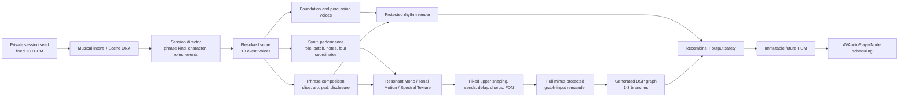

# Synth, track, settings, and rendering matrix

Snapshot: `origin/main` at commit [`69092ac5a9dacd469349efab0f70f26e65bf55d2`](https://github.com/randomactions/auto-techno/tree/69092ac5a9dacd469349efab0f70f26e65bf55d2), 2026-08-26.

This is an implementation map of the current canonical runtime. It does not describe retired engines, future roadmap items, or the older local checkout from which this audit was started.

## How to read this

- **Track** below means a score role or an audible lane in the DAW analogy. The app does not own a DAW-style array of independent tracks.
- **Voice** means a compiled, engine-owned signal generator.
- **Patch** means a recognizable home inside one internal synth architecture. It is not a preset file and is not loaded from disk.
- **Settings** are score-owned semantic values. The DSP translates them into bounded oscillator, envelope, filter, modulation, and send parameters.
- **Active** means that the score admitted events for the current future bar or phrase. A compiled voice may remain resident but do no audible work.
- All notes, automation, patch choices, and topology choices are resolved before immutable future PCM is scheduled. Nothing here is a user-editable knob in the shipping transport-only UI.

### Counts at this snapshot

| Surface | Count | What is counted |
| --- | ---: | --- |
| Canonical ensemble event voices | 13 | `kick`, `bass`, `rumble`, `percussion`, `clap`, `openHat`, `tunedTom`, `metallic`, `motif`, `response`, `atmosphere`, `transition`, `groovePulse` |
| Upper synth roles | 5 | Anchor, shadow, response, atmosphere, transition |
| Internal synth architectures | 3 | Resonant Mono, Tonal Motion, Spectral Texture |
| Named synth patch homes | 11 | 4 Resonant Mono, 3 Tonal Motion, 4 Spectral Texture |
| Shared patch automation coordinates | 4 | Color, shape, motion, space |
| Global semantic controls | 26 | 19 active musical controls plus 7 legacy sequencer controls |
| Phrase-scale performance characters | 6 | Coordinated musical interpretations, not selectable modes |
| Foundation behaviors | 7 | Four bass behaviors plus kick tail, tuned percussion, and absence |
| Patch effect-access labels | 9 | Permissions/evidence, not nine independently instantiated plug-ins |
| Mutable upper-graph processor kinds | 10 | Node palette for the generated graph-input remainder |
| Composition capabilities | 4 | Audio slicing, score-resolved arpeggiation, four-voice pad, harmonic disclosure; pad rhythmic modulation reuses the pad |

## Canonical signal map

The architecture types are compiled into the app. The score changes assignments and events; it does not dynamically load or unload synth binaries.

## Live Render Info view

The app's optional **Render Info** view is the live counterpart to this static
map. For the current already-prepared bar it shows resolved musical intent,
active score voices, synth architecture and patch assignments, the four
semantic automation coordinates, eligible effects, generated graph nodes,
automatic mix values, route geometry, reduced level/stereo evidence, and the
preparation verdict.

The view does not inspect the audio stream. Its bounded, PCM-free snapshot is
built during detached phrase preparation and published by the main actor only
when that scheduled bar becomes current. It therefore adds no synthesis,
effect, analysis, allocation, lock, or UI work to the realtime callback. The UI
cost is limited to rendering a few dozen values at bar boundaries.

## Track-equivalent and voice matrix

The first thirteen rows correspond to the complete `EnsembleVoice` enum. Shadow, pad, and audio-slice rows are derived audible capabilities and therefore are not extra ensemble event types.

| DAW analogy / score identity | Canonical role and source | Generator | Main settings or “preset” source | Activation | Route and persistent state |
| --- | --- | --- | --- | --- | --- |
| Kick | `EnsembleVoice.kick` → foundation | Analytic body + sub + noise/tonal click, followed by per-event first-order ADAA `tanh` conditioning | One of four continuously blended kick morphology homes; score accent; section detector level | Score kick event; may be score-withheld in the paid climax arc | Mono protected center. Detector is pre-fader; audible kick is `-1.5 dB` relative to detector. Conditioner resets per event; morphology evolves in score state. |
| Bass | `bass` → foundation | Resonant Mono foundation renderer | Bass Pulse or Bass Pluck plus behavior-specific C/S/M/Space automation | Only Sub Pulse, Monotone, Point, Pump, or dotted foundation relation; delayed-bass signature can suppress first-half events | Protected center; `space = 0`; no pulse echo or reverb. Resonant oscillator/filter/envelope continuation persists. |
| Kick tail / rumble | `rumble` → foundation | 43 Hz-class sine plus low noise, delayed attack and exponential tail | Foundation behavior `kickTail`; score accent and deterministic seed | Broken Suspension or Ambient Drift where the resolved foundation behavior requests it | Protected center; 0.68 s event, no upper graph; state-free event synthesis. |
| Tuned foundation percussion | `tunedTom` → foundation | Six-mode modal resonator with four continuation slots | Foundation behavior `tunedPercussive`; modal identity, motif-derived degree, material frame | Broken Suspension at compatible structural markers; up to two existing events per bar | Protected center; continuation may cross a bar; no separate synth track or renderer-side pitch choice. |
| Closed hat | `percussion` → percussion | Deterministic noise high-pass-style source | Neutral or open-hat-companion decay role; section, brightness, event accent | Existing arbitrated percussion event | Protected percussion. 50 ms source; event-local state only. |
| Clap / snare / rim | `clap` → percussion | One event slot with clap, pitched snare, or rim body | Body follows performance character; tail is natural or foreground-clearance | Existing arbitrated clap event | Protected percussion. Body choice does not add lanes; tail shaping preserves first 8 ms. |
| Open hat | `openHat` → percussion | Noise plus two metallic oscillators | Native body; natural or foreground-clearance tail; brightness and accent | Existing arbitrated open-hat event | Protected percussion; 190 ms native body before optional tail clearance. |
| Metallic percussion | `metallic` → percussion | Five inharmonic partials plus high-passed noise | Native body; natural or foreground-clearance tail; brightness and accent | Existing arbitrated metallic event | Protected percussion; 65 ms native body before optional tail clearance. |
| Groove pulse | `groovePulse` → percussion | 45 ms noise/click carrier | Percussion gear chooses center/middle/edge strike, damping, and seeded ±0.04 microvariation; stage chooses pattern and accents | Non-break percussion bars; no events in skeleton stage or major breaks | Protected percussion; deterministic event-local source; no added onset during accent regrouping. |
| Motif / protagonist | `motif` → `SynthRole.anchor` | Patch-selected Resonant Mono or Tonal Motion | Character/role patch assignment, C/S/M/Space, note pitch/gate/velocity, timbre intent, spectral reveal | Motif role admitted by score; texture-collapse can mute scheduled upper notes | Upper path and generated graph remainder. Resonant and tonal anchor states persist separately; arpeggiator may replace the ordinary motif notes. |
| Response | `response` → `SynthRole.response` | Resonant Mono, Tonal Motion, or Spectral Texture | Character/role patch assignment; response interval; optional breath timing offset | Response role/event admitted; suppressed during suspend gesture by the note resolver | Upper path; role-local state and evidence; Voltage Arc is the Broken Suspension response home. |
| Atmosphere | `atmosphere` → `SynthRole.atmosphere` | Tonal Motion or Spectral Texture, plus optional separate four-voice pad realization | Character/role patch, C/S/M/Space, scene atmosphere/drone, optional chord function | Atmosphere role/event admitted and scene atmosphere or drone is audible; pad has its own stricter eligibility | Upper/atmosphere path and spatial sends. Architecture state and pad phases/filter/envelopes persist. |
| Transition | `transition` → `SynthRole.transition` | Tonal Motion or Spectral Texture | Character/role patch; long note trajectory; possible Metal Veil rising cluster | Transition event admitted; suspend renders only the selected distant spatial carrier | Atmosphere/upper path; role-local state persists. |
| Shadow companion | Derived `SynthRole.shadow`; no `EnsembleVoice` case | Resonant Mono or Tonal Motion | Derived from motif pitches, modal interval, character patch, and role automation | Generated only from admitted motif pitches and not during suspend | Upper-tonal path. It is a companion to the motif, not a score track with independent onsets. |
| Four-voice pad | `PhraseCompositionBar.padVoicing`; reuses atmosphere assignment | Dedicated bounded polyphonic pad renderer | Four modal voices, harmonic function, disclosure stage, voice-leading, one atmosphere patch assignment, optional three-step modulation | Atmosphere role plus eligible character/phrase/chapter relationship | Upper/atmosphere path; fixed four-voice continuation. It adds no ensemble role or user synth. |
| Audio-slice overlay | `PhraseCompositionBar.audioSlice`; no new event voice | Band-limited resampler of already-rendered kick or percussion PCM | Source window, 3–4 triggers, 0.5–2× rate, direction, gain | Broken/Ambient major-break breakdown, no competing percussion-return relation | Protected percussion texture for this prepared bar only. No imported sample, loop library, or retained cross-bar PCM. |

## The three synth architectures

| Architecture | Patches | Core topology | Automation translation | Patch-change behavior |
| --- | --- | --- | --- | --- |
| Resonant Mono | Bass Pulse, Bass Pluck, Acid Thread, Acid Sequence | Band-limited saw/pulse plus sine/sub; optional bounded two-operator acid color; shared TPT state-variable nonlinear filter and ADAA saturation; mono glide and accent envelope | Color → base cutoff and envelope depth; shape → attack/decay and pulse width; motion → drive, resonance, glide, band mix and acid index; space → permitted sends | Resets filter/DC/envelope state when the patch identity changes; retains deterministic oscillator/frequency state. |
| Tonal Motion | North Star, Dark Chord, Glass Runner | Two 2×-oversampled band-limited oscillators, pulse/noise blend, drift, phase modulation, four-stage nonlinear filter, comb, all-pass and unsynced echo | Patch multiplier block modifies ADSR, detune, modulation, cutoff, drive, comb, echo and oscillator mix; four shared coordinates move within that home | Resets envelope/filter/timbre/memory buffers that could leak the old patch identity; role state otherwise continues. |
| Spectral Texture | Alien Noise, Metal Veil, Dust Cloud, Voltage Arc | Three deterministic oscillator/ring-mod sources into filter/resonator; Voltage Arc substitutes a low folded polyBLEP saw into a driven moving TPT band-pass | Color → filter/resonator or high-tail center/resonance; shape → attack/release; motion → glide/resonator motion/drive/LFO; space → filtered-reverb send | Resets filter/resonator/DC state on patch change while phase/frequency continuation stays deterministic. |

## Patch capability, home settings, and character assignment

Automation vectors use `(Color, Shape, Motion, Space)`, each clamped to `0–1`.

For normal upper assignments, the stored patch home feeds only Color, Shape, and Motion. Runtime resolution computes:

- `Color = clamp(homeColor + 0.32 × mutation)`
- `Shape = clamp(homeShape + 0.22 when Suspend, −0.12 when Corrode, otherwise unchanged)`
- `Motion = clamp(homeMotion + min(0.42, 0.42 × mutation))`
- `Space = clamp(roleSpace + 0.16 × mutation)`, where role space is Anchor `0.10`, Shadow/Response `0.24`, Atmosphere `0.72`, Transition `0.58`

The coded patch-home Space value is listed for completeness, but normal upper resolution replaces it with the role-owned Space formula above. The single corrective safe-upper assignment instead uses literal `(0.46, 0.52, 0.28, 0.18)`.

Effect abbreviations: **D** drive, **Ch** chorus, **Cb** comb, **UE** unsynced echo, **PE** pulse echo, **FR** filtered reverb, **MG** masking guard, **G** glue, **M** master.

| Architecture | Patch | Eligible uses | Coded home C/S/M/Space | Current character/role selections | Effect access | Special identity |
| --- | --- | --- | --- | --- | --- | --- |
| Resonant Mono | Bass Pulse | Foundation bass | `0.24 / 0.48 / 0.18 / 0` | Sub Pulse, Monotone, Pump; safe foundation and some legacy fallback | D, MG, G, M | Protected low-end pulse home |
| Resonant Mono | Bass Pluck | Foundation bass | `0.38 / 0.78 / 0.26 / 0` | Point; dotted three-sixteenth relation; energetic legacy fallback | D, MG, G, M | Shorter pointed bass home |
| Resonant Mono | Acid Thread | Motif, shadow, response | `0.46 / 0.62 / 0.58 / 0.12` | Acid Pressure shadow; Peak Drive shadow; Hypnotic Lock corroded anchor or motion shadow | D, Ch, UE, PE, FR, MG, G, M | `orderedHollow`, 2:1 modulator |
| Resonant Mono | Acid Sequence | Motif, shadow, response | `0.58 / 0.55 / 0.72 / 0.16` | Acid Pressure anchor/response; Hypnotic Lock motion anchor/response | D, Ch, UE, PE, FR, MG, G, M | `metallicTension`, √2 modulator |
| Tonal Motion | North Star | Motif, shadow, response | `0.52 / 0.44 / 0.34 / 0.20` | Peak Drive response; Melodic Glow anchor/response; Hypnotic variation/response; safe anchor/response | Ch, Cb, UE, PE, FR, MG, G, M | Balanced tonal protagonist |
| Tonal Motion | Dark Chord | Motif, shadow, response, atmosphere, transition | `0.30 / 0.72 / 0.28 / 0.36` | Ambient anchor/shadow; Melodic shadow/atmosphere/transition; Hypnotic variation; safe atmosphere/transition | Ch, Cb, UE, PE, FR, MG, G, M | Slow, sustained tonal field |
| Tonal Motion | Glass Runner | Motif, shadow, response | `0.70 / 0.34 / 0.62 / 0.24` | Peak Drive anchor; Broken anchor/shadow; Hypnotic variation/shadow; safe shadow | D, Ch, Cb, UE, PE, FR, MG, G, M | Fast, bright, driven motion |
| Spectral Texture | Alien Noise | Response, atmosphere | `0.58 / 0.46 / 0.76 / 0.62` | Acid/Peak atmosphere; Ambient response; Hypnotic tone response or ordinary atmosphere | D, Ch, UE, FR, MG, G, M | Ring-modulated alien response/air |
| Spectral Texture | Metal Veil | Response, atmosphere, transition | `0.78 / 0.32 / 0.68 / 0.52` | Acid/Peak/Broken transition; Hypnotic non-memory transition | D, Ch, UE, FR, MG, G, M | Transition use activates rising adjacent cluster |
| Spectral Texture | Dust Cloud | Atmosphere, transition | `0.34 / 0.82 / 0.42 / 0.78` | Broken atmosphere; Ambient atmosphere/transition; Hypnotic breath/break atmosphere or memory transition | Ch, UE, FR, MG, G, M | Slow dust-like field |
| Spectral Texture | Voltage Arc | Response | `0.76 / 0.40 / 0.82 / 0.44` | Broken Suspension response only | D, Ch, UE, FR, MG, G, M | `drivenUpperBand` harmonic tail |

### Resonant Mono patch realization

Common formulas are attack `1.5–7.5 ms` from Shape, decay `55–365 ms` inverse to Shape, input drive `1.18 + 1.12M` when allowed, resonance `min(0.88, 0.24 + 0.55M)`, base cutoff `72 + 620C Hz`, envelope depth `180 + 760C + 820M Hz`, pulse width `0.30 + 0.28S`, and glide `4–79 ms` from Motion.

| Patch | Sine / saw / pulse source weights | Filter band mix | Additional operator treatment |
| --- | --- | --- | --- |
| Bass Pulse | `0.66 / 0.18 / 0.16` | `0.02 + 0.04M` | None |
| Bass Pluck | `0.30 / 0.46 / 0.24` | `0.05 + 0.08M` | None |
| Acid Thread | `0.18 / 0.46 / 0.36` | `0.10 + 0.12M` | 2.0 ratio; peak index `min(2.10, 0.45 + 0.55C + 0.25M)`; operator weight `0.05`; two 120 Hz high-pass stages on the modulation delta |
| Acid Sequence | `0.16 / 0.46 / 0.45` | `0.15 + 0.18M` | √2 ratio; peak index `min(2.10, 0.65 + 0.75C + 0.65M)`; operator weight `0.065`; same high-pass and anti-alias budget |

Foundation note duration is `0.16 + 0.18S` seconds. Eligible dotted pre-kick notes may receive a score-bound raised-cosine terminal release; that is an articulation of the same Bass Pluck event, not sidechain detection.

### Tonal Motion patch multipliers

`A/D/S/R` are attack, decay, sustain, and release home multipliers. `Det/Mod/Cut/Drv/Cb/Echo` are detune, modulation, cutoff, drive, comb, and unsynced-echo home multipliers. Oscillator weights are Saw A / Saw B / Pulse / Noise. Shared automation and role/gesture envelopes multiply these values.

| Patch | A / D / S / R | Det / Mod / Cut / Drv | Cb / Echo | Oscillator weights |
| --- | --- | --- | --- | --- |
| North Star | `1.00 / 1.00 / 1.00 / 1.00` | `0.90 / 0.90 / 1.04 / 1.00` | `0.86 / 0.78` | `0.45 / 0.25 / 0.22 / 0.08` |
| Dark Chord | `1.65 / 1.72 / 1.22 / 1.70` | `0.72 / 0.62 / 0.72 / 0.92` | `1.05 / 1.18` | `0.50 / 0.30 / 0.12 / 0.08` |
| Glass Runner | `0.62 / 0.68 / 0.72 / 0.58` | `1.28 / 1.42 / 1.30 / 1.14` | `1.24 / 0.72` | `0.34 / 0.22 / 0.34 / 0.10` |

Automation then scales attack by `1.22 − 0.44S`, decay by `0.72 + 0.62S`, release by `0.70 + 0.68S`, detune by `0.76 + 0.48M`, modulation by `0.62 + 0.76M`, cutoff by `0.70 + 0.62C`, and allowed drive by `1.04 + 0.34M`.

Role envelope homes before patch/automation scaling:

| Role | Attack | Decay | Sustain | Release |
| --- | --- | --- | --- | --- |
| Anchor | One of `4 / 10 / 22 ms` from session envelope family | `0.11 / 0.22 / 0.38 s` | `0.16 / 0.24 / 0.36` | `0.08 / 0.16 / 0.28 s` |
| Shadow / response | `4 ms` on Release gesture, otherwise `9 ms` | `0.12 s` on Corrode, otherwise `0.22 s` | `0.34` on Release, otherwise `0.22` | `0.26 s` on Corrode, otherwise `0.16 s` |
| Atmosphere | `0.38 s` on Suspend, otherwise `0.18 s` | `1.8 s` | `0.72` | `1.6 s` on Suspend, otherwise `0.72 s` |
| Transition | `0.09 s` | `0.12 s` on Corrode, otherwise `0.22 s` | `0.56` | `0.44 s` |

The one eligible `sustainedWash` relation raises sustain to at least `0.68` and multiplies release by `3.2`, capped at sustain `0.92` and release `2.4 s`.

### Spectral Texture patch realization

Common envelope settings are attack `8–288 ms` and release `80–1,200 ms` from Shape. Non-Voltage patches glide over `40–260 ms`; their filter cutoff is `220 + 4,800C ± 720M Hz` and resonator frequency is the note frequency times `2 + 5C`.

| Patch | Three source ratios | Source blend | Additional treatment |
| --- | --- | --- | --- |
| Alien Noise | `1.71 / 2.43 / 3.19` | `A×B 0.62 + B×C 0.24 + A 0.14` | Drive when permitted |
| Metal Veil | `2.01 / 3.97 / 5.03` | `A×B 0.50 + B×C 0.34 + C 0.16` | Transition use replaces ratios with `1 / 1.059463 / 1.122462` rising cluster |
| Dust Cloud | `0.51 / 1.13 / 1.91` | `A 0.42 + A×B 0.26 + B×C 0.18 + C 0.14` | No local drive permission |
| Voltage Arc | Fold note to `28–56 Hz` | Low polyBLEP saw into moving band-pass | Center constrained to `6.5–11.5 kHz` at normal rates; excursion `min(18% of range, 140 + 760M)`; resonance `2.2 + 4.2C`; prefilter drive `1.65 + 1.35M`; LFO `2.4 + 3.6M Hz` |

## Foundation behavior matrix

`μ` is the bounded per-bar mutation amount. All bass Space values are literal zero.

| Foundation behavior | Compatible characters | Audible generator | Resolved settings | Notes |
| --- | --- | --- | --- | --- |
| Sub Pulse | Hypnotic Lock, Melodic Glow | Bass Pulse | `(0.16 + 0.12μ, 0.70, 0.10 + 0.10μ, 0)` | Tight protected bass |
| Monotone | Hypnotic Lock, Acid Pressure | Bass Pulse | `(0.22 + 0.18μ, 0.54, 0.18 + 0.18μ, 0)` | Default home for Hypnotic and Acid |
| Point | Acid Pressure, Peak Drive, Melodic Glow | Bass Pluck | `(0.44 + 0.22μ, 0.84, 0.24 + 0.16μ, 0)` | Pointed bass events |
| Pump | Peak Drive | Bass Pulse | `(0.30 + 0.18μ, 0.76, 0.30 + 0.16μ, 0)` | Later-half Peak foundation |
| Kick Tail | Broken Suspension, Ambient Drift | Rumble voice | 43 Hz + deterministic `0…3.3 Hz` offset; 0.68 s; delayed attack; level `0.072 × accent` | Synth plan carries a safe foundation assignment for validation, but no bass event renders it |
| Tuned Percussive | Broken Suspension | Six-mode modal voice | Fundamental `48–196 Hz`; excitation `0.30–0.90`; damping `0.25–0.85`; brightness `0.18–0.90`; inharmonicity `0.01–0.09` | Up to two score articulations; four fixed continuation slots |
| Absent | Ambient Drift | Silence | No foundation companion events | Safe assignment metadata remains non-audible |
| Dotted override | Eligible paired Lock bars whose behavior already uses bass | Bass Pluck | `(0.40 + 0.18μ, 0.84, 0.22 + 0.14μ, 0)` | Complementary `0x8248 / 0x4824` two-bar onset masks; may create exact pre-kick pocket |

## Phrase-scale performance-character matrix

Every phrase has one character. It coordinates foundation, patch roles, rhythm, and composition; it is not a user preset or engine switch.

| Character | Typical phrase purpose | Allowed foundations | Anchor / shadow / response / atmosphere / transition homes | Percussion body and composition tendencies |
| --- | --- | --- | --- | --- |
| Hypnotic Lock | Lock and identity return | Sub Pulse, Monotone | Anchor varies North Star/Dark Chord/Glass Runner, or Acid Thread/Sequence under gesture/chapter; shadow Glass Runner/Dark Chord or Acid Thread; response North Star/Alien Noise/Acid Sequence; atmosphere Alien Noise/Dust Cloud; transition Metal Veil/Dust Cloud | Clap body. Pad can disclose harmony in eligible Lock atmosphere; no phrase-composition arpeggiator. Identity return forces the home character and neutral corrections. |
| Acid Pressure | Contrast and release | Monotone, Point | Acid Sequence / Acid Thread / Acid Sequence / Alien Noise / Metal Veil | Clap body. Ascending arpeggiator when motif is admitted and context is eligible. |
| Peak Drive | Energy release | Point, Pump | Glass Runner / Acid Thread / North Star / Alien Noise / Metal Veil | Snare body. Descending arpeggiator; quarter-drive kick grammar with pickup/recovery possibilities. |
| Broken Suspension | Contrast and major break | Kick Tail, Tuned Percussive | Glass Runner / Glass Runner / Voltage Arc / Dust Cloud / Metal Veil | Rim body. Broken kick grammar; eligible major-break kick/percussion slicing and pad. |
| Ambient Drift | Major break | Absent, Kick Tail | Dark Chord / Dark Chord / Alien Noise / Dust Cloud / Dust Cloud | Rim body. Sparse foundation; eligible major-break slicing and pad. |
| Melodic Glow | Lock and contrast | Sub Pulse, Point | North Star / Dark Chord / North Star / Dark Chord / Dark Chord | Clap body. Pendulum/rotated arpeggiator and four-voice pad are the primary composition pairing. |

Identity-return clap events always resolve back to the clap body even if a different character body had been active earlier.

## Kick “preset” homes

The kick never switches among sample files. It moves continuously between four analytic source homes over deterministic 128-bar raised-cosine segments. `F0 = 44 + 0.7 × (sessionSeed mod 5)` Hz.

| Home | Fundamental | Pitch depth / fast depth | Pitch decay / fast decay | Body decay / sub decay | 2nd harmonic | Body drive | Sub level | Noise / tonal click | Click frequency |
| --- | ---: | ---: | ---: | ---: | ---: | ---: | ---: | ---: | ---: |
| Anchor | `F0` | `205 / 28 Hz` | `48 / 150 s⁻¹` | `17.5 / 12.5 s⁻¹` | `0.075` | `1.22` | `0.22` | `0.080 / 0.055` | `2,800 Hz` |
| Round | `F0 − 1.4` | `165 / 22 Hz` | `42 / 132 s⁻¹` | `14.8 / 10.8 s⁻¹` | `0.050` | `1.10` | `0.285` | `0.055 / 0.040` | `2,050 Hz` |
| Taut | `F0 + 2.1` | `238 / 34 Hz` | `59 / 172 s⁻¹` | `22.4 / 15.2 s⁻¹` | `0.100` | `1.30` | `0.170` | `0.095 / 0.067` | `3,350 Hz` |
| Hammer | `F0 − 0.3` | `286 / 39 Hz` | `70 / 185 s⁻¹` | `19.2 / 13.4 s⁻¹` | `0.140` | `1.40` | `0.190` | `0.105 / 0.070` | `1,750 Hz` |

Each kick event renders at most 0.32 s. Normal detector level is `0.72`, breakdown detector level `0.54`, and the audible bus multiplies it by `0.841395` (`−1.5 dB`).

## Percussion voice settings

| Voice | Source and duration | Level | Score-owned variants | Tail / effects |
| --- | --- | --- | --- | --- |
| Closed hat (`percussion`) | Deterministic noise, 50 ms | Build `0.09 × accent`; otherwise `0.075 × accent` | Neutral decay or open-hat companion | Decay rate `32 − 8 × brightness`; companion multiplies by `1.35` |
| Clap body | Three noise bursts at 0/11/23 ms plus 185 Hz body, 160 ms | `0.08 × accent` | Hypnotic, Acid, Melodic and identity return | Natural or foreground-clearance tail |
| Snare body | 220→168 Hz membrane, 1.93× overtone, filtered wire noise, 160 ms | `0.08 × accent` | Peak Drive clap event | Same tail role |
| Rim body | 430/1,120/2,480 Hz shell plus edge noise, 80 ms | `0.08 × accent` | Broken Suspension and Ambient Drift clap event | Same tail role |
| Open hat | Noise plus approximately 3.6–7.4 kHz and 5.1–7.3 kHz metallic oscillators, 190 ms | `0.052 × accent` | Native body | Same tail role |
| Metallic | Partials at 1,730/2,417/3,101/4,729/6,083 Hz with brightness detune, 65 ms | `0.042 × accent` | Native body | Same tail role |
| Groove pulse | Noise plus muted click, 45 ms | Base `0.045 × event intensity` | Anchor: middle/0.50 damping; Lift: middle/0.40; Contrast: edge/0.25; Turnaround: center/0.75; deterministic ±0.04 timbre | Contact maps to HP/LP/click: center `550/2600/940`, middle `550/3200/1180`, edge `700/3900/1480 Hz` |
| Tuned modal | Six resonances at ratios `1 / 1.47 / 2.09 / 2.77 / 3.62 / 4.63`; ≤2 ms excitation | Event level `0.085 × accent` | Modal pitch and material frame | Four continuation slots; pole decay is bounded and sample-rate-derived |
| Kick tail / rumble | Sine plus low noise, 680 ms | `0.072 × accent` | Deterministic 43–46.3 Hz home | Delayed attack avoids masking the kick transient |

For clap/open-hat/metallic events, `foregroundClearance` preserves the first 8 ms and then applies a raised-cosine release toward a final multiplier of `0.25`; `naturalBody` is exact neutral.

## Phrase-composition settings

| Capability | Eligibility | Resolved settings | What it is not |
| --- | --- | --- | --- |
| Audio slice | Major-break breakdown with Broken Suspension or Ambient Drift, and no percussion-return relation | Existing percussion source, falling back to an early kick; source length `0.5` or `1` step in current patterns; 3–4 triggers; rates `0.75/1/1.5/2×` in current patterns; forward/reverse; gains `0.22–0.34`; general bounds 0.25–2 source steps, ≤6 triggers, 0.5–2×, gain ≤0.72 | Not an imported sample, captured loop, granular side engine, or persistent PCM state |
| Arpeggiator | Melodic Glow, Acid Pressure, or Peak Drive; motif admitted; not major break, structural marker, or Tone chapter | 8 notes at 1/8 (`rateInSteps=2`) or 16 at 1/16 (`=1`); ascending/descending/pendulum/rotated; 1–2 octaves; score-owned duration, velocity, pitch and rotation | Not a free-running sequencer or new oscillator; it replaces ordinary anchor-note scheduling and uses the selected anchor patch |
| Four-voice pad | Atmosphere role plus compatible Ambient/Melodic/Lock/Break/Release/Breath or harmonic-coordination context | Four modal voices; onset 0, duration 16 steps; triangle/sine `0.52/0.48`; detune `0.9974/1.0011/0.9987/1.0026`; pan `−0.38/−0.12/0.14/0.40`; attack 0.42 s; release 0.65 s; cutoff `520 + 2,800C Hz`; drive `1.08 + 0.32S`; send `min(0.48, 0.16 + 0.32Space)` | Not a new performance role, user pad track, or unbounded polyphonic synth |
| Harmonic disclosure | Same eligible pad | Functions tonic/modal color/subdominant/return pull; Lock is concealed then partial, Major Break is revealed, other contexts established; dependent arp reads the same function | Not a second progression engine |
| Pad three-step pulse | Naturally resolved pad in latter-half major-break breakdown, macro bars 8–14, excluding minimalize/structural marker | Repeating filter scales `0.38/1/0.62`; spatial-send scales `0.72/0.85/1.28`; amplitude gate `0/1/0`; absolute-bar phase; 6 ms raised-cosine edges | Not a new note, clock, effect bus, or continuation owner |

## Effects and routing matrix

### Patch-access labels versus actual DSP checks

| Access label | Actual current behavior | Scope |
| --- | --- | --- |
| Drive | Checked locally by Resonant Mono and Spectral Texture; Tonal Motion has drive scaling only when its patch permits it | Per assignment |
| Comb | Checked by Tonal Motion; patch multiplier controls comb depth | Per tonal assignment |
| Unsynced echo | Checked by Tonal Motion; role-specific deterministic delay time `0.247–0.336 s` | Per tonal assignment |
| Pulse echo | Checked at each voice send and additionally score-gated; assignment access alone does not activate it | Shared upper return |
| Filtered reverb | Checked at each voice send; Space and selective spatial-carrier intent determine the send | Shared FDN/spatial return |
| Chorus | Listed as upper capability access, while the canonical renderer currently applies one shared upper chorus rather than gating a separate chorus instance per assignment | Shared upper stage |
| Masking guard | Capability/evidence label for the fixed dynamic upper spectral guard | Shared mix stage |
| Glue | Capability/evidence label for the fixed linked two-band glue | Shared mix stage |
| Master | Capability/evidence label for terminal compression/saturation and output safety | Shared terminal stage |

“Compatible effects” therefore do not mean a per-track insert chain. They combine local switches, send permissions, and truthful access labels for fixed shared stages.

### Fixed shared stages

| Stage | Current settings | Input / protection |
| --- | --- | --- |
| Dynamic low-mid guard | Cut ≤`0.42`; kick contribution ≤`0.16`; driven by upper low-mid envelope and darkness | Upper synth bus only |
| Dynamic high guard | Damping ≤`0.38`, driven by high-band envelope and darkness | Upper synth bus only |
| Rhythmic delay | Half-beat delay; wet `0.10 + 0.18×atmosphere`; feedback `0.20 + 0.12×hypnosis` | Upper synth input only |
| Pulse echo | Three sixteenths; feedback write `0.28`; 180 Hz HP, 3.2 kHz LP; audible return scale `0.18` | Only permitted upper sends; no kick/bass |
| Pulse-return drive | Amount ≤`0.55`, 8 ms boundary window, low-level gain ≤`3.2×`; applied after the feedback write | Memory chapter plus score/access eligibility; neutral in protected/home/break cases |
| Early reflection | 13 ms; input `0.30`; mix `0.035 + 0.08×atmosphere` | Upper synth input only |
| Shared chorus/stereo motion | 45 ms buffer; chorus period `1.8 + 1.8×hypnosis s`; depth `2 + 5×atmosphere` frames; mix `0.12 + 0.12×atmosphere`; pan period `6 + 10×hypnosis s`; pan depth `0.16 + 0.18×atmosphere + 0.08×textureChaos` | Upper synth input; kick and bass remain centered |
| Eight-line FDN | Delays based on `43/53/67/79/97/113/137/163 ms`; room `0.84 + 0.28×atmosphere + 0.08×drone`; decay `(1.45 + 2.20×hypnosis + 1.30×drone + 0.60×atmosphere)×1.75`, clamped `1.25–5.8 s`; damping `2,300 + 3,300×(1−atmosphericDarkness) Hz`; synth send `0.34 + 0.06×atmosphere`; percussion send `0.08×atmosphere`; wet ≤`0.24`, identity return scales wet by `0.45` | Upper plus restrained percussion and explicit spatial sends; never kick/foundation |
| Kick-linked duck | Center reduction ≤20%; upper reduction ≤38% | Detector is the unchanged pre-fader kick |
| Linked two-band glue | Low threshold `0.34`, ratio-like divisor `2.2`; upper threshold `0.26`, divisor `1.8` | Center and upper share linked detector behavior |
| Terminal compressor/safety | Threshold `0.42`, divisor `2.8`, makeup `1.015`; `tanh(1.12×sample)×0.78` safety | Full VoiceRenderer output; modal foundation is safely recombined afterward and receives terminal phrase safety |
| Live master trim | Attenuation only, `−3…0 dB`; attack ≤0.25 dB/accepted phrase; recovery 0.125 dB after two clean observations | Future accepted immutable phrase only; never current buffer |
| Percussion return | Bar-local one-step input; four-step delay; four-step gate; feedback `0.72`, return `0.42`, HP 650 Hz, LP 4.2 kHz, 8 ms edges; optional reverse anticipation swell | Existing protected percussion event; no cross-bar captured loop |

### Generated upper-graph palette

The generated graph processes only `full render − protected rhythm render`, then is recombined with the protected render. A base graph has 7–11 nodes; hard limits are 24 nodes, 3 branches, and 12 serial nodes per branch. Node amount is `0…1`, mix `0…0.82`, feedback `0…0.68`, and delay `0…0.42 s`. Topology mutations are insert, bypass, replace, reorder, or reroute-send; they occur only at authorized future phrase boundaries and crossfade old/new state over two bars.

| Node kind | DSP meaning | Parameter mapping |
| --- | --- | --- |
| Tone guard | Low-frequency subtraction from upper remainder | Corner `240 + 1,100×amount Hz`; subtraction `0.42×amount` |
| Saturation | Normalized `tanh` | Drive `1 + 3.2×amount` |
| Wave fold | Sine-domain fold | Drive `1.2 + 4.5×amount` |
| Phaser | One-stage all-pass-like memory | Coefficient `0.18 + 0.58×amount` |
| Chorus | Modulated delay | Generated delay `10–21 ms`; modulation `0.08 + 0.22×amount Hz` |
| Comb | Feedback delay | Generated delay `18–65 ms`; feedback allowed and bounded |
| Echo | Feedback delay | Generated delay `80–339 ms`; feedback allowed and bounded |
| Diffusion | Cross-coupled feedback delay | Generated delay `45–164 ms`; crossfeed `0.18` |
| Resonator | State-variable resonant color | Frequency `180 + 1,800×amount Hz`; damping `0.91 − 0.12×amount` |
| Stereo motion | Bounded cross-pan | Rate `0.035 + 0.18×amount Hz`; pan depth `0.42×amount` |

The conservative fallback graph is four nodes: Tone Guard `(amount .42, mix .34)`, Saturation `(.32, .30)`, Chorus `(.28, .22, 16 ms)`, and Diffusion `(.30, .20, feedback .34, 90 ms)`.

## Global semantic settings

These are internal autonomous coordinates, not user controls. All clamp to `0…1`, except Groove has a minimum of `0.05`. The initial production session uses the defaults below; future phrases apply bounded coordinated mutation. The private root seed still changes the event choices, identity DNA, and deterministic trajectories.

| Branch | Setting | Initial value | Main audible owners |
| --- | --- | ---: | --- |
| Motion | Groove | `0.70` | Drive derivation, swing/groove profile |
| Motion | Syncopation | `0.40` | Drive derivation, weak bass candidates and rhythm |
| Motion | Beat shape | `0.15` | Five-band kick/clap vocabulary from straight through full break |
| Motion | Polyrhythm | `0.40` | Triplet-like bass candidates |
| Character | Darkness | `0.65` | Effective darkness, upper spectral guard |
| Character | Atmosphere | `0.40` | Spatial wetness, chorus, pad/atmosphere levels |
| Character | Atmospheric darkness | `0.40` | Effective darkness and FDN damping |
| Character | Hypnosis | `0.65` | Delay feedback, modulation periods, FDN decay |
| Character | Aggression | `0.40` | Scene character and coordinated intent |
| Character | Machine texture | `0.08` | Eligible pulse-return drive amount |
| Character | Drone | `0.28` | Atmosphere/pad level and FDN room/decay/wet |
| Musicality | Melodicity | `0.40` | Response admission/level and arpeggiator octave choice |
| Musicality | Synth presence | `0.40` | Anchor/shadow level and role density inputs |
| Musicality | Note activity | `0.40` | Motif event count and arpeggiator rate choice |
| Uncertainty | Overall chaos | `0.15` | Adds bounded `0.3×` influence to drum/synth/texture chaos |
| Uncertainty | Drum chaos | `0.15` | Percussion variation and proposals |
| Uncertainty | Synth chaos | `0.15` | Upper mutation inputs |
| Uncertainty | Texture chaos | `0.15` | Graph/stereo texture and spatial movement |
| Evolution | Pace of change | `0.25` | Phrase-to-phrase intent mutation amount |
| Legacy sequencer metadata | Sequencer presence | `0.00` | Generates `TechnoScene.sequencer` metadata only |
| Legacy sequencer metadata | Sequencer style | `0.00` | Chooses pulse-network/arpeggiated-motif/textural-step-field metadata only |
| Legacy sequencer metadata | Sequencer density | `0.32` | Metadata event count only |
| Legacy sequencer metadata | Sequencer register | `0.35` | Metadata event pitch only |
| Legacy sequencer metadata | Sequencer repetition | `0.72` | Metadata placement/duration only |
| Legacy sequencer metadata | Sequencer drift | `0.25` | Metadata octave movement only |
| Legacy sequencer metadata | Sequencer depth | `0.35` | Stored intent value; no current scene or renderer consequence |

### Legacy sequencer status

At this snapshot, `TechnoScene.sequencer` is generated and included in typed fingerprints/validation, but no audible renderer consumes it. Production starts `sequencerPresence` at zero, and the current phrase mutation path does not carry the sequencer branch forward. It must not be counted as a live track, synth, or effect. The current audible arpeggiator is the separate score-bound `PhraseCompositionBar.arpeggiator` described above.

## When settings can change

| Boundary | What may change | What remains continuous |
| --- | --- | --- |
| New Set | Private root, identity DNA, all score/render/evaluator/live/long-horizon state | Nothing from the old performance is intentionally retained |
| Pause / resume | No musical choice | Position, identity, score, patch state, effect tails, and adaptation state |
| Phrase boundary | Phrase kind, one performance character, admitted roles, interlock chapter, graph mutation, long-horizon operator, composition eligibility | Same root identity, tonal/modal DNA, accepted continuation, bounded recent memory |
| Bar boundary | Foundation behavior, gesture, event set, patch assignments, four automation values, kick syntax, percussion gear, pad function/modulation, effect sends | Voice/filter/delay/FDN state unless the score-owned patch change requires a local identity reset |
| Note/event boundary | Note onset, pitch, duration, gate/retrigger/slide, velocity, spectral reveal, envelope relation | Compatible oscillator/filter/envelope state can continue; patch changes reset only identity-leaking state |
| Sample | Envelopes, glide, LFOs, filters, delay/FDN memory, automation consequence | No planning, allocation, model inference, file I/O, or user decision occurs here |
| Route/sample-rate recovery | Buffers and route-derived delay geometry are rebuilt deterministically | Same session root and musical continuation; interrupted phrase is reproduced at the active rate |

## Direct answer to the dynamic-loading question

At minute 10 and minute 40, the audible combination can absolutely differ: different roles may be admitted, those roles may receive different patch homes, events and automation may change, and the upper DSP graph may have a different bounded topology. However, this is **dynamic score assignment and stateful DSP**, not dynamic loading of A/B/C plug-ins and unloading them for C/H/J. The three internal synth architectures and all voice code are part of the app; silent roles simply have no scheduled events, and eligible patch changes are applied to future rendered bars/phrases.

## Pinned implementation sources

- [Instrument palette and assignment policy](https://github.com/randomactions/auto-techno/blob/69092ac5a9dacd469349efab0f70f26e65bf55d2/Sources/AutoTechnoCore/InstrumentPalette.swift)
- [Performance characters and foundation compatibility](https://github.com/randomactions/auto-techno/blob/69092ac5a9dacd469349efab0f70f26e65bf55d2/Sources/AutoTechnoCore/PerformanceCharacter.swift)
- [Canonical ensemble voices and percussion articulations](https://github.com/randomactions/auto-techno/blob/69092ac5a9dacd469349efab0f70f26e65bf55d2/Sources/AutoTechnoCore/AutonomousSession.swift)
- [Upper synth roles, notes, patch selection, and automation](https://github.com/randomactions/auto-techno/blob/69092ac5a9dacd469349efab0f70f26e65bf55d2/Sources/AutoTechnoCore/SynthPerformance.swift)
- [Phrase slicing, arpeggiator, pad, disclosure, and voice leading](https://github.com/randomactions/auto-techno/blob/69092ac5a9dacd469349efab0f70f26e65bf55d2/Sources/AutoTechnoCore/PhraseComposition.swift)
- [Kick morphology homes](https://github.com/randomactions/auto-techno/blob/69092ac5a9dacd469349efab0f70f26e65bf55d2/Sources/AutoTechnoCore/KickMorphology.swift)
- [Musical intent settings](https://github.com/randomactions/auto-techno/blob/69092ac5a9dacd469349efab0f70f26e65bf55d2/Sources/AutoTechnoCore/MusicalIntent.swift)
- [Main voice rendering and fixed routing](https://github.com/randomactions/auto-techno/blob/69092ac5a9dacd469349efab0f70f26e65bf55d2/Sources/AutoTechnoDSP/VoiceRenderer.swift)
- [Resonant Mono implementation](https://github.com/randomactions/auto-techno/blob/69092ac5a9dacd469349efab0f70f26e65bf55d2/Sources/AutoTechnoDSP/ResonantMonoVoice.swift)
- [Tonal Motion implementation](https://github.com/randomactions/auto-techno/blob/69092ac5a9dacd469349efab0f70f26e65bf55d2/Sources/AutoTechnoDSP/AlienAnalogVoice.swift)
- [Spectral Texture implementation](https://github.com/randomactions/auto-techno/blob/69092ac5a9dacd469349efab0f70f26e65bf55d2/Sources/AutoTechnoDSP/SpectralTextureVoice.swift)
- [Pad and slice renderer](https://github.com/randomactions/auto-techno/blob/69092ac5a9dacd469349efab0f70f26e65bf55d2/Sources/AutoTechnoDSP/PhraseCompositionRenderer.swift)
- [Generated upper DSP graph](https://github.com/randomactions/auto-techno/blob/69092ac5a9dacd469349efab0f70f26e65bf55d2/Sources/AutoTechnoDSP/GeneratedDSPGraph.swift)
- [Eight-line spatial FDN](https://github.com/randomactions/auto-techno/blob/69092ac5a9dacd469349efab0f70f26e65bf55d2/Sources/AutoTechnoDSP/FeedbackDelayNetwork.swift)
- [Canonical full/protected render and graph recombination](https://github.com/randomactions/auto-techno/blob/69092ac5a9dacd469349efab0f70f26e65bf55d2/Sources/AutoTechnoDSP/AutonomousPhraseRenderer.swift)
- [Human-readable palette contract](https://github.com/randomactions/auto-techno/blob/69092ac5a9dacd469349efab0f70f26e65bf55d2/docs/INSTRUMENT_PALETTE.md)
- [Human-readable performance grammar](https://github.com/randomactions/auto-techno/blob/69092ac5a9dacd469349efab0f70f26e65bf55d2/docs/PERFORMANCE_GRAMMAR.md)
